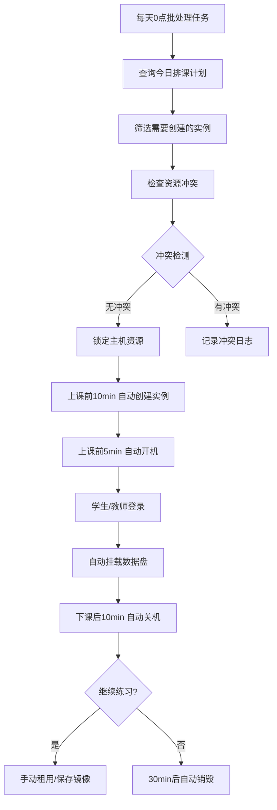

# 云电脑业务管理系统 (Cloud Desktop Business Management System)

## 系统概览 (System Overview)

云电脑业务管理系统是一个完整的虚拟桌面基础设施(VDI)管理平台，用于管理云端计算资源、用户访问、实例生命周期和存储资源。

**核心职责**:
- 管理分布式计算资源和实例
- 控制用户访问和权限
- 处理数据存储和磁盘管理
- 监控资源利用率和健康状态
- 管理云盒终端设备和边缘接入

---

## 1. 边缘机房管理 (Edge Data Center Management)

### 1.1 边缘机房 (Edge Data Center)
**说明**: 数据中心级别的物理边缘机房，包含所有硬件资源

**主要属性**:
- `name`: 边缘机房名称 (e.g., 北京数据中心)
- `location`: 物理位置
- `total_cpu_cores`: 总CPU核心数
- `total_memory_gb`: 总内存容量
- `total_storage_gb`: 总存储容量
- `status`: 运营状态 (active, maintenance, offline)

---

### 1.2 服务器 (Servers)

边缘机房内的专用服务器集群，按功能划分为三类：

#### 1.2.1 管理服务器 (Management Server)

**功能**: 集中管理系统，负责整个平台的协调

| 管理功能 | 说明 | 关键职责 |
|---------|------|---------|
| 管理实例 (Manage Instances) | 实例生命周期管理 | 创建、启动、停止、删除实例 |
| 管理用户 (Manage Users) | 用户和权限管理 | 用户认证、授权、访问控制 |
| 管理共享资源 (Manage Shared Resources) | 共享资源分配和监控 | 资源池管理、配额分配、使用监控 |
| 管理私有数据盘 (Manage Private Data Disks) | 存储资源管理 | 私有数据盘生命周期、快照、备份 |
| 管理云盒 (Manage Cloud Boxes) | 云盒终端设备管理 | 设备注册、状态监控、固件升级、用户分配 |

**特性**:
- 单点控制，高可用配置建议（主备模式）
- 与所有其他组件通信
- 维护系统状态和配置

---

#### 1.2.2 私有数据盘存储 (Private Data Disk Storage)

**功能**: 基于 Ceph RBD 提供虚拟化的持久化私有数据盘存储

**实现方式**:
- **存储后端**: Ceph RBD (RADOS Block Device)
- **存储架构**: 分布式存储集群，无需专用物理服务器
- **虚拟化**: 每个私有数据盘对应一个 Ceph RBD image
- **存储池**: 支持多个存储池，可按存储类型（standard/ssd/nvme）分类

**主要特征**:
- **分布式存储**: 基于 Ceph 集群，提供高可用和高性能
- **虚拟块设备**: 每个私有数据盘是独立的 RBD image
- **支持快照和克隆**: 使用 Ceph RBD 原生功能
- **在线扩容**: 支持在线扩容，无需停机
- **多实例挂载**: 通过 Ceph RBD 快照克隆实现多实例只读共享（标准 RBD 不支持多实例并发写入）
- **自动挂载**: 实例启动时自动加载用户私有数据盘

**多实例挂载说明**:
- **独占模式** (share_mode=exclusive): RBD image 可被单个实例以读写模式挂载
- **共享模式** (share_mode=shared): 通过 RBD 快照+克隆机制实现多实例只读访问
  - 系统创建 RBD 快照
  - 为每个实例创建只读克隆
  - 所有实例以 ro (只读) 模式挂载
  - 不支持多实例并发写入（Ceph RBD 限制）

**存储类型支持**:
- `standard`: 标准存储（HDD/混合存储池）
- `ssd`: SSD高速存储（SSD存储池）
- `nvme`: NVMe超高速存储（NVMe存储池）

**存储池配置**:
- 默认存储池: `private-data-disks`
- 可按 `disk_type` 配置不同的 Ceph 存储池
- 支持多存储池，实现存储类型隔离

---

#### 1.2.3 文件服务器 (File Server)

**功能**: 集中存储和分发镜像、模板等配置文件

**包含子模块**:

##### 镜像库 (Image Repository)
- **说明**: 存储OS基础镜像、应用层镜像等
- **关键关系**:
  - 每个镜像有最低资源要求描述 (**Minimum Resource Requirement Description**)
  - 包括: 最小CPU、内存、存储要求
  - 包括: 推荐规格和OS兼容性信息
- **功能**:
  - 镜像版本管理
  - 镜像标签分类
  - 镜像权限控制（公开/私有/组织）

##### 模板库 (Template Repository)
- **说明**: 存储预配置的实例模板
- **类型**:
  - 实例模板：单个虚拟桌面配置
- **功能**:
  - 快速部署标准配置
  - 模板版本控制
  - 自定义参数支持

---

### 1.3 算力机 (Host)

**功能**: 实际运行实例的物理或虚拟宿主机

**主要属性**:
- `hostname`: 主机名
- `host_type`: 主机类型
  - `cpu_server`: CPU优化服务器
  - `pc_farm`: PC农场（个人计算资源）
  - `gpu_server`: GPU加速服务器
- `cpu_cores`: CPU核心数
- `memory_gb`: 内存大小
- `storage_gb`: 本地存储
- `gpu_count`: GPU数量（可选）
- `allocated_cpu_cores`: 已分配CPU（实时跟踪）
- `allocated_memory_gb`: 已分配内存（实时跟踪）
- `allocated_storage_gb`: 已分配存储（实时跟踪）
- `status`: 运营状态 (active, maintenance, offline, decommissioning)
- `health_status`: 健康状态 (healthy, warning, critical)
- `hypervisor_type`: 虚拟化技术 (KVM, Hyper-V, VMware)
- `rental_mode`: 租赁方式 (exclusive-独占, shared-共享)

**租赁方式** (Rental Mode):

算力机的租赁方式决定了资源的使用模式：

| 租赁方式 | 说明 | 资源分配 | 适用场景 |
|---------|------|---------|---------|
| **独占方式** (exclusive) | 整个物理机独占给单个用户使用 | 使用实机（物理机），整台机器资源完全分配给用户 | 高性能计算、数据密集型应用、需要完全资源控制 |
| **共享方式** (shared) | 物理机可被多个用户共享使用 | 在共享物理机上运行多个实例，按需分配资源 | 普通应用、开发测试、资源利用率优化 |

**独占方式特性**:
- 整台物理机资源完全分配给单个用户
- 无虚拟化开销，性能最优
- 适合对性能要求极高的场景
- 资源利用率较低，但用户获得完全控制权

**共享方式特性**:
- 物理机资源被多个实例共享
- 通过虚拟化技术实现资源隔离
- 资源利用率高，成本相对较低
- 适合大多数常规应用场景

**资源跟踪**:
- 实时记录已分配资源（反范式化设计以加快查询）
- 通过数据库触发器自动维护
- 支持快速容量检查，无需聚合查询
- 独占模式下，整台机器资源视为已分配
- 共享模式下，按实例分配的资源累计计算

**算力机与实例的关系**:
- 一个算力机可以运行多个实例
- 独占模式的算力机整机分配给单个实例
- 共享模式的算力机可以运行多个实例，按需分配资源
- 实例通过 `host_id` 关联到算力机
- 实例的资源分配会更新算力机的 `allocated_*` 字段

**算力机与算力池的关系**:
- 一个算力机只能属于一个算力池（一对多关系）
- 通过 `resource_pool_id` 外键直接关联
- 算力机注册时必须指定算力池
- 算力机可以转移至另一个算力池（需确保没有运行中的实例）

---

### 1.4 云盒 (Cloud Box)

**定义**: 云盒是一个操作终端设备,可以连接键盘、鼠标和显示器,通过网线连接到边缘机房,作为用户访问云电脑的本地终端。

**主要属性**:
- `box_id`: 云盒唯一标识 (UUID)
- `name`: 云盒名称
- `serial_number`: 设备序列号 (唯一标识)
- `subnet_id`: 所属子网ID (外键 → subnets.subnet_id，可选)
- `status`: 运行状态
  - `online`: 在线运行中
  - `offline`: 离线
  - `initializing`: 初始化中
  - `maintenance`: 维护中
  - `error`: 错误状态
- `ip_address`: IP地址
- `mac_address`: MAC地址
- `firmware_version`: 固件版本号
- `last_boot_time`: 最近开机时间 (TIMESTAMP)
- `is_disabled`: 是否禁用 (BOOLEAN)
- `edge_data_center_id`: 所属边缘机房ID (外键 → edge_data_centers.room_id)
- `created_at`: 创建时间
- `updated_at`: 更新时间
- `last_heartbeat`: 最后心跳时间 (用于监控在线状态)

**扩展属性**:
- `model`: 设备型号
- `manufacturer`: 制造商
- `hardware_config`: 硬件配置信息 (JSON)
  - CPU型号
  - 内存大小
  - 存储容量
  - 支持的分辨率
- `location`: 物理位置描述
- `assigned_user_id`: 分配的用户ID (可选,外键 → users.user_id)
- `tags`: 标签和元数据 (JSON)

**临时绑定机制**:
- `temporary_instance_id`: 临时绑定的实例ID (可选,外键 → instances.instance_id)
- `temporary_bind_expires_at`: 绑定过期时间 (可选, TIMESTAMP)
- **用途**: 支持临时将云盒绑定到特定实例，用户无需登录即可直接进入实例
- **生命周期**: 
  - 绑定前：管理员将云盒临时绑定到指定实例
  - 使用时：云盒启动时自动检测临时绑定，直接进入绑定的实例
  - 解除绑定：解除临时绑定，云盒恢复为需要登录的状态

**网络配置**:
- `network_mode`: 网络模式
  - `dhcp`: 自动获取IP
  - `static`: 静态IP配置
- `gateway`: 网关地址
- `dns_servers`: DNS服务器列表 (JSON数组)
- `subnet_mask`: 子网掩码

**监控指标**:
- `cpu_usage_percent`: CPU使用率
- `memory_usage_percent`: 内存使用率
- `disk_usage_percent`: 磁盘使用率
- `temperature`: 设备温度
- `uptime_seconds`: 运行时长(秒)

**生命周期状态**:
```
初始化中 (initializing)
  ↓
在线 (online) ←→ 维护中 (maintenance)
  ↓
离线 (offline)
  ↓
禁用 (disabled)
  ↓
报废 (decommissioned)
```

**功能特性**:
- **即插即用**: 云盒连接网络后自动注册到管理系统
- **远程管理**: 支持远程配置、升级固件、重启等操作
- **状态监控**: 实时监控设备健康状态和性能指标
- **用户绑定**: 可将云盒分配给特定用户使用
- **访问控制**: 支持基于云盒的访问权限管理
- **批量管理**: 支持批量配置、升级、重启等操作

**与其他模块的关系**:
- 属于特定的**边缘机房** (Edge Data Center)
- 连接到特定的**网络** (Network)
- 可分配给特定的**用户** (User)
- 可临时绑定到**实例** (Instance) - 通过 `temporary_instance_id` 关联
- 作为访问**实例** (Instance)的客户端终端

**典型用途**:
- **企业办公**: 员工通过云盒访问云桌面进行日常办公
- **图形工作站**: 设计师通过云盒访问高性能云端图形工作站
- **远程办公**: 远程员工通过云盒安全访问公司资源

---

## 2. 实例管理 (Instance Management)

### 2.1 实例 (Instance)

**定义**: 单个虚拟桌面或云电脑

**生命周期状态**:
```
创建中 (creating) / 已停止 (stopped)  ← 创建时状态为stopped，不分配资源
  ↓
初始化中 (initializing)              ← Instance启动时，正在分配资源
  ↓
运行中 (running) ←→ 暂停 (suspended)  ← 资源已分配，可以使用
  ↓
停止中 (stopping)                    ← Instance停止时，正在释放资源
  ↓
已停止 (stopped)                      ← 资源已释放，但Instance记录保留
  ↓
删除中 (terminating)
  ↓
已删除 (deleted)
```

**资源分配时机**:
- **创建时**：只创建Instance记录，状态为 `stopped`，不分配算力机
- **启动时**：根据租赁模式分配资源
  - 独占模式：分配整个算力机
  - 共享模式：在算力机上分配资源
- **停止时**：释放资源，但保留Instance记录

**关键属性**:
- `instance_id`: 实例唯一标识 (UUID)
- `name`: 实例名称
- `user_id`: 所有者用户ID（外键 → users.user_id）
- `tenant_id`: 所属租户ID（外键 → tenants.tenant_id）
- `template_id`: 创建源模板ID（可选，外键 → templates.template_id）
- `status`: 实例状态 (creating, initializing, running, suspended, stopping, stopped, terminating, deleted)
- `config`: 实例配置信息（JSON格式）
  - `imageId`: 使用的镜像ID（如果从模板创建，继承模板的baseImageId）
  - `imageVersionId`: 具体使用的镜像版本ID（可选）
  - `cpuCores`: CPU核心数
  - `memoryGb`: 内存大小（GB）
  - `storageGb`: 存储大小（GB）
  - `gpuCount`: GPU数量（可选）
  - `bandwidthGbps`: 网络带宽（Gbps，可选）
  - `networkConfig`: 网络配置（JSON，可选）
    - vpc_id: VPC ID
    - subnet_id: 子网ID
    - security_group_ids: 安全组ID列表
    - auto_assign_public_ip: 是否自动分配公网IP
  - `userData`: 实例初始化脚本（cloud-init，可选）
  - `description`: 实例描述
- `rental_mode`: 租赁模式 (exclusive-独占, shared-共享，仅在运行时设置)
- `resource_pool_id`: 分配的算力池ID（外键 → resource_pools.pool_id，创建时为 NULL，启动时必填）
- `host_id`: 分配的算力机ID（外键 → hosts.host_id，创建时为 NULL，启动时根据租赁模式设置）
- `created_at`, `updated_at`: 时间戳

**重要说明**:
- Instance创建时：只创建记录，状态为 `stopped`，不分配资源（`resource_pool_id`、`host_id` 均为 null）
- Instance启动时：根据租赁模式分配资源
  - **独占模式**：分配整个算力机，设置 `host_id`
  - **共享模式**：在算力机上分配资源，设置 `host_id`
- Instance停止时：释放资源，清除 `host_id`，但Instance记录保留

**实例与模板的关系** (多对一，可选):
- 实例可以关联到一个模板（`template_id`）
- 从模板创建的实例会记录模板ID
- 直接创建的实例可以不关联模板（`template_id` 为 null）
- 一个模板可以被多个实例使用
- 通过模板创建实例时，模板的默认配置会被应用，用户可以选择性地覆盖部分参数
- 镜像ID从模板继承，不可覆盖（由模板的 `base_image_id` 决定）

**实例创建方式**:
1. **直接创建**: 用户直接指定所有配置参数创建实例
2. **从模板创建**: 用户选择模板，系统应用模板默认配置，用户可选择性覆盖部分参数

**Instance与算力机的关系**:

Instance的资源分配是动态的，与Instance状态相关：

1. **Instance创建时**：
   - 只创建Instance记录（配置信息）
   - 状态为 `stopped`
   - **不分配算力机**
   - `resource_pool_id`、`host_id` 均为 null

2. **Instance启动时**（`POST /api/v1/instances/:id/start`）：
   - 在指定算力池中选择可用的算力机
   - 根据租赁模式分配资源：
     - **独占模式（exclusive）**：整台算力机资源视为已分配
     - **共享模式（shared）**：按实例需求分配资源
   - 将Instance直接关联到算力机（`host_id`）
   - 关系：`Instance -> Host`（直接关联）

3. **Instance停止时**（`POST /api/v1/instances/:id/stop`）：
   - 释放算力机资源（解除关联，但Instance记录保留）
   - 清除 `host_id`
   - 状态变为 `stopped`
   - 算力机资源可以重新分配给其他Instance

**关系约束**:
- Instance直接关联到Host
- Instance停止时，Host关联会被清空（`host_id` 和 `resource_pool_id` 设为 NULL）
- Instance启动时必须指定算力池ID（`resource_pool_id`），系统从该算力池中选择可用的Host
- Instance可以指定租赁模式（`rental_mode`），如果不指定则默认为共享模式

---

### 2.2 实例资源挂载规则 (Instance Resource Attachment Rules)
- **说明**: 定义实例能挂载的资源约束规则
- **应用范围**:
  - 按机器类型定制规则
  - 例如: CPU服务器最多可挂10个私有数据盘，PC农场最多5个
  - 例如: GPU资源只能附加到GPU服务器
- **约束类型**:
  - `max_attachable`: 最大可挂载数量
  - `resource_type`: 资源类型（磁盘、网络、GPU等）
  - `attachment_restrictions`: JSON格式的复杂约束

---

### 2.3 实例管理 (Instance Management)

**功能**: 单个实例的直接管理

**操作**:
- 启动/停止实例
- 修改实例配置
- 重启实例
- 查看实例详细信息

**子功能**:

#### 挂载私有数据盘 (Attach Private Data Disk)
- 将私有数据盘挂载到单个实例
- 指定挂载路径
- 权限验证
- 共享私有数据盘强制只读模式

#### 实例资源挂载规则 (Instance Resource Attachment Rules)
- 验证资源挂载的合法性
- 检查资源限制
- 记录挂载操作日志

---

## 3. 数据管理 (Data Management)

### 3.0 存储架构概述 (Storage Architecture Overview)

**云电脑系统采用双层存储架构**，将实例的系统存储和持久化数据存储分离，提高灵活性和可靠性。

---

#### 3.0.1 系统盘 (System Disk)

**定义**: 实例的操作系统和应用程序存储，由算力机本地存储提供

**特性**:
- **存储位置**: 算力机本地存储（`hosts.storage_gb`）
- **生命周期**: 与实例绑定，实例删除时系统盘随之删除
- **容量来源**: 从算力机本地存储分配
- **配额计算**: 计入用户的 `max_storage_gb` 配额
- **性能**: 本地存储，高IOPS，低延迟
- **备份**: 通过镜像快照备份

**系统盘容量**:
- 由实例的 `allocated_storage_gb` 属性定义
- 创建实例时根据镜像的最低存储要求设置
- 可以在实例停止状态下扩容（不支持缩容）

**存储分配流程**:
```
1. 实例创建时指定 allocated_storage_gb
2. 从算力机本地存储分配对应容量
3. 更新算力机的 allocated_storage_gb（反范式化跟踪）
4. 实例删除时自动释放系统盘空间
5. 算力机的 allocated_storage_gb 自动减少
```

---

#### 3.0.2 私有数据盘 (Private Data Disk)

**定义**: 独立的持久化存储资源，基于 Ceph RBD (RADOS Block Device) 实现的虚拟数据盘

**实现技术**:
- **存储后端**: Ceph RBD (RADOS Block Device)
- **存储位置**: Ceph 集群的存储池（`rbd_pool`，默认 `private-data-disks`）
- **虚拟化**: 每个私有数据盘对应一个 Ceph RBD image
- **命名规则**: `disk-{disk_id}` 格式，确保全局唯一

**特性**:
- **存储位置**: Ceph 集群存储池（虚拟化存储，无需物理服务器）
- **生命周期**: 独立于实例，实例删除后私有数据盘保留
- **容量来源**: 从 Ceph 存储池分配（通过 RBD image 管理）
- **配额计算**: 计入用户的 `max_private_data_disk_gb` 配额（独立于系统盘配额）
- **性能**: 支持多种存储类型（standard, ssd, nvme），通过不同 Ceph 存储池实现
- **备份**: 支持 Ceph RBD 快照和克隆功能
- **在线操作**: 支持在线扩容和热挂载

**私有数据盘容量**:
- 由私有数据盘的 `size_gb` 属性定义
- 创建后支持在线扩容（通过 Ceph RBD resize）
- 不支持缩容（防止数据丢失）

**存储分配流程**:
```
1. 用户创建私有数据盘，指定 size_gb 和 disk_type
2. 系统生成唯一的 disk_id 和 rbd_image_name (disk-{disk_id})
3. 在 Ceph 存储池中创建对应的 RBD image
4. 私有数据盘状态为 available
5. 用户将私有数据盘挂载到实例（通过 instance_private_data_disk_attachments 表）
6. 实例启动时自动加载用户的所有可用私有数据盘
7. 私有数据盘可卸载并挂载到其他实例
8. 用户删除私有数据盘时删除对应的 Ceph RBD image，释放存储池容量
```

**Ceph RBD 集成**:
- **RBD Image**: 每个私有数据盘对应一个 Ceph RBD image
- **存储池**: 可配置不同的存储池（通过 `rbd_pool` 字段）
- **快照**: 使用 Ceph RBD snapshot 功能
- **克隆**: 使用 Ceph RBD clone 功能从快照创建
- **扩容**: 使用 Ceph RBD resize 命令在线扩容

---

#### 3.0.3 存储架构对比

| 特性 | 系统盘 (System Disk) | 私有数据盘 (Private Data Disk) |
|------|---------------------|-------------------|
| **存储位置** | 算力机本地存储 | Ceph RBD 集群存储池 |
| **存储技术** | 本地磁盘/SSD | Ceph RBD (虚拟块设备) |
| **生命周期** | 与实例绑定 | 独立于实例 |
| **实例删除后** | 自动删除 | 保留 |
| **挂载数量** | 1个（固定） | 多个（受挂载规则限制） |
| **共享** | 不支持 | 支持（共享模式） |
| **扩容** | 支持（停机） | 支持（在线） |
| **缩容** | 不支持 | 不支持 |
| **快照** | 通过镜像 | Ceph RBD 快照 |
| **克隆** | 不支持 | 支持（从快照克隆） |
| **配额字段** | `max_storage_gb` | `max_private_data_disk_gb` |
| **性能** | 高（本地存储） | 可配置（standard/ssd/nvme） |
| **用途** | OS、应用程序 | 用户数据、数据库、日志 |
| **自动加载** | 不支持 | 支持（实例启动时自动挂载） |

---

#### 3.0.4 存储配额计算

**用户存储配额分为两部分**:

1. **系统盘配额** (`max_storage_gb`):
   - 计算公式: Σ(所有实例的 allocated_storage_gb)
   - 仅统计非deleted状态的实例
   - stopped状态的实例仍占用系统盘配额

2. **私有数据盘配额** (`max_private_data_disk_gb`):
   - 计算公式: Σ(所有私有数据盘的 size_gb)
   - 包括所有非deleted状态的私有数据盘
   - 无论私有数据盘是否挂载到实例都占用配额

**示例**:
```
用户A的配额:
  - max_storage_gb: 500GB (系统盘总配额)
  - max_private_data_disk_gb: 2000GB (私有数据盘总配额)

用户A的资源使用:
  实例1: allocated_storage_gb = 100GB (running)
  实例2: allocated_storage_gb = 200GB (stopped)
  实例3: allocated_storage_gb = 150GB (deleted) ← 不计入

  系统盘使用: 100 + 200 = 300GB / 500GB (60%)
  系统盘剩余: 200GB

  私有数据盘1: size_gb = 500GB (attached to 实例1)
  私有数据盘2: size_gb = 1000GB (available, 未挂载)
  私有数据盘3: size_gb = 300GB (attached to 实例2)

  私有数据盘使用: 500 + 1000 + 300 = 1800GB / 2000GB (90%)
  私有数据盘剩余: 200GB
```

---

### 3.1 私有数据盘 (Private Data Disk)

**功能**: 独立的持久化存储资源

**私有数据盘属性**:
- `disk_id`: 私有数据盘唯一标识 (UUID)
- `user_id`: 所有者用户ID
- `tenant_id`: 所属租户ID
- `name`: 私有数据盘名称
- `size_gb`: 容量大小（GB）
- `disk_type`: 存储类型 (standard, ssd, nvme)
- `status`: 状态 (available, attached, creating, deleting, error)
- `share_mode`: 共享模式 (exclusive-独占, shared-共享)
- `max_attachments`: 最大挂载实例数（exclusive=1, shared=N，默认1）
- `rbd_image_name`: Ceph RBD image 名称（格式：`disk-{disk_id}`，全局唯一）
- `rbd_pool`: Ceph 存储池名称（默认：`private-data-disks`）
- `created_at`, `updated_at`: 时间戳
- `created_by`, `updated_by`: 审计字段（操作者用户ID）

---

**私有数据盘与实例的挂载关系** (多对多关系表):

通过关联表 `instance_private_data_disk_attachments` 管理私有数据盘与实例的挂载关系：

| 字段 | 类型 | 说明 |
|------|------|------|
| `attachment_id` | UUID | 挂载记录唯一标识 |
| `instance_id` | UUID | 实例ID（外键 → instances.instance_id） |
| `disk_id` | UUID | 私有数据盘ID（外键 → private_data_disks.disk_id） |
| `mount_path` | VARCHAR(255) | 实例内挂载路径 (e.g., /mnt/data1, D:\) |
| `mount_mode` | ENUM | 挂载模式 (rw-读写, ro-只读) |
| `attached_at` | TIMESTAMP | 挂载时间 |
| `attached_by` | UUID | 操作者用户ID |
| `status` | ENUM | 挂载状态 (attaching, attached, detaching, failed) |

**约束条件**:
- **唯一性约束**: `UNIQUE(instance_id, disk_id)` - 防止重复挂载
- **独占模式**: share_mode=exclusive 时，一个私有数据盘最多挂载到1个实例
- **共享模式**: share_mode=shared 时，一个私有数据盘可挂载到多个实例，但不超过 max_attachments
- **挂载限制**: 同一实例不能重复挂载同一私有数据盘
- **共享限制**: 共享模式私有数据盘只能以只读模式（ro）挂载，不支持读写模式（rw）
  - **数据库约束**:
    ```sql
    CHECK (
      (SELECT share_mode FROM private_data_disks WHERE disk_id = instance_private_data_disk_attachments.disk_id) = 'exclusive'
      OR mount_mode = 'ro'
    )
    ```
  - **应用层验证**: 在挂载前验证 share_mode 和 mount_mode 的组合
- **共享安全**: 多实例共享时强制只读，防止数据冲突和并发写入问题

**特性**:
- 支持热挂载：可附加到运行中的实例
- 灵活共享：支持独占和共享两种模式
- 独立生命周期：私有数据盘生命周期独立于实例（实例删除时私有数据盘保留）
- 独立备份：支持独立的备份和快照
- 挂载前置检查：私有数据盘删除前必须先卸载所有挂载

---

### 3.2 私有数据盘管理 (Private Data Disk Management)

| 操作 | 说明 | 约束条件 | 实现方式 |
|-----|------|---------|---------|
| 创建私有数据盘 | 新建存储资源 | 用户配额、Ceph存储池容量 | 在Ceph存储池中创建RBD image |
| 挂载私有数据盘 | 绑定到实例 | 实例运行中、类型兼容、规则约束、共享模式只读 | 通过虚拟化管理接口挂载RBD设备 |
| 卸载私有数据盘 | 解除绑定 | 实例允许卸载 | 从实例卸载RBD设备 |
| 快照 | 创建点备份 | 当前状态快照 | 使用Ceph RBD snapshot |
| 克隆 | 从快照复制整个私有数据盘 | 足够存储空间、需要先创建快照 | 使用Ceph RBD clone功能 |
| 扩容 | 增加容量（在线扩容） | Ceph存储池容量充足 | 使用Ceph RBD resize命令 |
| 删除私有数据盘 | 彻底删除 | 未挂载状态 | 删除Ceph RBD image和数据库记录 |
| 自动挂载 | 实例启动时自动挂载用户私有数据盘 | 实例启动成功 | 实例状态变为running后自动触发 |

**API 端点**:

- `POST /api/v1/private-data-disks` - 创建私有数据盘
- `GET /api/v1/private-data-disks` - 获取私有数据盘列表
- `GET /api/v1/private-data-disks/:disk_id` - 获取私有数据盘详情
- `PATCH /api/v1/private-data-disks/:disk_id` - 更新私有数据盘
- `DELETE /api/v1/private-data-disks/:disk_id` - 删除私有数据盘
- `POST /api/v1/private-data-disks/:disk_id/resize` - 扩容私有数据盘
- `POST /api/v1/private-data-disks/:disk_id/snapshots` - 创建快照
- `POST /api/v1/private-data-disks/:disk_id/clone` - 克隆私有数据盘
- `POST /api/v1/private-data-disks/:disk_id/attach` - 挂载到实例
- `POST /api/v1/private-data-disks/:disk_id/detach` - 从实例卸载
- `GET /api/v1/private-data-disks/:disk_id/attachments` - 获取挂载关系列表
- `GET /api/v1/instances/:instance_id/private-data-disks` - 获取实例的私有数据盘列表
- `POST /api/v1/instances/:instance_id/private-data-disks/:disk_id/attach` - 挂载到实例
- `POST /api/v1/instances/:instance_id/private-data-disks/:disk_id/detach` - 从实例卸载

---

## 4. 租户管理 (Tenant Management)

### 4.1 租户 (Tenant)

**定义**: 租户是系统中最顶层的组织单元，用于实现多租户隔离和管理。每个租户拥有独立的资源配额、网络隔离和管理员。

**租户属性**:
- `tenant_id`: 租户唯一标识 (UUID)
- `name`: 租户名称（唯一）
- `description`: 租户描述
- `status`: 租户状态
  - `active`: 活跃状态，正常使用
  - `inactive`: 非活跃状态，暂停使用
  - `suspended`: 暂停状态，资源被冻结
- `admin_user_id`: 租户管理员用户ID（外键 → users.user_id）
- `vlan_id`: 租户默认VLAN ID（用于网络隔离）
- `quota_config`: 租户配额配置（JSON）
  - `max_instances`: 最大实例数
  - `max_cpu_cores`: 最大CPU总核心数
  - `max_memory_gb`: 最大内存总量
  - `max_storage_gb`: 最大存储总容量
  - `max_private_data_disk_gb`: 最大私有数据盘容量
  - `max_ip_addresses`: 最大IP地址数
  - `max_bandwidth_gbps`: 最大网络带宽（Gbps）
  - `semester_points`: 学期积分（学校租户专用，学期末作废）
  - `enterprise_config`: 企业租户专用配置（企业租户专用，JSON格式）
    - `contract_type`: 合同类型 (monthly, quarterly, yearly)
    - `credit_limit`: 信用额度（元）
    - `payment_terms`: 付款条件 (net30, net60, net90)
    - `billing_contact`: 财务联系人邮箱
    - `sla_level`: SLA级别 (standard, premium, enterprise)
    - `resource_reservation`: 是否支持资源预留 (boolean)
    - `sso_enabled`: 是否启用SSO (boolean)
    - `sso_provider`: SSO提供商 (saml, oidc, ldap)
    - `ip_whitelist`: IP白名单（CIDR格式数组）
    - `compliance_requirements`: 合规要求数组 (gdpr, iso27001等)
    - `data_retention_days`: 数据保留天数（默认365天）
- `tenant_type`: 租户类型（可选，用于区分不同类型的租户）
  - `general`: 普通租户（默认）
  - `school`: 学校租户（支持排课自动化、积分计费等特殊功能）
  - `enterprise`: 企业租户（支持合同制计费、部门管理、审批流程等特殊功能）
- `created_at`: 创建时间
- `updated_at`: 更新时间
- `created_by`: 创建者用户ID（外键 → users.user_id，超级管理员）

**租户类型与功能关联**:
- **普通租户** (`general`):
  - 使用基础功能
  - 仅支持通用角色（admin, tenant_admin, operator, user）
  - 不支持场景特定功能

- **学校租户** (`school`):
  - 支持学校场景特殊功能（排课自动化、积分计费等）
  - 支持学校场景角色（teacher, student, academic_affairs, it_staff）
  - 支持院校-专业-年级-班级四级用户组结构
  - 不支持企业场景功能

- **企业租户** (`enterprise`):
  - 支持企业场景特殊功能（合同制计费、部门管理等）
  - 支持企业场景角色（enterprise_admin, department_manager等）
  - 支持企业-部门-项目组-团队四级用户组结构
  - 不支持学校场景功能

**功能模块可见性配置**:

| 功能模块 | general | school | enterprise | 说明 |
|---------|---------|--------|------------|------|
| **基础功能模块** |
| 租户管理 | ✅ | ✅ | ✅ | 所有租户类型都支持 |
| 用户管理 | ✅ | ✅ | ✅ | 所有租户类型都支持 |
| 用户组管理 | ✅ | ✅ | ✅ | 所有租户类型都支持（层级结构不同） |
| 边缘机房管理 | ✅ | ✅ | ✅ | 所有租户类型都支持 |
| 算力机管理 | ✅ | ✅ | ✅ | 所有租户类型都支持 |
| 实例管理 | ✅ | ✅ | ✅ | 所有租户类型都支持 |
| 实例集管理 | ✅ | ✅ | ✅ | 所有租户类型都支持 |
| 私有数据盘管理 | ✅ | ✅ | ✅ | 所有租户类型都支持 |
| 镜像管理 | ✅ | ✅ | ✅ | 所有租户类型都支持 |
| 模板管理 | ✅ | ✅ | ✅ | 所有租户类型都支持 |
| VPC管理 | ✅ | ✅ | ✅ | 所有租户类型都支持 |
| 子网管理 | ✅ | ✅ | ✅ | 所有租户类型都支持 |
| IP地址管理 | ✅ | ✅ | ✅ | 所有租户类型都支持 |
| 安全组管理 | ✅ | ✅ | ✅ | 所有租户类型都支持 |
| 资源池管理 | ✅ | ✅ | ✅ | 所有租户类型都支持 |
| 云盒管理 | ✅ | ✅ | ✅ | 所有租户类型都支持 |
| 配额管理 | ✅ | ✅ | ✅ | 所有租户类型都支持 |
| 订阅管理 | ✅ | ✅ | ✅ | 所有租户类型都支持 |
| 使用计量 | ✅ | ✅ | ✅ | 所有租户类型都支持 |
| 账单管理 | ✅ | ✅ | ✅ | 所有租户类型都支持 |
| 支付管理 | ✅ | ✅ | ✅ | 所有租户类型都支持 |
| 操作日志 | ✅ | ✅ | ✅ | 所有租户类型都支持 |
| 监控指标 | ✅ | ✅ | ✅ | 所有租户类型都支持 |
| **学校场景功能模块** |
| 排课自动化 | ❌ | ✅ | ❌ | 仅学校租户 |
| 课表导入 | ❌ | ✅ | ❌ | 仅学校租户 |
| 自动创建实例 | ❌ | ✅ | ❌ | 仅学校租户（排课场景） |
| 积分计费 | ❌ | ✅ | ❌ | 仅学校租户 |
| 学期积分管理 | ❌ | ✅ | ❌ | 仅学校租户 |
| 免费积分管理 | ✅ | ✅ | ✅ | 所有租户类型都支持 |
| GPU比例分配 | ❌ | ✅ | ❌ | 仅学校租户（1:8:32约束） |
| 数据盘自动挂载（学校） | ❌ | ✅ | ❌ | 仅学校租户（个人盘+公共盘） |
| 资源申请与审批（学校） | ❌ | ✅ | ❌ | 仅学校租户（课程资源审批） |
| 场所管理 | ❌ | ✅ | ❌ | 仅学校租户（上课场所） |
| **企业场景功能模块** |
| 企业组织结构管理 | ❌ | ❌ | ✅ | 仅企业租户 |
| 成本中心管理 | ❌ | ❌ | ✅ | 仅企业租户 |
| 预算管理 | ❌ | ❌ | ✅ | 仅企业租户 |
| 合同制计费 | ❌ | ❌ | ✅ | 仅企业租户 |
| 企业合同管理 | ❌ | ❌ | ✅ | 仅企业租户 |
| 信用额度管理 | ❌ | ❌ | ✅ | 仅企业租户 |
| 发票管理 | ❌ | ❌ | ✅ | 仅企业租户 |
| 成本分摊 | ❌ | ❌ | ✅ | 仅企业租户 |
| 多级审批流程 | ❌ | ❌ | ✅ | 仅企业租户 |
| 费用审批 | ❌ | ❌ | ✅ | 仅企业租户 |
| 预算审批 | ❌ | ❌ | ✅ | 仅企业租户 |
| SSO单点登录 | ❌ | ❌ | ✅ | 仅企业租户 |
| IP白名单 | ❌ | ❌ | ✅ | 仅企业租户 |
| 访问时间限制 | ❌ | ❌ | ✅ | 仅企业租户 |
| 合规性审计 | ❌ | ❌ | ✅ | 仅企业租户 |
| 资源预留 | ❌ | ❌ | ✅ | 仅企业租户 |
| SLA保障 | ❌ | ❌ | ✅ | 仅企业租户 |
| 资源优先级管理 | ❌ | ❌ | ✅ | 仅企业租户 |

**功能模块可见性规则**:
- 前端UI根据租户类型动态显示/隐藏功能模块
- 企业租户不显示学校场景功能模块（排课、积分计费等）
- 学校租户不显示企业场景功能模块（合同管理、SSO等）
- 普通租户只显示基础功能模块
- 系统管理员（admin）可以访问所有功能模块（跨租户）

**功能模块配置实现**:
- 前端路由守卫：根据租户类型过滤菜单项和路由
- 后端API：根据租户类型返回可用功能模块列表
- 权限验证：访问场景特定功能时验证租户类型
- 错误提示：访问不支持的功能时返回明确的错误信息

**租户类型切换限制**:
- 租户类型创建后不建议修改（涉及数据迁移）
- 如需修改租户类型，需要：
  1. 验证现有用户角色是否与新类型兼容
  2. 迁移或清理不兼容的用户角色
  3. 迁移或清理场景特定的配置数据
  4. 清理场景特定的功能模块数据（如排课计划、企业合同等）

**租户与用户的关系** (一对多):
- 一个租户包含多个用户
- 每个用户必须属于一个租户
- 用户通过 `tenant_id` 字段关联到租户

**租户与用户组的关系** (一对多):
- 一个租户包含多个用户组
- 每个用户组必须属于一个租户
- 用户组通过 `tenant_id` 字段关联到租户
- 一个用户可以在多个用户组（跨组场景）

**租户与VPC的关系** (一对多):
- 一个租户可以创建多个VPC
- 租户内的VPC自动继承租户的VLAN配置
- 通过VLAN实现租户间的网络隔离

**网络隔离机制**:
- 租户创建时分配唯一的VLAN ID
- 租户内创建的VPC自动继承租户的VLAN ID
- 不同租户的VPC使用不同的VLAN ID，实现二层网络隔离
- 即使IP地址在同一网段，不同租户的实例也无法直接通信

**租户管理员**:
- 每个租户有一个管理员（`admin_user_id`）
- 租户管理员拥有 `tenant_admin` 角色
- 租户管理员只能管理自己租户内的资源
- 租户管理员可以：
  - 管理租户内的用户和用户组
  - 管理租户内的实例和资源
  - 查看租户内的配额使用情况
  - 无法跨租户操作

**特性**:
- **资源隔离**: 租户间资源完全隔离
- **网络隔离**: 通过VLAN实现租户间网络隔离
- **配额管理**: 租户级别的配额限制
- **独立管理**: 每个租户有独立的管理员

---

## 5. 用户管理 (User Management)

### 5.1 用户组管理 (User Group Management)

**功能**: 组织用户并进行集合管理

**特性**:
- 多层级组织结构
- 组织权限继承
- 组级别的资源配额
- 批量操作支持

**用户组属性**:
- `group_id`: 用户组唯一标识 (UUID)
- `name`: 用户组名称
- `description`: 用户组描述
- `tenant_id`: 所属租户ID（外键 → tenants.tenant_id）
- `parent_group_id`: 父用户组ID（可选，支持层级结构）
- `group_type`: 用户组类型（可选，用于不同场景）
  - `general`: 普通用户组（默认）
  - `school`: 学校用户组（支持院校-专业-年级-班级四级结构）
  - `enterprise`: 企业用户组（支持企业-部门-项目组-团队四级结构）
- `group_level`: 层级级别（场景专用）
  - `university`: 院校级别（学校场景）
  - `major`: 专业级别（学校场景）
  - `grade`: 年级级别（学校场景）
  - `class`: 班级级别（学校场景）
  - `enterprise`: 企业级别（企业场景）
  - `department`: 部门级别（企业场景）
  - `project_group`: 项目组级别（企业场景）
  - `team`: 团队级别（企业场景）
- `quota_config`: 用户组配额配置（JSON）
- `created_at`, `updated_at`: 时间戳

**用户组与租户的关系**:
- 每个用户组必须属于一个租户
- 用户组通过 `tenant_id` 字段关联到租户
- 租户内的用户组可以跨组共享资源（如共享配额）

**学校场景用户组层级结构**:
- 支持院校-专业-年级-班级四级层级结构
- 通过 `parent_group_id` 实现层级关系
- 层级示例：
  ```
  院校（university）
    └─ 专业（major）
        └─ 年级（grade）
            └─ 班级（class）
  ```
- 每个层级可以设置独立的配额配置
- 支持跨层级权限继承

**企业场景用户组层级结构**:
- 支持企业-部门-项目组-团队四级层级结构
- 通过 `parent_group_id` 实现层级关系
- 层级示例：
  ```
  企业（enterprise）
    └─ 部门（department）
        └─ 项目组（project_group）
            └─ 团队（team）
                └─ 用户（users）
  ```
- 每个层级可以设置独立的配额和预算配置
- 支持成本中心（Cost Center）关联
- 支持跨层级权限继承和资源共享

**用户组与用户的关系** (多对多):
- 一个用户可以在多个用户组
- 一个用户组包含多个用户
- 通过关联表 `user_group_members` 管理关系

---

### 5.2 用户管理 (User Management)

**用户属性**:
- `user_id`: 用户唯一标识 (UUID)
- `username`: 用户名
- `email`: 邮箱
- `password_hash`: 密码（加密存储）
- `role`: 角色 (admin, tenant_admin, operator, user, teacher, student, academic_affairs, it_staff, enterprise_admin, department_manager, project_manager, finance_manager, compliance_officer)
  - `admin`: 系统管理员
  - `tenant_admin`: 租户管理员
  - `operator`: 运维人员
  - `user`: 普通用户
  - `teacher`: 教师（学校场景）
  - `student`: 学生（学校场景）
  - `academic_affairs`: 教务人员（学校场景）
  - `it_staff`: IT管理员（学校场景）
  - `enterprise_admin`: 企业管理员（企业场景）
  - `department_manager`: 部门经理（企业场景）
  - `project_manager`: 项目经理（企业场景）
  - `finance_manager`: 财务管理员（企业场景）
  - `compliance_officer`: 合规官（企业场景）
- `status`: 账户状态 (active, inactive, locked)
- `tenant_id`: 所属租户ID（外键 → tenants.tenant_id）
- `groups`: 所属用户组（多对多关系）

**角色与租户类型关联规则**:
- **通用角色**（适用于所有租户类型）:
  - `admin`: 系统管理员（跨租户）
  - `tenant_admin`: 租户管理员
  - `operator`: 运维人员
  - `user`: 普通用户

- **学校场景角色**（仅适用于 `tenant_type = school`）:
  - `teacher`: 教师
  - `student`: 学生
  - `academic_affairs`: 教务人员
  - `it_staff`: IT管理员

- **企业场景角色**（仅适用于 `tenant_type = enterprise`）:
  - `enterprise_admin`: 企业管理员
  - `department_manager`: 部门经理
  - `project_manager`: 项目经理
  - `finance_manager`: 财务管理员
  - `compliance_officer`: 合规官

**角色可见性配置表**:

| 角色 | general | school | enterprise | 说明 |
|------|---------|--------|------------|------|
| `admin` | ✅ | ✅ | ✅ | 系统管理员，跨租户 |
| `tenant_admin` | ✅ | ✅ | ✅ | 租户管理员 |
| `operator` | ✅ | ✅ | ✅ | 运维人员 |
| `user` | ✅ | ✅ | ✅ | 普通用户 |
| `teacher` | ❌ | ✅ | ❌ | 仅学校场景 |
| `student` | ❌ | ✅ | ❌ | 仅学校场景 |
| `academic_affairs` | ❌ | ✅ | ❌ | 仅学校场景 |
| `it_staff` | ❌ | ✅ | ❌ | 仅学校场景 |
| `enterprise_admin` | ❌ | ❌ | ✅ | 仅企业场景 |
| `department_manager` | ❌ | ❌ | ✅ | 仅企业场景 |
| `project_manager` | ❌ | ❌ | ✅ | 仅企业场景 |
| `finance_manager` | ❌ | ❌ | ✅ | 仅企业场景 |
| `compliance_officer` | ❌ | ❌ | ✅ | 仅企业场景 |

**角色可见性规则**:
- 创建/编辑用户时，只能选择当前租户类型支持的角色
- 企业租户的用户创建界面不显示学校角色选项
- 学校租户的用户创建界面不显示企业角色选项
- 普通租户（general）只能使用通用角色
- 系统管理员（admin）可以跨租户操作，不受此限制

**角色验证规则**:
- 创建用户时：验证 `role` 是否适用于用户的 `tenant_id` 对应的租户类型
- 更新用户角色时：验证新角色是否适用于当前租户类型
- 用户切换租户时：如果新租户类型不支持当前角色，需要先修改角色
- 验证失败时：返回明确的错误信息，提示该角色不适用于当前租户类型

**权限体系**:
- 基于角色的访问控制 (RBAC)
- `admin`: 系统管理员（超级管理员），完全权限，可以创建和管理所有租户
- `tenant_admin`: 租户管理员，只能管理自己租户内的资源
- `operator`: 运维人员，资源管理权限
- `user`: 普通用户，仅操作自有资源

**角色权限说明**:
- **admin (系统管理员/超级管理员)**:
  - 可以创建、删除、管理所有租户
  - 可以管理所有用户和用户组
  - 可以管理所有资源（实例、存储、网络等）
  - 可以查看和修改所有配额
  - 可以管理边缘机房、服务器等基础设施

- **tenant_admin (租户管理员)**:
  - 只能管理自己租户内的用户和用户组
  - 只能管理自己租户内的实例和资源
  - 可以查看自己租户的配额使用情况
  - 不能跨租户操作
  - 不能创建或删除租户

- **operator (运维人员)**:
  - 资源管理权限
  - 可以管理实例、存储等资源
  - 通常用于系统运维和监控

- **user (普通用户)**:
  - 仅操作自有资源
  - 可以创建和管理自己的实例
  - 可以管理自己的私有数据盘

---

### 5.3 角色可见性与过滤机制 (Role Visibility & Filtering)

**目的**: 根据租户类型动态过滤可见角色，确保用户只能看到和使用适用于当前租户类型的角色。

#### 5.3.1 角色可见性规则

**规则定义**:
- 角色可见性由租户类型决定
- 前端UI根据租户类型动态生成角色选择列表
- 后端API验证角色与租户类型的匹配性

**过滤逻辑**:
```
获取当前租户类型 (tenant_type)
  ↓
根据租户类型查询可用角色列表
  ↓
过滤角色选择列表（前端）
  ↓
验证选择的角色是否匹配（后端）
```

#### 5.3.2 前端实现

**角色选择组件**:
- 读取当前用户的租户类型
- 根据租户类型过滤角色选项
- 企业租户：只显示通用角色 + 企业角色
- 学校租户：只显示通用角色 + 学校角色
- 普通租户：只显示通用角色

**实现示例**:
```typescript
// 伪代码示例
function getAvailableRoles(tenantType: TenantType): Role[] {
  const commonRoles = ['admin', 'tenant_admin', 'operator', 'user'];
  
  if (tenantType === 'enterprise') {
    return [...commonRoles, 'enterprise_admin', 'department_manager', 
            'project_manager', 'finance_manager', 'compliance_officer'];
  } else if (tenantType === 'school') {
    return [...commonRoles, 'teacher', 'student', 
            'academic_affairs', 'it_staff'];
  } else {
    return commonRoles;
  }
}
```

#### 5.3.3 后端验证

**创建用户验证**:
- 验证 `role` 是否适用于 `tenant_id` 对应的租户类型
- 验证失败返回错误：`"角色 {role} 不适用于租户类型 {tenant_type}"`

**更新用户角色验证**:
- 验证新角色是否适用于当前租户类型
- 如果用户切换租户，需要同时验证角色兼容性

**API响应**:
- 用户列表API：根据租户类型过滤返回的角色信息
- 角色列表API：返回当前租户类型可用的角色列表

**验证逻辑**:
```typescript
// 伪代码示例
function validateRoleForTenant(role: string, tenantType: TenantType): boolean {
  const roleTenantMapping = {
    // 通用角色
    'admin': ['general', 'school', 'enterprise'],
    'tenant_admin': ['general', 'school', 'enterprise'],
    'operator': ['general', 'school', 'enterprise'],
    'user': ['general', 'school', 'enterprise'],
    // 学校角色
    'teacher': ['school'],
    'student': ['school'],
    'academic_affairs': ['school'],
    'it_staff': ['school'],
    // 企业角色
    'enterprise_admin': ['enterprise'],
    'department_manager': ['enterprise'],
    'project_manager': ['enterprise'],
    'finance_manager': ['enterprise'],
    'compliance_officer': ['enterprise'],
  };
  
  const allowedTenantTypes = roleTenantMapping[role] || [];
  return allowedTenantTypes.includes(tenantType);
}
```

#### 5.3.4 功能模块可见性配置

**功能模块过滤逻辑**:
```typescript
// 伪代码示例
function getAvailableModules(tenantType: TenantType): Module[] {
  const baseModules = [
    'tenant_management',
    'user_management',
    'user_group_management',
    'edge_datacenter',
    'compute_machine',
    'instance_management',
    'instance_set_management',
    'private_data_disk',
    'image_management',
    'template_management',
    'vpc_management',
    'subnet_management',
    'ip_address_management',
    'security_group',
    'resource_pool',
    'cloud_box',
    'quota_management',
    'subscription_management',
    'usage_metering',
    'billing_management',
    'payment_management',
    'operation_logs',
    'monitoring_metrics',
  ];
  
  if (tenantType === 'enterprise') {
    return [
      ...baseModules,
      'enterprise_organization',
      'cost_center',
      'budget_management',
      'contract_billing',
      'enterprise_contract',
      'credit_limit',
      'invoice_management',
      'cost_allocation',
      'multi_level_approval',
      'expense_approval',
      'budget_approval',
      'sso_integration',
      'ip_whitelist',
      'access_time_restriction',
      'compliance_audit',
      'resource_reservation',
      'sla_guarantee',
      'resource_priority',
    ];
  } else if (tenantType === 'school') {
    return [
      ...baseModules,
      'course_scheduling',
      'schedule_import',
      'auto_instance_creation',
      'points_billing',
      'semester_points',
      'gpu_proportional_allocation',
      'auto_disk_mounting_school',
      'resource_application_school',
      'place_management',
    ];
  } else {
    return baseModules;
  }
}
```

**前端路由守卫**:
- 根据租户类型动态生成侧边栏菜单
- 路由访问时验证租户类型是否支持该功能模块
- 不支持的功能模块返回404或权限错误页面

**后端API验证**:
- 每个场景特定功能的API端点验证租户类型
- 返回403 Forbidden如果租户类型不支持该功能
- 错误信息：`"功能模块 {module} 不适用于租户类型 {tenant_type}"`

**功能模块访问控制示例**:
```typescript
// 伪代码示例
function canAccessModule(module: string, tenantType: TenantType): boolean {
  const moduleTenantMapping = {
    // 基础模块（所有租户类型）
    'tenant_management': ['general', 'school', 'enterprise'],
    'user_management': ['general', 'school', 'enterprise'],
    'instance_management': ['general', 'school', 'enterprise'],
    // ... 其他基础模块
    
    // 学校场景模块
    'course_scheduling': ['school'],
    'points_billing': ['school'],
    'semester_points': ['school'],
    
    // 企业场景模块
    'enterprise_organization': ['enterprise'],
    'contract_billing': ['enterprise'],
    'sso_integration': ['enterprise'],
  };
  
  const allowedTenantTypes = moduleTenantMapping[module] || [];
  return allowedTenantTypes.includes(tenantType);
}
```

---

## 6. 共享资源管理 (Shared Resource Management)

**说明**: 共享资源是指在多个用户、实例或应用之间共享使用的计算、存储和网络资源。这些资源通过资源池进行统一管理和分配，确保资源的高效利用和公平分配。

**核心特征**:
- **多租户共享**: 资源可被多个用户和实例共同使用
- **动态分配**: 根据需求动态分配和回收资源
- **配额控制**: 通过配额机制确保资源公平分配
- **统一管理**: 集中管理和监控所有共享资源

---

### 6.1 资源池 (Resource Pool)

**功能**: 对共享计算资源进行逻辑分组和管理

**资源池通用属性**:
- `pool_id`: 资源池唯一标识 (UUID)
- `pool_name`: 资源池名称
- `pool_type`: 资源池类型 (compute, storage, ip_address)
- `description`: 资源池描述
- `edge_data_center_id`: 所属边缘机房ID（可选，支持跨边缘机房）
- `scheduling_policy`: 调度策略
  - `load_balance`: 负载均衡（默认）
  - `priority`: 优先级调度
  - `affinity`: 亲和性调度
  - `round_robin`: 轮询调度
- `status`: 状态 (active, maintenance, disabled)
- `created_at`, `updated_at`: 时间戳
- `created_by`, `updated_by`: 审计字段

---

#### 6.1.1 算力池 (Compute Pool)

**功能**: 聚合多个计算机器形成共享计算资源池

**算力池特有属性**:
- `total_cpu_cores`: 池内总CPU核心数（聚合统计）
- `total_memory_gb`: 池内总内存容量（聚合统计）
- `total_storage_gb`: 池内总存储容量（聚合统计）
- `total_gpu_count`: 池内总GPU数量（聚合统计）
- `allocated_cpu_cores`: 已分配CPU核心数
- `allocated_memory_gb`: 已分配内存容量
- `allocated_storage_gb`: 已分配存储容量
- `allocated_gpu_count`: 已分配GPU数量

**算力池与算力机的关系** (一对多):

算力机通过外键 `resource_pool_id` 直接关联到算力池：

| 字段 | 类型 | 说明 |
|------|------|------|
| `host_id` | UUID | 算力机唯一标识 |
| `resource_pool_id` | UUID | 所属算力池ID（外键 → resource_pools.pool_id） |
| `edge_data_center_id` | UUID | 所属边缘机房ID（外键 → edge_data_centers.edge_data_center_id） |

**约束条件**:
- **一个算力机只能属于一个算力池**（一对多关系）
- 一个算力池可以包含多个算力机
- 算力机注册时必须指定算力池
- 算力机可以转移至另一个算力池（需确保没有运行中的实例）

**特性**:
- 多个用户的实例可部署在同一算力池中
- 用于实例部署的候选集合
- 支持跨多个物理边缘机房，实现地理分布式资源共享
- 资源统计实时更新（通过聚合算力机资源）

---

#### 6.1.2 存储池 (Storage Pool)

**功能**: 管理 Ceph 集群的存储资源，为私有数据盘提供存储空间

**存储池实现**:
- **存储后端**: Ceph RBD (RADOS Block Device)
- **存储池类型**: Ceph 存储池（pool），支持多个存储池
- **存储位置**: Ceph 集群的 OSD (Object Storage Daemon) 节点
- **虚拟化**: 每个私有数据盘对应一个 RBD image

**存储池配置**:
- **默认存储池**: `private-data-disks`（可在创建私有数据盘时指定）
- **按类型分类**: 可根据 `disk_type` 配置不同的 Ceph 存储池
  - `standard`: 标准存储池（HDD/混合）
  - `ssd`: SSD存储池
  - `nvme`: NVMe存储池

**Ceph 存储池管理**:
- **容量管理**: 通过 Ceph 集群的 OSD 节点提供存储容量
- **配额管理**: 在应用层通过用户配额（`max_private_data_disk_gb`）控制
- **冗余**: 通过 Ceph 的副本机制（replication）或纠删码（erasure coding）实现
- **性能**: 可通过 Ceph 存储池的配置优化 IOPS 和吞吐量

**特性**:
- 多个用户可从同一 Ceph 存储池创建私有数据盘
- 支持按存储类型分类（通过不同的 Ceph 存储池）
- 实现存储资源的统一管理和按需分配
- 提供高可用和高性能的分布式存储

---

#### 6.1.3 IP地址池 (IP Address Pool)

**详细内容参见**: [7.1 IP地址管理](#71-ip地址管理-ip-address-management)

**功能概述**:
- 聚合可用IP地址形成共享网络资源池
- 多个实例从同一IP地址池获取网络地址
- 支持多个网络段（VLAN、子网）管理
- 实现IP地址的自动分配和回收
- 防止IP地址冲突和浪费

**资源分配/回收机制 (Resource Allocation/Recycling Mechanism)**:

| 阶段 | 操作 | 说明 |
|-----|------|------|
| **分配** | 预留 | 从共享资源池中预留资源 |
| | 实际分配 | 创建实例时从池中占用资源 |
| | 跟踪 | 实时更新池中资源使用统计和剩余容量 |
| **回收** | 释放 | 实例删除时将资源归还到池中 |
| | 清理 | 清理残留数据，确保资源可重新分配 |
| | 更新池状态 | 更新共享池可用容量，供其他用户使用 |

**自动化机制**:
- 周期性垃圾回收，释放未使用资源
- 资源泄漏检测，防止资源浪费
- 自动修复机制，确保资源池健康状态
- 负载均衡，优化资源在共享池中的分配

---

### 6.2 模板 (Template)

**共享特性**: 模板是可在多个用户和实例间共享的标准配置资源，提高部署效率和配置一致性。

---

#### 6.2.1 实例模板 (Instance Template)

**定义**: 预定义的单个实例配置模板，用于快速创建具有标准配置的实例

**实例模板属性**:
- `template_id`: 模板唯一标识 (UUID)
- `name`: 模板名称（在租户内唯一）
- `description`: 模板描述
- `use_case`: 模板用途（枚举类型，可选）
  - `ai_application`: AI应用 - 适用于机器学习、深度学习等AI工作负载
  - `graphics_rendering`: 图形渲染 - 适用于3D渲染、视频处理等图形密集型任务
  - `gaming_high_performance`: 游戏高性能 - 适用于游戏服务器、云游戏等高性能场景
  - `lightweight_office`: 轻量办公 - 适用于日常办公、文档处理等轻量级应用
  - `web_server`: Web服务器 - 适用于Web应用、API服务等
  - `database`: 数据库 - 适用于数据库服务器
  - `development`: 开发环境 - 适用于开发、测试环境
  - `general`: 通用 - 通用用途，无特定场景要求
- `template_type`: 模板类型 (instance)
- `base_image_id`: 基础镜像ID（外键 → images.image_id，可选）
- `default_cpu_cores`: 默认CPU核心数
- `default_memory_gb`: 默认内存大小
- `default_storage_gb`: 默认存储容量
- `default_gpu_count`: 默认GPU数量（可选，默认0）
- `default_bandwidth_gbps`: 默认网络带宽（可选）
- `network_config`: 网络配置（JSON，可选）
  - vpc_id: VPC ID
  - subnet_id: 子网ID
  - security_group_ids: 安全组ID列表
  - auto_assign_public_ip: 是否自动分配公网IP
- `user_data`: 实例初始化脚本（cloud-init，可选）
- `tags`: 默认标签（JSON，可选）
- `visibility`: 可见性 (public, private, group_specific)
  - `public`: 公开 - 所有用户可见
  - `private`: 私有 - 仅创建者可见
  - `group_specific`: 组内共享 - 仅创建者所属用户组可见
- `owner_id`: 创建者用户ID（外键 → users.user_id）
- `tenant_id`: 所属租户ID（外键 → tenants.tenant_id，可选）
- `version`: 模板版本号（默认 "v1.0.0"）
- `status`: 状态 (active, deprecated, archived)
  - `active`: 活跃状态，可以使用
  - `deprecated`: 已废弃，不推荐使用但仍可用
  - `archived`: 已归档，不可使用
- `created_at`, `updated_at`: 时间戳

**模板与租户的关系** (多对一，可选):
- 模板可以属于一个租户（`tenant_id`）
- 租户内的模板名称必须唯一（`tenant_id` + `name` 唯一）
- 租户管理员可以管理租户内的模板
- 系统管理员可以管理所有模板

**模板与用户的关系** (多对一):
- 每个模板必须有一个所有者（`owner_id`）
- 所有者可以管理自己创建的模板
- 根据可见性设置，其他用户可以使用模板

**模板版本管理**:
- 通过 `template_versions` 表管理模板版本历史
- 每个版本保存完整的配置快照（`config_snapshot`）
- 支持版本号（`version_number`）和最新版本标记（`is_latest`）
- 版本变更记录变更日志（`changelog`）

**模板与镜像的关系** (多对一):
- 每个实例模板必须关联一个基础镜像（`base_image_id`）
- 一个镜像可被多个模板引用
- 模板继承镜像的操作系统和应用配置
- 模板在镜像基础上定义资源规格和网络配置

**模板参数化**:
- 模板定义默认值，用户创建实例时可覆盖
- 支持参数: CPU、内存、存储、带宽、网络配置
- 镜像ID不可覆盖（固定）
- 用户数据脚本可定制

**模板访问权限验证**:
- **模板状态检查**: 模板状态必须为 `active`，`deprecated` 和 `archived` 状态的模板不可使用
- **可见性检查**:
  - `public`: 所有用户可以使用
  - `private`: 仅模板所有者可以使用
  - `group_specific`: 仅模板所有者所属用户组的成员可以使用
- **租户检查**: 如果模板属于某个租户，则只有该租户内的用户可以使用

**模板参数覆盖规则**:
- 用户提供的参数优先级高于模板默认值
- 镜像ID（`base_image_id`）不可覆盖，固定使用模板指定的镜像
- 用户可以指定镜像版本ID（`image_version_id`），但必须是指定镜像的版本
- 如果用户未提供某个参数，使用模板的默认值
- 网络配置和用户数据脚本可以完全覆盖或部分覆盖

**配置合并示例**:
```
模板配置:
  base_image_id: "img-ubuntu-22.04"
  default_cpu_cores: 4
  default_memory_gb: 8
  default_storage_gb: 100
  default_bandwidth_gbps: 5.0
  network_config: { vpc_id: "vpc-001", subnet_id: "subnet-001" }

用户覆盖:
  cpu_cores: 8
  memory_gb: 16
  image_version_id: "version-uuid"

最终配置:
  imageId: "img-ubuntu-22.04"  (不可覆盖)
  imageVersionId: "version-uuid" (用户指定)
  cpuCores: 8                    (用户覆盖)
  memoryGb: 16                   (用户覆盖)
  storageGb: 100                 (使用模板默认值)
  bandwidthGbps: 5.0             (使用模板默认值)
  networkConfig: { vpc_id: "vpc-001", subnet_id: "subnet-001" } (使用模板默认值)
```

---


#### 6.2.3 模板版本管理

**版本控制机制**:
- 每个模板有版本号（语义化版本，如 v1.0.0）
- 模板更新时创建新版本，旧版本保留
- 用户可指定使用特定版本或"最新版"

**版本表结构** (`template_versions`):

| 字段 | 类型 | 说明 |
|------|------|------|
| `version_id` | UUID | 版本唯一标识 |
| `template_id` | UUID | 模板ID |
| `version_number` | VARCHAR | 版本号 (e.g., v1.0.0) |
| `is_latest` | BOOLEAN | 是否为最新版本 |
| `config_snapshot` | JSON | 该版本的完整配置快照 |
| `changelog` | TEXT | 版本更新说明 |
| `created_at` | TIMESTAMP | 版本创建时间 |
| `created_by` | UUID | 创建者 |

**数据库模型实现**:

**模板表 (`templates`)**:
| 字段 | 类型 | 说明 |
|------|------|------|
| `template_id` | UUID | 模板唯一标识（主键） |
| `name` | VARCHAR(255) | 模板名称（与tenant_id组合唯一） |
| `description` | TEXT | 模板描述 |
| `use_case` | ENUM | 模板用途（ai_application, graphics_rendering, gaming_high_performance, lightweight_office, web_server, database, development, general） |
| `template_type` | ENUM | 模板类型（instance），默认 instance |
| `base_image_id` | UUID | 基础镜像ID（外键 → images.image_id，可选） |
| `default_cpu_cores` | INT | 默认CPU核心数 |
| `default_memory_gb` | INT | 默认内存大小（GB） |
| `default_storage_gb` | INT | 默认存储容量（GB） |
| `default_gpu_count` | INT | 默认GPU数量，默认0 |
| `default_bandwidth_gbps` | FLOAT | 默认网络带宽（Gbps） |
| `network_config` | JSONB | 网络配置（JSON格式） |
| `user_data` | TEXT | 实例初始化脚本（cloud-init） |
| `tags` | JSONB | 默认标签（JSON格式） |
| `visibility` | ENUM | 可见性（public, private, group_specific），默认 private |
| `owner_id` | UUID | 创建者用户ID（外键 → users.user_id） |
| `tenant_id` | UUID | 所属租户ID（外键 → tenants.tenant_id，可选） |
| `version` | VARCHAR(50) | 模板版本号，默认 "v1.0.0" |
| `status` | ENUM | 状态（active, deprecated, archived），默认 active |
| `created_at` | TIMESTAMP | 创建时间 |
| `updated_at` | TIMESTAMP | 更新时间 |

**索引**:
- `(tenant_id, name)` - 唯一索引，确保同一租户内模板名称唯一
- `owner_id` - 索引，快速查找用户创建的模板
- `tenant_id` - 索引，快速查找租户的模板
- `status` - 索引，快速过滤活跃模板
- `visibility` - 索引，快速过滤可见性
- `template_type` - 索引，快速过滤模板类型

**模板版本表 (`template_versions`)**:
| 字段 | 类型 | 说明 |
|------|------|------|
| `version_id` | UUID | 版本唯一标识（主键） |
| `template_id` | UUID | 模板ID（外键 → templates.template_id） |
| `version_number` | VARCHAR(50) | 版本号（e.g., v1.0.0，与template_id组合唯一） |
| `is_latest` | BOOLEAN | 是否为最新版本，默认 false |
| `config_snapshot` | JSONB | 该版本的完整配置快照 |
| `changelog` | TEXT | 版本更新说明 |
| `created_at` | TIMESTAMP | 版本创建时间 |
| `created_by` | UUID | 创建者用户ID（外键 → users.user_id） |

**索引**:
- `(template_id, version_number)` - 唯一索引
- `template_id` - 索引，快速查找模板的所有版本
- `is_latest` - 索引，快速查找最新版本

**关联关系**:
- `Template` ←→ `Instance` (一对多): 通过 `instances.template_id` 关联
- `Template` ←→ `User` (多对一): 通过 `templates.owner_id` 关联
- `Template` ←→ `Tenant` (多对一): 通过 `templates.tenant_id` 关联
- `Template` ←→ `TemplateVersion` (一对多): 通过 `template_versions.template_id` 关联
- `TemplateVersion` ←→ `User` (多对一): 通过 `template_versions.created_by` 关联

---

**模板功能总结**:
- **快速部署**: 基于共享模板快速创建实例
- **配置标准化**: 确保所有实例使用统一配置
- **版本管理**: 支持模板版本迭代和回滚
- **可见性控制**: 灵活的共享权限控制（公开/私有/组织）
- **参数化**: 默认配置 + 用户自定义覆盖
- **与镜像集成**: 模板引用镜像，继承OS和应用配置

---

### 6.3 算力机 (Host)

参见 [1.3 算力机 (Host)](#13-算力机-host)

---

### 6.4 镜像 (Image)

**功能**: 实例的基础操作系统和应用镜像

**共享特性**: 镜像是平台级共享资源，存储在文件服务器的镜像库中，可被多个用户和实例重复使用，显著节省存储空间。

**镜像类型**:
- `os_base`: 基础OS镜像（仅含操作系统）- 全平台共享
- `application_layer`: 应用层镜像（包含应用软件）- 可组织内共享
- `custom`: 自定义镜像 - 私有或按需共享

**镜像属性**:
- `image_id`: 镜像唯一标识 (UUID)
- `name`: 镜像名称
- `description`: 镜像说明
- `image_type`: 镜像类型 (os_base, application_layer, custom)
- `base_os`: 基础操作系统 (ubuntu, centos, windows_server, etc.)
- `os_version`: 系统版本 (e.g., 22.04, 8, 2022)
- `architecture`: 系统架构 (x86_64, arm64)
- `size_gb`: 镜像大小
- `visibility`: 可见性 (public-全员共享, private-私有, group_specific-组内共享)
- `status`: 状态 (active, deprecated, archived)
- `file_server_id`: 所在文件服务器（集中存储，统一分发）
- `file_path`: 镜像文件路径
- `checksum_md5`: MD5校验和（确保完整性）
- `owner_id`: 创建者用户ID
- `created_at`, `updated_at`: 时间戳

---

#### 6.4.1 镜像版本管理

**版本控制机制**:

镜像版本管理采用**语义化版本号 + 标签（Tag）**的双重机制，提供灵活的版本引用方式。

**镜像版本表** (`image_versions`):

| 字段 | 类型 | 说明 |
|------|------|------|
| `version_id` | UUID | 版本唯一标识 |
| `image_id` | UUID | 镜像ID（外键 → images.image_id） |
| `version_number` | VARCHAR(20) | 语义化版本号 (e.g., v1.0.0, v2.1.3) |
| `version_name` | VARCHAR(100) | 版本名称 (e.g., "Ubuntu 22.04 LTS with Docker") |
| `is_latest` | BOOLEAN | 是否为最新稳定版本 |
| `is_default` | BOOLEAN | 是否为默认版本 |
| `parent_version_id` | UUID | 父版本ID（用于追溯版本来源） |
| `size_gb` | DECIMAL | 该版本镜像大小 |
| `file_path` | VARCHAR(500) | 镜像文件路径 |
| `checksum_md5` | VARCHAR(32) | MD5校验和 |
| `release_notes` | TEXT | 版本发布说明 |
| `status` | ENUM | 版本状态 (active, deprecated, archived) |
| `created_at` | TIMESTAMP | 版本创建时间 |
| `created_by` | UUID | 创建者 |

**版本号规范** (语义化版本):
- 格式: `vMAJOR.MINOR.PATCH` (e.g., v1.2.3)
- **MAJOR**: 主版本号，重大更新（不兼容的变更）
- **MINOR**: 次版本号，新增功能（向下兼容）
- **PATCH**: 修订号，bug修复和小改动

**示例版本演进**:
```
v1.0.0 → Ubuntu 22.04 基础镜像（初始发布）
v1.1.0 → 添加 Docker 和常用开发工具
v1.1.1 → 修复网络配置bug
v1.2.0 → 添加 Kubernetes 工具
v2.0.0 → 升级到 Ubuntu 24.04（重大更新）
```

---

#### 6.4.2 镜像标签系统

**镜像标签表** (`image_tags`):

| 字段 | 类型 | 说明 |
|------|------|------|
| `tag_id` | UUID | 标签唯一标识 |
| `image_id` | UUID | 镜像ID |
| `version_id` | UUID | 指向的版本ID |
| `tag_name` | VARCHAR(50) | 标签名称 (e.g., latest, stable, dev, v1.0) |
| `is_immutable` | BOOLEAN | 是否不可变标签（true则不能重新指向） |
| `created_at` | TIMESTAMP | 标签创建时间 |
| `updated_at` | TIMESTAMP | 标签更新时间（重新指向时更新） |

**标签类型**:

1. **系统标签** (自动管理):
   - `latest`: 始终指向最新发布的稳定版本
   - `stable`: 指向当前稳定版本
   - `dev`: 指向开发版本
   - `lts`: 长期支持版本

2. **版本标签** (固定不变):
   - `v1.0.0`, `v1.1.0`: 对应具体版本号，创建后不可变

3. **自定义标签** (用户定义):
   - `production`: 生产环境推荐版本
   - `testing`: 测试环境版本
   - `golden-image`: 黄金镜像

**标签使用示例**:
```
镜像: ubuntu-server (image_id: img-001)

  版本列表:
    v1.0.0 (deprecated) → 标签: v1.0.0
    v1.1.0 (active)     → 标签: v1.1.0, stable
    v1.2.0 (active)     → 标签: v1.2.0
    v2.0.0 (active)     → 标签: v2.0.0, latest, production

  用户引用方式:
    - ubuntu-server:latest     → 使用 v2.0.0
    - ubuntu-server:stable     → 使用 v1.1.0
    - ubuntu-server:v1.2.0     → 使用 v1.2.0
    - ubuntu-server:production → 使用 v2.0.0
```

---

#### 6.4.3 镜像版本操作

**发布新版本**:
```
1. 用户上传新镜像文件到文件服务器
2. 系统计算镜像校验和（MD5）
3. 创建新版本记录：
   - 自动递增版本号（或用户指定）
   - 填写发布说明
   - 设置父版本（追溯来源）
4. 创建版本标签（如 v1.2.0）
5. 可选：更新 latest 标签指向新版本
6. 通知使用该镜像的用户
```

**版本回滚**:
```
场景: v2.0.0 发现严重bug，需要回滚到 v1.1.0

操作:
1. 将 latest 标签重新指向 v1.1.0
2. 将 v2.0.0 状态标记为 deprecated
3. 通知所有使用 latest 标签的用户
4. 新创建的实例将使用 v1.1.0
5. 已运行的实例不受影响（除非用户主动更新）
```

**版本废弃**:
```
场景: v1.0.0 过时，需要废弃

操作:
1. 将 v1.0.0 状态设置为 deprecated
2. 删除所有指向 v1.0.0 的可变标签
3. 版本标签 v1.0.0 保留（不可变标签）
4. 禁止使用 v1.0.0 创建新实例
5. 已有实例继续运行，但显示废弃警告
6. 建议用户迁移到新版本
```

**版本归档**:
```
场景: v1.0.0 长期未使用，归档释放存储空间

条件:
- 版本状态为 deprecated
- 无实例使用该版本
- 废弃超过6个月

操作:
1. 将状态设置为 archived
2. 删除镜像文件（或移动到归档存储）
3. 保留版本元数据（用于审计）
4. 无法再使用该版本创建实例
```

---

#### 6.4.4 实例与镜像版本的关系

**实例镜像引用** (更新 instances 表):
- `image_id`: 镜像ID
- `image_version_id`: 具体使用的版本ID
- `image_tag_used`: 创建时使用的标签（用于审计）

**版本锁定机制**:
- 实例创建时记录具体的 `image_version_id`
- 即使镜像标签（如 latest）更新，已创建实例不受影响
- 用户可以选择将实例迁移到新版本（需要重建或在线升级）

**版本使用统计**:
```sql
-- 统计每个版本被多少实例使用
SELECT iv.version_number, COUNT(i.instance_id) as instance_count
FROM image_versions iv
LEFT JOIN instances i ON iv.version_id = i.image_version_id
WHERE iv.image_id = 'img-001'
GROUP BY iv.version_id, iv.version_number
ORDER BY iv.created_at DESC;
```

---

#### 6.4.5 镜像资源要求

关联表 `image_requirements` 定义了每个镜像的最低和推荐资源:

**表结构**:
| 字段 | 类型 | 说明 |
|------|------|------|
| `requirement_id` | UUID | 唯一标识（主键） |
| `image_id` | UUID | 关联的镜像ID（外键 → images.image_id，唯一） |
| `min_cpu_cores` | INTEGER | 最低CPU核心数 (e.g., 1) |
| `min_memory_gb` | INTEGER | 最低内存容量 (e.g., 2) |
| `min_storage_gb` | INTEGER | 最低存储容量 (e.g., 20) |
| `recommended_cpu_cores` | INTEGER | 推荐CPU核心数 (e.g., 4) |
| `recommended_memory_gb` | INTEGER | 推荐内存容量 (e.g., 8) |
| `recommended_storage_gb` | INTEGER | 推荐存储容量 (e.g., 50) |
| `gpu_required` | BOOLEAN | 是否需要GPU (默认false) |
| `min_gpu_count` | INTEGER | 最低GPU数量（可选，gpu_required=true时必填） |
| `hypervisor_compatibility` | VARCHAR(255) | 虚拟化兼容性列表（逗号分隔：kvm,hyperv,vmware） |
| `created_at` | TIMESTAMP | 创建时间 |
| `updated_at` | TIMESTAMP | 更新时间 |

**约束条件**:
- `UNIQUE(image_id)` - 每个镜像只能有一条资源要求记录
- `CHECK(min_cpu_cores > 0)` - 最低CPU必须大于0
- `CHECK(min_memory_gb > 0)` - 最低内存必须大于0
- `CHECK(min_storage_gb > 0)` - 最低存储必须大于0
- `CHECK(recommended_cpu_cores >= min_cpu_cores)` - 推荐配置不低于最低配置
- `CHECK(recommended_memory_gb >= min_memory_gb)`
- `CHECK(recommended_storage_gb >= min_storage_gb)`
- `CHECK(gpu_required = false OR min_gpu_count > 0)` - 需要GPU时必须指定数量

**作用**:
- 实例创建时验证资源充足性
- 用户创建时的推荐规格选择
- 防止资源不足导致的启动失败
- 前端显示镜像的资源要求信息
- 确保共享镜像在不同实例上的正确运行

**共享优势**:
- **存储效率**: 一个镜像可被数千个实例使用，无需重复存储
- **一致性**: 所有使用相同镜像的实例保持配置一致
- **版本管理**: 集中管理镜像版本，方便升级和维护
- **快速部署**: 从共享镜像创建实例速度更快

---

## 7. 网络与IP地址管理 (Network & IP Address Management)

### 7.1 IP地址管理 (IP Address Management)

**功能**: 管理和分配实例使用的IP地址资源

**核心组件**:

#### 7.1.1 IP地址池 (IP Address Pool)

**定义**: 预定义的可用IP地址集合，供实例动态分配使用

**主要属性**:
- `pool_id`: 资源池唯一标识 (UUID，作为资源池类型 ip_address 的特例)
- `pool_name`: IP池名称 (e.g., "边缘机房1-业务网段")
- `network_segment`: 网络段 (e.g., 192.168.1.0/24)
- `gateway`: 网关地址
- `subnet_mask`: 子网掩码
- `vlan_id`: VLAN ID（可选）
- `dns_servers`: DNS服务器列表
- `total_addresses`: 总地址数
- `available_addresses`: 可用地址数
- `reserved_addresses`: 保留地址（网关、广播等）
- `edge_data_center_id`: 所属边缘机房
- `status`: 状态 (active, full, maintenance)

**IP地址分类**:
- **可分配地址**: 可动态分配给实例的地址
- **保留地址**: 网关、DNS、广播地址等
- **已分配地址**: 当前被实例占用的地址
- **冻结地址**: 临时锁定，不可分配

---

#### 7.1.2 IP地址记录 (IP Address Record)

**属性**:
- `ip_address`: IP地址
- `ip_pool_id`: 所属IP池
- `status`: 状态 (available, allocated, reserved, frozen)
- `instance_id`: 分配的实例ID（可选）
- `mac_address`: 绑定的MAC地址（可选）
- `allocated_at`: 分配时间
- `lease_expires_at`: 租期到期时间（DHCP场景）

---

#### 7.1.3 IP分配策略 (IP Allocation Strategy)

**分配模式**:

| 模式 | 说明 | 适用场景 |
|-----|------|---------|
| **自动分配** | 系统从池中自动选择可用IP | 大多数场景，简化管理 |
| **指定分配** | 用户指定特定IP地址 | 需要固定IP的场景 |
| **预留分配** | 为用户/组预留IP段 | 多租户隔离 |
| **DHCP模式** | 动态租期管理 | 临时实例、测试环境 |

**分配算法**:
- 顺序分配：按地址顺序分配
- 随机分配：随机选择可用地址
- 最少使用优先：优先分配历史使用次数最少的地址

---

### 7.2 IP地址管理操作 (IP Management Operations)

#### 7.2.1 创建IP地址池

**流程**:
```
定义网络段 (Define Network Segment)
  ↓
配置网关和DNS (Configure Gateway & DNS)
  ↓
设置保留地址 (Set Reserved Addresses)
  ↓
关联边缘机房/资源池 (Associate with Room/Pool)
  ↓
激活IP池 (Activate IP Pool)
```

**验证规则**:
- 网络段不与现有IP池冲突
- 网关地址在网络段范围内
- 保留地址合法且不重复

---

#### 7.2.2 IP分配流程

**实例创建时的IP分配**:
```
实例创建请求 (Instance Creation Request)
  ↓
选择IP池 (Select IP Pool)
  ↓
检查IP池可用性 (Check Availability)
  ↓
应用分配策略 (Apply Allocation Strategy)
  ↓
分配IP地址 (Allocate IP)
  ↓
更新IP记录 (Update IP Record)
  ↓
配置实例网络 (Configure Instance Network)
  ↓
记录分配日志 (Log Allocation)
```

**约束条件**:
- IP池必须有可用地址
- 用户指定的IP必须未被占用
- 实例所在边缘机房与IP池边缘机房匹配
- 满足网络隔离要求（VLAN等）

---

#### 7.2.3 IP回收流程

**实例删除时的IP回收**:
```
实例删除/停止 (Instance Deleted/Stopped)
  ↓
解除IP绑定 (Unbind IP)
  ↓
清理网络配置 (Clean Network Config)
  ↓
更新IP状态为可用 (Mark IP Available)
  ↓
更新池统计信息 (Update Pool Statistics)
  ↓
记录回收日志 (Log Deallocation)
```

**回收策略**:
- 立即回收：实例删除后立即释放IP
- 延迟回收：保留一段时间后释放（防止快速重建需求）
- 永久绑定：IP与实例永久绑定，不自动回收

---

### 7.3 IP地址监控与管理 (IP Monitoring & Management)

#### 7.3.1 IP池容量监控

**监控指标**:
- IP使用率：已分配/总可用 × 100%
- 剩余可用IP数量
- IP分配速率：每小时/天的分配数量
- IP回收速率
- IP池耗尽预警

**告警阈值**:
- 警告：使用率 > 80%
- 严重：使用率 > 95%
- 紧急：可用IP < 10个

---

#### 7.3.2 IP冲突检测

**检测机制**:
- ARP扫描检测重复IP
- 分配前检查IP可达性
- 定期扫描网络段
- IP分配记录与实际使用对比

**冲突处理**:
- 自动标记冲突IP为冻结状态
- 通知管理员处理
- 记录冲突事件日志

---

#### 7.3.3 IP管理报表

**报表类型**:
- IP使用情况报表（按池、按用户、按时间）
- IP分配历史记录
- IP回收统计
- 异常IP使用报告
- 网络段利用率趋势

---

### 7.4 虚拟私有云 (VPC - Virtual Private Cloud)

**定义**: 用户专属的隔离网络环境，提供完全的网络控制和安全隔离

**VPC属性**:
- `vpc_id`: VPC唯一标识 (UUID)
- `name`: VPC名称
- `description`: VPC描述
- `user_id`: 所有者用户ID（外键 → users.user_id）
- `tenant_id`: 所属租户ID（外键 → tenants.tenant_id）
- `cidr_block`: VPC网络段 (e.g., 10.0.0.0/16)
- `edge_data_center_id`: 关联边缘机房ID
- `vlan_id`: VLAN ID（用于网络隔离，子网继承此VLAN配置）
- `enable_dns`: 是否启用DNS解析
- `dns_servers`: DNS服务器列表
- `status`: 状态 (active, disabled, deleted)
- `created_at`, `updated_at`: 时间戳
- `created_by`, `updated_by`: 审计字段

**VPC与租户的关系**:
- 每个VPC必须属于一个租户
- VPC通过 `tenant_id` 字段关联到租户
- VPC的VLAN ID自动继承租户的VLAN ID（如果未指定）
- 租户内的多个VPC共享相同的VLAN ID，实现租户内网络隔离

**特性**:
- 完全隔离的网络空间
- 自定义IP地址范围
- 支持多个子网划分
- 内置DNS和DHCP服务
- 租户级别的网络隔离

---

### 7.5 子网 (Subnet)

**定义**: VPC内的网络分段，用于进一步隔离和组织资源

**子网属性**:
- `subnet_id`: 子网唯一标识 (UUID)
- `vpc_id`: 所属VPC ID（外键）
- `name`: 子网名称
- `cidr_block`: 子网网络段 (e.g., 10.0.1.0/24)
- `availability_zone`: 可用区（可选，用于跨边缘机房场景）
- `gateway`: 子网网关地址
- `vlan_id`: VLAN ID（用于二层隔离）
- `is_public`: 是否为公网子网
- `auto_assign_ip`: 是否自动分配IP
- `status`: 状态 (active, disabled)
- `created_at`, `updated_at`: 时间戳

**子网与IP地址池的关系**:
- 每个子网对应一个IP地址池
- 子网创建时自动创建关联的IP地址池
- IP地址池的网络段继承自子网的 cidr_block

**约束条件**:
- 子网的cidr_block必须在VPC的cidr_block范围内
- 同一VPC内子网的cidr_block不能重叠
- 子网删除前必须先释放所有已分配的IP

**子网与场所的关系**:
- 子网可以独立存在（不关联场所）
- 子网可以关联到场所（通过Place.subnet_id）
- 一个子网最多只能被一个场所使用（一对一关系）

---

### 7.5.1 场所管理 (Place Management)

**定义**: 场所是租户下的物理或逻辑位置，用于组织和标识不同的部署位置。每个场所可以关联一个子网。

**场所属性**:
- `place_id`: 场所唯一标识 (UUID)
- `name`: 场所名称
- `description`: 场所描述
- `tenant_id`: 所属租户ID（外键 → tenants.tenant_id）**必填，场所在租户下，不在VPC下**
- `subnet_id`: 关联的子网ID（外键 → subnets.subnet_id，可选）
- `location`: 物理位置描述（可选）
- `status`: 状态 (active, inactive, disabled)
- `created_at`, `updated_at`: 时间戳
- `created_by`, `updated_by`: 审计字段

**场所与租户的关系** (一对多):
- 一个租户可以有多个场所
- 每个场所必须属于一个租户
- 场所通过 `tenant_id` 字段关联到租户
- **场所在租户下，不在VPC下**

**场所与子网的关系** (一对一，可选):
- 一个场所可以关联一个子网（`subnet_id` 可选）
- 一个子网最多只能被一个场所使用
- 子网可以独立存在（不关联场所）
- 如果场所关联了子网，该子网必须属于同一租户下的VPC

**约束条件**:
- 同一租户下场所名称唯一（tenant_id + name 唯一）
- 如果关联子网，子网必须属于同一租户下的VPC
- 一个子网最多只能被一个场所使用（通过Place.subnet_id的@unique约束实现）

**特性**:
- 场所级别的资源组织和管理
- 支持场所与子网的灵活关联
- 子网可以独立存在，不绑定场所
- 租户级别的场所隔离

**场所使用场景**:
- 多地点部署：不同物理位置的资源管理
- 部门隔离：同一租户下不同部门的资源分组
- 环境隔离：测试环境、生产环境等不同环境的管理
- 子网组织：将子网按场所进行分组管理

---

### 7.6 安全组 (Security Group)

**定义**: 虚拟防火墙，控制实例的入站和出站流量

**安全组属性**:
- `security_group_id`: 安全组唯一标识 (UUID)
- `vpc_id`: 所属VPC ID（外键）
- `name`: 安全组名称
- `description`: 安全组描述
- `user_id`: 所有者用户ID
- `is_default`: 是否为默认安全组
- `created_at`, `updated_at`: 时间戳

**安全组规则** (Security Group Rules):

通过表 `security_group_rules` 定义流量规则：

| 字段 | 类型 | 说明 |
|------|------|------|
| `rule_id` | UUID | 规则唯一标识 |
| `security_group_id` | UUID | 所属安全组ID |
| `direction` | ENUM | 方向 (inbound-入站, outbound-出站) |
| `protocol` | VARCHAR | 协议 (tcp, udp, icmp, all) |
| `port_range_min` | INTEGER | 起始端口（null表示所有端口） |
| `port_range_max` | INTEGER | 结束端口（null表示所有端口） |
| `remote_ip_prefix` | CIDR | 远程IP地址段 (e.g., 0.0.0.0/0, 192.168.1.0/24) |
| `remote_group_id` | UUID | 远程安全组ID（与remote_ip_prefix二选一） |
| `action` | ENUM | 动作 (allow, deny) |
| `priority` | INTEGER | 优先级（1-1000，数字越小优先级越高） |
| `description` | VARCHAR | 规则描述 |

**默认规则**:
- **入站规则**: 默认拒绝所有入站流量
- **出站规则**: 默认允许所有出站流量
- **同安全组通信**: 允许同一安全组内实例互相通信

**规则示例**:
```json
[
  {
    "direction": "inbound",
    "protocol": "tcp",
    "port_range": "22",
    "remote_ip_prefix": "0.0.0.0/0",
    "action": "allow",
    "description": "允许SSH访问"
  },
  {
    "direction": "inbound",
    "protocol": "tcp",
    "port_range": "80,443",
    "remote_ip_prefix": "0.0.0.0/0",
    "action": "allow",
    "description": "允许HTTP/HTTPS访问"
  },
  {
    "direction": "inbound",
    "protocol": "tcp",
    "port_range": "3306",
    "remote_group_id": "sg-app-servers",
    "action": "allow",
    "description": "允许应用服务器访问数据库"
  }
]
```

**安全组与实例的关系** (多对多):

通过表 `instance_security_groups` 管理：

| 字段 | 类型 | 说明 |
|------|------|------|
| `instance_sg_id` | UUID | 关系唯一标识 |
| `instance_id` | UUID | 实例ID |
| `security_group_id` | UUID | 安全组ID |
| `attached_at` | TIMESTAMP | 绑定时间 |

**约束条件**:
- 一个实例可以绑定多个安全组（最多5个）
- 多个安全组的规则取并集
- 安全组规则变更立即生效

---

### 7.7 网络隔离与安全实现 (Network Isolation Implementation)

#### 7.7.1 VLAN隔离
- 不同租户/用户组使用不同VLAN
- VPC与VLAN ID绑定
- 子网继承VPC的VLAN配置
- 实现网络层面的多租户隔离

**VLAN实际应用用例**:

**用例1: 多租户企业隔离场景**

**场景描述**:
同一边缘机房中部署多个企业的云桌面服务，需要确保不同企业的网络完全隔离。

**配置方案**:
```
企业A (租户A)
  ├─ VPC-A (vpc_id: vpc-001)
  │   ├─ VLAN ID: 100
  │   ├─ 子网A1 (10.1.0.0/24, VLAN: 100)
  │   │   └─ IP地址池A1 (vlan_id: 100)
  │   │       └─ 实例A1, 实例A2
  │   └─ 子网A2 (10.1.1.0/24, VLAN: 100)
  │       └─ IP地址池A2 (vlan_id: 100)
  │           └─ 实例A3, 实例A4

企业B (租户B)
  ├─ VPC-B (vpc_id: vpc-002)
  │   ├─ VLAN ID: 200
  │   ├─ 子网B1 (10.2.0.0/24, VLAN: 200)
  │   │   └─ IP地址池B1 (vlan_id: 200)
  │   │       └─ 实例B1, 实例B2
  │   └─ 子网B2 (10.2.1.0/24, VLAN: 200)
  │       └─ IP地址池B2 (vlan_id: 200)
  │           └─ 实例B3, 实例B4
```

**网络隔离效果**:
- 企业A的实例（VLAN 100）无法直接访问企业B的实例（VLAN 200）
- 即使IP地址在同一网段（如10.1.0.10和10.2.0.10），也无法通信
- 需要三层路由才能实现跨VLAN通信，且必须通过安全组和ACL控制

**技术实现**:
1. 创建VPC时指定VLAN ID
2. 子网自动继承VPC的VLAN ID
3. IP地址池继承子网的VLAN ID
4. 实例创建时从IP地址池分配IP，自动关联VLAN配置
5. 交换机根据VLAN ID进行二层转发隔离

---

**用例2: 企业内部门隔离场景**

**场景描述**:
企业内部不同部门需要网络隔离，但部分资源需要共享访问。

**配置方案**:
```
企业C (租户C)
  ├─ VPC-C (vpc_id: vpc-003)
  │   ├─ VLAN ID: 300
  │   ├─ 子网-研发部 (10.3.1.0/24, VLAN: 301)
  │   │   └─ IP地址池-研发部 (vlan_id: 301)
  │   │       └─ 实例: 研发实例1-10
  │   ├─ 子网-财务部 (10.3.2.0/24, VLAN: 302)
  │   │   └─ IP地址池-财务部 (vlan_id: 302)
  │   │       └─ 实例: 财务实例1-5
  │   └─ 子网-共享资源 (10.3.10.0/24, VLAN: 310)
  │       └─ IP地址池-共享资源 (vlan_id: 310)
  │           └─ 实例: 共享数据库服务器
```

**隔离策略**:
- 研发部和财务部使用不同VLAN（301和302），完全隔离
- 共享资源使用独立VLAN（310）
- 通过安全组规则控制：允许研发部和财务部访问共享资源，但相互隔离

**安全组配置示例**:
```json
共享资源安全组规则:
{
  "inbound": [
    {
      "protocol": "tcp",
      "port_range": "3306",
      "remote_group_id": "sg-研发部",
      "action": "allow",
      "description": "允许研发部访问数据库"
    },
    {
      "protocol": "tcp",
      "port_range": "3306",
      "remote_group_id": "sg-财务部",
      "action": "allow",
      "description": "允许财务部访问数据库"
    }
  ]
}
```

---

**用例3: 测试/生产环境隔离场景**

**场景描述**:
同一用户需要同时运行测试和生产环境，需要严格隔离。

**配置方案**:
```
用户D
  ├─ VPC-生产环境 (vpc_id: vpc-prod)
  │   ├─ VLAN ID: 400
  │   ├─ 子网-生产前端 (10.4.1.0/24, VLAN: 400)
  │   ├─ 子网-生产后端 (10.4.2.0/24, VLAN: 400)
  │   └─ 子网-生产数据库 (10.4.3.0/24, VLAN: 400)
  │
  └─ VPC-测试环境 (vpc_id: vpc-test)
      ├─ VLAN ID: 500
      ├─ 子网-测试前端 (10.5.1.0/24, VLAN: 500)
      ├─ 子网-测试后端 (10.5.2.0/24, VLAN: 500)
      └─ 子网-测试数据库 (10.5.3.0/24, VLAN: 500)
```

**隔离效果**:
- 生产环境（VLAN 400）和测试环境（VLAN 500）完全隔离
- 防止测试环境误操作影响生产环境
- 测试环境可以安全地进行网络实验和配置变更

---

**用例4: 跨边缘机房VLAN隔离场景**

**场景描述**:
企业业务分布在多个边缘机房，需要跨机房网络隔离。

**配置方案**:
```
边缘机房A
  ├─ 企业E-VPC (vpc_id: vpc-e)
  │   ├─ VLAN ID: 600
  │   └─ 子网A (10.6.1.0/24, VLAN: 600)
  │       └─ 实例: 前端服务器A1-A3

边缘机房B
  ├─ 企业E-VPC (vpc_id: vpc-e, 跨机房)
  │   ├─ VLAN ID: 600 (相同VLAN ID)
  │   └─ 子网B (10.6.2.0/24, VLAN: 600)
  │       └─ 实例: 前端服务器B1-B3
```

**VLAN隧道实现**:
- 使用VXLAN或GRE隧道在边缘机房间传输VLAN流量
- 相同VLAN ID（600）的实例可以通过三层路由通信
- 保持网络隔离性，同时实现跨机房网络连通

---

**用例5: 云盒与实例VLAN隔离场景**

**场景描述**:
云盒设备需要连接到特定VLAN，确保只能访问对应租户的实例。

**配置方案**:
```
边缘机房物理网络
  ├─ VLAN 100 (企业A)
  │   ├─ 云盒A1-A10 (vlan_id: 100)
  │   └─ 实例A1-A50 (VLAN: 100)
  │
  └─ VLAN 200 (企业B)
      ├─ 云盒B1-B10 (vlan_id: 200)
      └─ 实例B1-B50 (VLAN: 200)
```

**访问控制**:
- 云盒A1-A10配置为VLAN 100，只能访问VLAN 100的实例
- 云盒B1-B10配置为VLAN 200，只能访问VLAN 200的实例
- 即使云盒和实例在同一物理交换机上，不同VLAN也无法通信

---

**VLAN配置最佳实践**:

1. **VLAN ID分配策略**:
   - 为每个租户/VPC分配唯一的VLAN ID范围
   - 预留VLAN ID段用于系统管理（如VLAN 1-99）
   - 用户VLAN从VLAN 100开始分配

2. **VLAN与子网对应关系**:
   - 一个VLAN可以包含多个子网（同一VPC内）
   - 不同VPC使用不同VLAN ID
   - 子网创建时自动继承VPC的VLAN配置

3. **网络隔离层次**:
   ```
   第一层：VLAN隔离（二层隔离）
     ↓
   第二层：子网隔离（IP地址段隔离）
     ↓
   第三层：安全组隔离（实例级别隔离）
     ↓
   第四层：ACL隔离（子网级别隔离）
   ```

4. **VLAN监控与管理**:
   - 监控每个VLAN的实例数量和网络流量
   - 检测VLAN配置冲突
   - 记录VLAN变更历史
   - 支持VLAN级别的网络故障排查

5. **VLAN扩展性**:
   - 支持最多4094个VLAN（标准VLAN ID范围：1-4094）
   - 支持VLAN Trunking（跨交换机VLAN传输）
   - 支持QinQ（双层VLAN标签，用于更复杂的网络场景）

---
#### 7.7.2 访问控制列表 (ACL)

- 基于IP的访问控制列表
- 入站/出站规则管理
- 与安全组协同工作
  - ACL：子网级别，无状态过滤
  - 安全组：实例级别，有状态过滤

---

### 7.8 网络配额与带宽管理 (Network Quotas & Bandwidth Management)

**IP配额管理**:
- 每个用户/组的IP数量限制
- 按网络段限制IP分配
- IP使用率监控和告警

**带宽配额管理**:
- `max_bandwidth_gbps`: 用户总带宽配额
- 单实例带宽限制（不超过用户剩余配额）
- 带宽超额预警机制

**带宽QoS策略**:
- **保证带宽**: 实例最低保证带宽
- **最大带宽**: 实例可突发的最大带宽
- **限流策略**: 超过配额时的流量整形
- **优先级**: 不同实例的带宽优先级

**带宽监控**:
- 实时带宽使用率监控
- 峰值带宽记录
- 带宽使用趋势分析
- 异常流量检测和告警

**示例场景**:
```
用户A配额: max_bandwidth_gbps = 10 Gbps
  实例1:
    - 保证带宽: 2 Gbps
    - 最大带宽: 5 Gbps
    - 当前使用: 3.2 Gbps

  实例2:
    - 保证带宽: 1 Gbps
    - 最大带宽: 3 Gbps
    - 当前使用: 0.8 Gbps

  实例3:
    - 保证带宽: 2 Gbps
    - 最大带宽: 4 Gbps
    - 当前使用: 2.5 Gbps

  用户总使用: 6.5 Gbps / 10 Gbps (65%)
  保证带宽总和: 5 Gbps (符合规范)
  最大带宽总和: 12 Gbps (允许超额，实际限流到10 Gbps)
```

**带宽分配验证**:
- 创建实例时验证保证带宽之和不超过用户配额
- 调整带宽时重新验证配额
- 防止资源滥用和恶意占用

---


## 8. 系统架构关系 (System Architecture Relationships)

### 8.1 实例创建流程（含IP和带宽分配）

#### 8.1.1 直接创建实例流程

```
用户 (User)
  ↓
选择镜像 (Select Image) 或 提供镜像ID
  ↓
指定实例规格 (Specify Instance Specs)
  - CPU核心数
  - 内存大小
  - 存储容量
  - GPU数量（可选）
  - 网络带宽（可选）
  ↓
指定网络配置 (Specify Network Config)
  - VPC ID（可选）
  - 子网ID（可选）
  - 安全组ID列表（可选）
  ↓
验证镜像要求 (Validate Image Requirements)
  - 检查用户指定的资源 >= 镜像的最低资源要求
  ↓
验证用户配额 (Check User Quota: CPU/Memory/Storage/IP/Bandwidth)
  - 验证租户配额（最高优先级）
  - 验证用户配额
  ↓
创建实例记录 (Create Instance Record)
  - 状态设为 stopped（不分配资源）
  - 保存配置到 config 字段
  - template_id 为 null（直接创建）
  - resource_pool_id, host_id 均为 null
  ↓
实例已创建 (Instance Created)
  ↓
用户启动实例 (User Start Instance)
  - POST /api/v1/instances/:id/start
  - 可指定 resource_pool_id 和 rental_mode
  ↓
根据租赁模式分配资源 (Allocate Resources Based on Rental Mode)
  ↓
[独占模式] 分配算力机 (Exclusive Mode: Allocate Compute Machine)
  - 在指定算力池中选择可用独占算力机
  - 检查资源是否足够
  - 关联Instance到算力机
  - 更新算力机资源分配统计
  ↓
[共享模式] 分配算力机资源 (Shared Mode: Allocate Host Resources)
  - 在指定算力池中选择可用共享算力机
  - 检查算力机剩余资源是否足够
  - 关联Instance到算力机
  - 更新算力机资源分配统计
  ↓
实例运行 (Instance Running)
  - 状态变为 running
  - 资源已分配，可以使用
```

#### 8.1.2 从模板创建实例流程

```
用户 (User)
  ↓
选择模板 (Select Template)
  - 用户指定 template_id
  - 系统验证模板访问权限
    * 检查模板状态（必须为 active）
    * 检查模板可见性（public/private/group_specific）
    * 验证用户是否有权限使用该模板
  ↓
读取模板配置 (Load Template Config)
  - base_image_id: 基础镜像ID（不可覆盖）
  - default_cpu_cores: 默认CPU核心数
  - default_memory_gb: 默认内存大小
  - default_storage_gb: 默认存储容量
  - default_gpu_count: 默认GPU数量
  - default_bandwidth_gbps: 默认网络带宽
  - network_config: 网络配置模板
  - user_data: 初始化脚本
  ↓
用户覆盖参数 (User Override Parameters)
  - 实例名称（可选，默认自动生成）
  - CPU核心数（可选，覆盖 default_cpu_cores）
  - 内存大小（可选，覆盖 default_memory_gb）
  - 存储容量（可选，覆盖 default_storage_gb）
  - GPU数量（可选，覆盖 default_gpu_count）
  - 带宽（可选，覆盖 default_bandwidth_gbps）
  - 镜像版本ID（可选，指定镜像版本）
  - 网络配置（可选，覆盖 network_config）
  - 用户数据脚本（可选，覆盖 user_data）
  ↓
合并配置 (Merge Config)
  - 用户提供的参数优先于模板默认值
  - 镜像ID固定使用模板的 base_image_id（不可覆盖）
  - 生成最终配置
  ↓
验证镜像要求 (Validate Image Requirements)
  - 检查最终配置的资源 >= 镜像的最低资源要求
  ↓
验证用户配额 (Check User Quota)
  - 验证租户配额（最高优先级）
  - 验证用户配额
  ↓
创建实例记录 (Create Instance Record)
  - 状态设为 stopped（不分配资源）
  - 保存最终配置到 config 字段
  - 设置 template_id 关联到模板
  - resource_pool_id, host_id 均为 null
  ↓
实例已创建 (Instance Created)
  ↓
用户启动实例 (User Start Instance)
  - POST /api/v1/instances/:id/start
  - 可指定 resource_pool_id 和 rental_mode
  ↓
根据租赁模式分配资源 (Allocate Resources Based on Rental Mode)
  ↓
[独占模式] 分配算力机 (Exclusive Mode: Allocate Compute Machine)
  - 在指定算力池中选择可用独占算力机
  - 检查资源是否足够
  - 关联Instance到算力机
  - 更新算力机资源分配统计
  ↓
[共享模式] 分配算力机资源 (Shared Mode: Allocate Host Resources)
  - 在指定算力池中选择可用共享算力机
  - 检查算力机剩余资源是否足够
  - 关联Instance到算力机
  - 更新算力机资源分配统计
  ↓
实例运行 (Instance Running)
  - 状态变为 running
  - 资源已分配，可以使用
```

**API实现方式**:

1. **方式1**: 在创建实例API中提供 `template_id` 参数
   ```
   POST /api/v1/instances
   {
     "template_id": "uuid",
     "name": "my-instance",
     "cpu_cores": 8,  // 覆盖模板默认值（可选）
     "memory_gb": 16,
     // ... 其他覆盖参数
   }
   ```

2. **方式2**: 使用专用路由
   ```
   POST /api/v1/instances/from-template/:template_id
   {
     "name": "my-instance",
     "cpu_cores": 8,  // 覆盖模板默认值（可选）
     "memory_gb": 16,
     // ... 其他覆盖参数
   }
   ```

**配置合并规则**:
- 用户提供的参数优先级高于模板默认值
- 镜像ID（base_image_id）不可覆盖，固定使用模板指定的镜像
- 如果用户未提供某个参数，使用模板的默认值
- 网络配置和用户数据脚本也遵循相同的合并规则

### 8.2 私有数据盘挂载流程

#### 8.2.1 手动挂载流程

```
用户请求挂载 (User Request Attach)
  ↓
验证私有数据盘可用 (Verify Disk Available)
  ↓
检查挂载规则 (Check Attachment Rules)
  - 独占模式：检查是否已挂载到其他实例
  - 共享模式：检查挂载数量是否超过 max_attachments
  - 共享模式：强制只读挂载
  ↓
验证权限 (Verify Permission)
  ↓
创建挂载记录 (Create Attachment Record)
  ↓
挂载操作 (Mount Disk to VM)
  - 调用虚拟化管理接口挂载 RBD image
  - 在实例内创建挂载点并格式化（如需要）
  ↓
更新私有数据盘状态 (Update Disk Status)
  - 状态从 available 变为 attached（如果是首次挂载）
  ↓
操作日志记录 (Log Operation)
```

#### 8.2.2 自动挂载流程（实例启动时）

```
实例启动请求 (Instance Start Request)
  ↓
分配算力资源 (Allocate Compute Resources)
  ↓
启动实例 (Start Instance)
  ↓
实例状态更新为 running
  ↓
自动挂载用户私有数据盘 (Auto Attach User Disks)
  - 查询用户的所有可用私有数据盘（status = available 或 attached）
  - 按创建时间顺序遍历每个私有数据盘
  - 对每个私有数据盘执行挂载流程：
    * 独占模式：检查是否已挂载到其他实例，如已挂载则跳过
    * 共享模式：检查挂载数量，如未超过限制则挂载
    * 生成默认挂载路径（/mnt/data1, /mnt/data2, ...）
    * 共享模式强制只读挂载
  - 记录挂载结果（成功/失败统计）
  ↓
实例启动完成 (Instance Started)
```

**自动挂载特性**:
- **触发时机**: 实例状态从 stopped/creating 变为 running 时
- **挂载范围**: 仅挂载实例所有者的私有数据盘
- **挂载顺序**: 按私有数据盘创建时间顺序
- **错误处理**: 单个私有数据盘挂载失败不影响其他盘和实例启动
- **默认路径**: 自动生成 `/mnt/data{index}` 格式的挂载路径
- **日志记录**: 记录自动挂载的详细结果和错误信息

### 8.3 资源层次关系

```
边缘机房 (Edge Data Center)
  ├─ 算力池 (Resource Pools - Compute Pool)
  │    ├─ 算力机1 (Host 1) [共享模式]
  │    │    ├─ Instance A
  │    │    ├─ Instance B
  │    │    └─ Instance C
  │    ├─ 算力机2 (Host 2) [共享模式]
  │    │    └─ Instance D
  │    └─ 算力机3 (Host 3) [独占模式]
  │         └─ Instance E
  ├─ 存储池 (Resource Pools - Storage Pool)
  │    ├─ Ceph 集群 (Ceph Cluster)
  │    │    ├─ RBD 存储池 (RBD Pools)
  │    │    │    ├─ private-data-disks (默认私有数据盘存储池)
  │    │    │    └─ {其他存储池} (按 disk_type 分类)
  │    │    └─ RBD Images (虚拟数据盘)
  │    └─ 存储池磁盘 (Storage Pool Disks)
  ├─ IP地址池 (Resource Pools - IP Address Pool)
  │    └─ IP地址记录 (IP Address Records)
  ├─ 文件服务器 (File Servers)
  │    ├─ 镜像库 (Image Repository)
  │    │    └─ 镜像 (Images)
  │    │         └─ 镜像要求 (Image Requirements)
  │    └─ 模板库 (Template Repository)
  │         └─ 模板 (Templates)
  └─ 云盒 (Cloud Boxes)
       └─ 临时绑定到实例 (Temporary Bind to Instances)

用户系统 (User System)
  ├─ 租户 (Tenants)
  │    ├─ 租户配额 (Tenant Quotas)
  │    ├─ 租户管理员 (Tenant Admin)
  │    ├─ 用户 (Users)
  │    │    ├─ 配额 (Quotas)
  │    │    │    ├─ 实例配额
  │    │    │    ├─ 存储配额
  │    │    │    ├─ IP配额
  │    │    │    ├─ 网络带宽配额
  │    │    │    └─ 订阅 (Subscriptions)
  │    │    └─ 实例 (Instances)
  │    │         └─ 直接关联算力机
  │    └─ 用户组 (User Groups)
  │         ├─ 成员 (Members)
  │         └─ 组配额 (Group Quotas)
  └─ 系统管理员 (System Admin)

网络资源 (Network Resources)
  ├─ 租户 (Tenants)
  │    └─ VLAN隔离 (VLAN Isolation)
  ├─ IP地址池 (IP Address Pools)
  │    ├─ 网络段 (Network Segments)
  │    └─ IP地址记录 (IP Address Records)
  │         ├─ 可用 (Available)
  │         ├─ 已分配 (Allocated)
  │         └─ 保留 (Reserved)
  └─ 虚拟私有云 (VPC)
       ├─ 子网 (Subnets)
       └─ IP地址池 (IP Address Pools)
```

**资源关系说明**:
- **边缘机房** → **算力池** (1:N)：一个机房可以有多个算力池
- **算力池** → **算力机** (1:N)：一个算力池可以包含多个算力机，一个算力机只能属于一个算力池
- **算力机** → **Instance** (1:N)：一个算力机可以运行多个实例
- **Instance** → **算力机** (N:1，可选)：Instance直接关联到算力机
- **Instance** → **算力池** (N:1，可选)：Instance记录分配的算力池

---

## 9. 关键概念 (Key Concepts)

### 9.1 实例资源挂载规则 (Instance Resource Attachment Rules)

**目的**: 定义实例可附加的资源约束

**灵活性**:
- 按机器类型定制规则
- 支持按资源类型（磁盘、网络、GPU）定义
- 支持复杂的JSON约束条件

**示例规则**:
```json
{
  "host_type": "cpu_server",
  "resource_type": "disk",
  "max_attachable": 10,
  "restrictions": {
    "min_instance_memory": 4,
    "supported_disk_types": ["ssd", "nvme"]
  }
}
```

### 9.2 镜像最低资源要求 (Image Minimum Requirements)

**目的**: 确保实例有足够资源运行镜像

**验证时机**:
- 实例创建时
- 修改实例规格时
- 更换镜像时

**验证失败后果**:
- 阻止操作
- 返回详细错误信息
- 建议推荐规格

### 9.3 IP地址资源共享 (IP Address Resource Sharing)

**目的**: 通过IP地址池实现网络资源的高效共享

**共享特点**:
- **动态分配**: IP地址根据实例需求动态分配和回收
- **自动回收**: 实例删除后IP自动归还池中供其他实例使用
- **冲突避免**: 系统自动防止IP地址冲突
- **多租户隔离**: 通过VLAN等机制实现网络隔离

**使用场景**:
- 临时测试实例：使用DHCP模式，短期租用IP
- 生产实例：固定IP分配，长期绑定
- 批量部署：从IP池自动分配，简化操作

---

## 10. 配额系统 (Quota System)

### 10.1 租户配额 (Tenant Quotas)

**定义**: 租户级别的资源配额限制，限制租户内所有用户和用户组的总资源使用。

**租户配额属性**:
- `tenant_id`: 租户ID（外键 → tenants.tenant_id）
- `max_instances`: 最大实例数（租户内所有用户的总和）
- `max_cpu_cores`: 最大CPU总核心数（租户内所有用户的总和）
- `max_memory_gb`: 最大内存总量（租户内所有用户的总和）
- `max_storage_gb`: 最大存储总容量（租户内所有用户的总和）
- `max_private_data_disk_gb`: 最大私有数据盘容量（租户内所有用户的总和）
- `max_ip_addresses`: 最大IP地址数（租户内所有用户的总和）
- `max_bandwidth_gbps`: 最大网络带宽（Gbps，租户内所有用户的总和）
- `semester_points`: 学期积分（学校租户专用）
  - 学期总积分配额
  - 学期末自动作废
  - 用于学校排课等场景的资源消耗

**租户配额特点**:
- 租户配额是租户内所有用户和用户组共享的上限
- 租户内所有用户的资源使用总和不能超过租户配额
- 租户管理员可以查看租户配额使用情况
- 只有超级管理员可以修改租户配额
- 学校租户的学期积分在学期末自动清零，不可跨学期使用

---

### 10.2 用户配额 (User Quotas)

每个用户具有以下硬限制:
- `max_instances`: 最大实例数
- `max_cpu_cores`: 最大CPU总核心数
- `max_memory_gb`: 最大内存总量
- `max_storage_gb`: 最大存储总容量
- `max_private_data_disk_gb`: 最大私有数据盘容量
- `max_ip_addresses`: 最大IP地址数
- `max_bandwidth_gbps`: 最大网络带宽（Gbps）

### 10.3 用户组配额 (User Group Quotas)

- 对整个组的资源限制
- 成员共享组配额
- 高于用户配额时生效
- 包括IP地址配额限制
- 包括网络带宽配额限制

### 10.4 配额计算逻辑 (Quota Calculation Logic)

#### 10.4.1 配额占用规则

**实例状态与配额占用关系**:

| 实例状态 | CPU配额 | 内存配额 | 存储配额 | 带宽配额 | IP配额 | 说明 |
|---------|---------|---------|---------|---------|--------|------|
| creating | ✅ 占用 | ✅ 占用 | ✅ 占用 | ✅ 占用 | ✅ 占用 | 创建中预留资源 |
| initializing | ✅ 占用 | ✅ 占用 | ✅ 占用 | ✅ 占用 | ✅ 占用 | 初始化占用全部资源 |
| running | ✅ 占用 | ✅ 占用 | ✅ 占用 | ✅ 占用 | ✅ 占用 | 运行中占用全部资源 |
| suspended | ✅ 占用 | ✅ 占用 | ✅ 占用 | ❌ 不占用 | ✅ 占用 | 暂停时释放带宽 |
| stopping | ✅ 占用 | ✅ 占用 | ✅ 占用 | ❌ 不占用 | ✅ 占用 | 停止中释放带宽 |
| stopped | ❌ 不占用 | ❌ 不占用 | ✅ 占用 | ❌ 不占用 | ✅ 占用 | 仅占用存储和IP |
| terminating | ❌ 不占用 | ❌ 不占用 | ✅ 占用 | ❌ 不占用 | ❌ 不占用 | 删除中释放计算资源 |
| deleted | ❌ 不占用 | ❌ 不占用 | ❌ 不占用 | ❌ 不占用 | ❌ 不占用 | 释放所有资源 |

**私有数据盘配额占用**:
- 私有数据盘配额独立于实例存储配额
- `max_storage_gb`: 仅计算实例系统盘容量总和
- `max_private_data_disk_gb`: 计算用户所有私有数据盘容量总和
- 私有数据盘无论是否挂载到实例，都占用配额
- 私有数据盘删除后立即释放配额

**IP地址配额占用**:
- 实例分配IP后即占用配额
- 实例停止（stopped）时仍占用IP配额（保留IP绑定）
- 实例删除后释放IP配额
- 支持配置是否在stopped状态释放IP

---

#### 10.4.2 组配额与用户配额的关系

**配额层级**:
```
租户配额 (Tenant Quotas)
    ↓ (租户内所有用户和用户组共享)
用户组配额 (User Group Quotas)
    ↓ (组内所有用户共享)
用户配额 (User Quotas)
    ↓ (用户所有资源总和)
实例集配额 (Instance Set Quotas, 可选)
    ↓ (集内所有实例总和)
单个实例资源
```

**验证逻辑**:
1. **租户级别**: 租户内所有用户和用户组资源总和 ≤ 租户配额
2. **用户组级别**: 用户组内所有成员资源总和 ≤ 用户组配额
3. **用户级别**: 用户所有资源总和 ≤ 用户配额
4. **实例集级别** (如果设置): 实例集内所有实例资源总和 ≤ 实例集配额

**配额计算模式**:

**模式1: 独立配额** (默认)
- 用户配额独立于用户组配额
- 验证时仅检查用户自身配额
- 适用于严格隔离的多租户场景

**模式2: 共享配额**
- 用户从用户组配额中分配资源
- 用户配额总和 ≤ 用户组配额
- 组内用户竞争共享资源
- 适用于部门内资源共享场景

**模式3: 混合配额**
- 用户有基础配额 + 从组配额借用
- 优先使用用户配额，不足时从组配额借用
- 灵活性最高，适用于弹性资源需求

**租户配额验证**:
- 租户内所有用户和用户组的资源使用总和不能超过租户配额
- 租户配额是最顶层的限制
- 即使用户配额和用户组配额允许，如果租户配额不足，操作也会被拒绝

---

#### 10.4.3 配额验证流程

**实例创建时的配额验证**:
```
1. 获取用户当前资源使用情况
   - 统计所有 running/suspended/stopped 实例
   - 按状态计算各类资源占用

2. 计算新实例需要的资源
   - CPU: allocated_cpu_cores
   - 内存: allocated_memory_gb
   - 存储: allocated_storage_gb
   - 带宽: allocated_bandwidth_gbps
   - IP: 1个

3. 验证租户配额（最高优先级）
   - 获取租户内所有用户的资源使用总和
   - tenant_total_cpu + new_cpu ≤ tenant_max_cpu_cores ✓
   - tenant_total_memory + new_memory ≤ tenant_max_memory_gb ✓
   - tenant_total_storage + new_storage ≤ tenant_max_storage_gb ✓
   - tenant_total_bandwidth + new_bandwidth ≤ tenant_max_bandwidth_gbps ✓
   - tenant_total_ip_count + 1 ≤ tenant_max_ip_addresses ✓
   - tenant_total_instance_count + 1 ≤ tenant_max_instances ✓

4. 验证用户组配额（如果启用共享配额）
   - group_total_cpu + new_cpu ≤ group_max_cpu_cores ✓
   - group_total_memory + new_memory ≤ group_max_memory_gb ✓
   - ... (所有资源类型)

5. 验证用户配额
   - current_cpu + new_cpu ≤ max_cpu_cores ✓
   - current_memory + new_memory ≤ max_memory_gb ✓
   - current_storage + new_storage ≤ max_storage_gb ✓
   - current_bandwidth + new_bandwidth ≤ max_bandwidth_gbps ✓
   - current_ip_count + 1 ≤ max_ip_addresses ✓
   - current_instance_count + 1 ≤ max_instances ✓

6. 验证实例集配额（如果实例加入实例集）
   - instance_set_total_cpu + new_cpu ≤ instance_set_max_cpu ✓
   - ... (所有资源类型)

7. 所有验证通过 → 允许创建
   任一验证失败 → 拒绝创建，返回详细错误信息
```

**配额调整时的验证**:
- 实例扩容（增加CPU/内存/存储/带宽）
  - 验证增量资源是否超过剩余配额（包括租户配额）
- 实例缩容（减少资源）
  - 直接允许，释放配额供其他实例使用
- 私有数据盘扩容
  - 验证增量存储是否超过 max_private_data_disk_gb 剩余配额（包括租户配额）

---

### 10.5 配额验证和执行 (Quota Validation & Enforcement)

**验证时机**:
- 实例创建时验证所有配额
- 资源扩容时验证增量配额
- 带宽调整时验证网络配额
- 定期检查配额使用情况
- 用户/组配额调整时验证现有资源是否超标

**执行机制**:
- **实时验证**: 每次资源操作前进行配额检查
- **后台审计**: 定期扫描检测配额泄漏或超标
- **自动告警**: 配额使用率达到阈值时通知用户
  - 80%: 提醒
  - 90%: 警告
  - 95%: 严重警告
- **强制执行**: 配额不足时阻止操作，返回明确错误信息

**带宽配额说明**:
- `max_bandwidth_gbps`: 用户所有实例的总带宽上限
- 单个实例可设置带宽限制，但总和不能超过用户配额
- 支持带宽QoS策略（保证带宽、突发带宽）
- 超额使用时触发限流或告警

**配额使用示例**:
```
用户配额: max_bandwidth_gbps = 10 Gbps
  - 实例A: 分配 3 Gbps (running)
  - 实例B: 分配 5 Gbps (running)
  - 实例C: 分配 4 Gbps (stopped, 不占用带宽配额)
  - 当前使用: 8 Gbps / 10 Gbps (80%)
  - 剩余可用: 2 Gbps
  - 创建实例D需要 3 Gbps: ❌ 超出配额限制
  - 启动实例C需要 4 Gbps: ❌ 超出配额限制
```

**配额超标处理**:
- 管理员降低用户配额时，如果现有资源超标：
  - 选项1: 拒绝降低配额，要求用户先释放资源
  - 选项2: 允许降低，但标记用户为超标状态，禁止新建资源
  - 选项3: 强制释放部分资源（需谨慎使用）

---

## 11. 计费与订阅管理 (Billing and Subscription Management)

**功能**: 处理业务侧的计费、计量和订阅管理，支持灵活的计费模式和套餐管理

**核心目标**:
- 准确计量资源使用
- 灵活的订阅套餐管理
- 自动化计费和账单生成
- 支持多种计费模式

---

### 11.1 订阅计划 (Subscription Plans)

**定义**: 预定义的服务套餐，包含资源配额和定价策略

#### 11.1.1 套餐类型

| 套餐级别 | 月费 | CPU核心 | 内存(GB) | 存储(GB) | 带宽(Gbps) | IP数量 | 支持级别 |
|---------|------|---------|----------|----------|------------|--------|---------|
| **基本版** (Basic) | ¥299/月 | 4核 | 8GB | 100GB | 5 Gbps | 2个 | 邮件支持 |
| **专业版** (Professional) | ¥999/月 | 16核 | 32GB | 500GB | 20 Gbps | 10个 | 7×24电话支持 |
| **企业版** (Enterprise) | ¥2999/月 | 64核 | 128GB | 2000GB | 100 Gbps | 50个 | 专属客户经理 |
| **定制版** (Custom) | 协商定价 | 自定义 | 自定义 | 自定义 | 自定义 | 自定义 | VIP支持 |

#### 11.1.2 套餐属性

**基本属性**:
- `plan_id`: 套餐唯一标识
- `plan_name`: 套餐名称
- `plan_level`: 套餐级别 (basic, professional, enterprise, custom)
- `monthly_fee`: 月费（固定费用）
- `annual_discount`: 年付折扣（如年付9折）
- `status`: 状态 (active, deprecated, archived)

**资源配额**:
- `included_cpu_cores`: 包含CPU核心数
- `included_memory_gb`: 包含内存容量
- `included_storage_gb`: 包含存储容量
- `included_bandwidth_gbps`: 包含网络带宽
- `included_ip_addresses`: 包含IP地址数
- `included_instances`: 包含最大实例数

**超额计费率** (Overage Rates):
- `overage_cpu_rate`: 超额CPU费率（元/核心/小时）
- `overage_memory_rate`: 超额内存费率（元/GB/小时）
- `overage_storage_rate`: 超额存储费率（元/GB/月）
- `overage_bandwidth_rate`: 超额带宽费率（元/Gbps/小时）
- `overage_ip_rate`: 超额IP费率（元/个/月）

**示例**:
```json
{
  "plan_id": "professional_plan",
  "plan_name": "专业版",
  "plan_level": "professional",
  "monthly_fee": 999.00,
  "annual_discount": 0.9,
  "included_resources": {
    "cpu_cores": 16,
    "memory_gb": 32,
    "storage_gb": 500,
    "bandwidth_gbps": 20,
    "ip_addresses": 10,
    "instances": 20
  },
  "overage_rates": {
    "cpu_rate": 0.5,       // 0.5元/核心/小时
    "memory_rate": 0.2,    // 0.2元/GB/小时
    "storage_rate": 1.0,   // 1元/GB/月
    "bandwidth_rate": 2.0, // 2元/Gbps/小时
    "ip_rate": 10.0        // 10元/个/月
  }
}
```

#### 11.1.3 套餐管理操作

**订阅套餐**:
```
用户选择套餐 (User Selects Plan)
  ↓
验证用户资质 (Validate User)
  ↓
确认支付方式 (Confirm Payment Method)
  ↓
创建订阅记录 (Create Subscription)
  ↓
应用配额限制 (Apply Quota Limits)
  ↓
激活订阅 (Activate Subscription)
  ↓
发送确认邮件 (Send Confirmation)
```

**升级/降级套餐**:
- 立即生效或下个计费周期生效
- 按比例退费或补费
- 自动调整资源配额

**套餐续费**:
- 自动续费（默认）
- 手动续费
- 续费提醒（到期前7天、3天、1天）

---

### 11.2 使用计量 (Usage Metering)

**功能**: 实时跟踪和记录用户的资源使用情况，作为计费依据

#### 11.2.1 计量维度

**计算资源计量**:
- **CPU使用**: 核心数 × 使用时长
- **内存使用**: GB × 使用时长
- **GPU使用**: GPU数 × 使用时长
- 计量单位: 核心·小时、GB·小时

**存储资源计量**:
- **实例存储**: GB × 存储时长
- **私有数据盘存储**: GB × 存储时长
- **快照存储**: GB × 存储时长
- 计量单位: GB·天 或 GB·月

**网络资源计量**:
- **网络带宽**: Gbps × 使用时长
- **流量使用**: 入站流量 + 出站流量（GB）
- **IP地址**: IP数 × 占用时长
- 计量单位: Gbps·小时、GB、IP·天

#### 11.2.2 计量采集策略

**采集频率**:
- **实时采集**: 每分钟采集一次资源使用数据
- **聚合存储**: 每小时聚合一次数据
- **计费统计**: 每日汇总计费数据

**采集内容**:
```json
{
  "user_id": 12345,
  "timestamp": "2025-10-31T10:30:00Z",
  "metrics": {
    "cpu": {
      "allocated_cores": 16,
      "used_cores": 12.5,
      "usage_duration_minutes": 60
    },
    "memory": {
      "allocated_gb": 32,
      "used_gb": 28.3,
      "usage_duration_minutes": 60
    },
    "storage": {
      "instance_storage_gb": 500,
      "private_data_disk_storage_gb": 1000,
      "snapshot_storage_gb": 200
    },
    "network": {
      "allocated_bandwidth_gbps": 20,
      "used_bandwidth_gbps": 15.8,
      "inbound_traffic_gb": 150.5,
      "outbound_traffic_gb": 320.2,
      "ip_count": 10
    },
    "instances": {
      "running_count": 8,
      "stopped_count": 2,
      "total_count": 10
    }
  }
}
```

#### 11.2.3 计量数据存储

**数据表设计**:
- `usage_records`: 原始计量记录（分钟级）
- `usage_hourly`: 小时聚合数据
- `usage_daily`: 日聚合数据
- `usage_monthly`: 月聚合数据（用于账单生成）

**数据保留策略**:
- 原始数据保留30天
- 小时数据保留6个月
- 日数据保留2年
- 月数据永久保留

---

### 11.3 计费模式 (Billing Models)

#### 11.3.1 包年包月 (Subscription-based)

**特点**:
- 固定月费/年费
- 包含一定资源配额
- 超出配额按使用计费

**计费公式**:
```
月度费用 = 套餐月费 + 超额使用费

超额使用费 = Σ(超额资源 × 超额费率 × 使用时长)
```

**示例**:
```
用户订阅: 专业版 (¥999/月)
  包含资源: 16核CPU, 32GB内存, 500GB存储, 20 Gbps带宽

本月实际使用:
  - CPU: 平均18核 (超出2核)
  - 内存: 平均35GB (超出3GB)
  - 存储: 600GB (超出100GB)
  - 带宽: 平均18 Gbps (未超出)

超额计费:
  - CPU超额: 2核 × 720小时 × ¥0.5/核心·小时 = ¥720
  - 内存超额: 3GB × 720小时 × ¥0.2/GB·小时 = ¥432
  - 存储超额: 100GB × 1个月 × ¥1.0/GB·月 = ¥100

月度总费用 = ¥999 + ¥720 + ¥432 + ¥100 = ¥2,251
```

#### 11.3.2 按需付费 (Pay-as-you-go)

**特点**:
- 无固定月费
- 完全按实际使用计费
- 灵活适合临时需求

**计费公式**:
```
费用 = Σ(资源用量 × 单价)

CPU费用 = 使用核心数 × 使用小时数 × CPU单价
内存费用 = 使用GB数 × 使用小时数 × 内存单价
存储费用 = 存储GB数 × 存储天数 × 存储单价
带宽费用 = 带宽Gbps × 使用小时数 × 带宽单价
流量费用 = 流量GB × 流量单价
```

**单价表**:
| 资源类型 | 单价 | 计量单位 |
|---------|------|---------|
| CPU | ¥0.8/核心·小时 | 核心·小时 |
| 内存 | ¥0.3/GB·小时 | GB·小时 |
| 存储(SSD) | ¥1.5/GB·月 | GB·月 |
| 存储(标准) | ¥0.8/GB·月 | GB·月 |
| 带宽 | ¥3.0/Gbps·小时 | Gbps·小时 |
| 出站流量 | ¥0.5/GB | GB |
| IP地址 | ¥15/个·月 | IP·月 |

#### 11.3.3 预付费资源包 (Prepaid Resource Package)

**特点**:
- 预付费购买资源包
- 价格优惠（通常7-8折）
- 有效期内使用（如1年）

**资源包类型**:
- CPU资源包: 10万核心·小时
- 内存资源包: 50万GB·小时
- 存储资源包: 10TB·月
- 带宽资源包: 10万Gbps·小时
- 流量资源包: 100TB

#### 11.3.4 按量/包时长转换 (Pay-as-you-go / Prepaid Conversion)

**转换规则**:
- **包时长 → 按量**: 满整周/日按对应包价计费，防止"拆包"薅羊毛
- **按量 → 包时长**: 当使用时长达到包时长阈值时，自动按包价计费
- **转换时机**: 实例创建时选择计费模式，运行期间可手动转换

**包时长类型**:
- `pay_as_you_go`: 按量计费（按秒计费，前端展示"约 X 元/天"）
- `daily`: 包日（24小时）
- `weekly`: 包周（7天）
- `monthly`: 包月（30天，学校场景禁用）

**计费规则与防欺诈机制**:
```
场景1: 用户选择按量计费（pay_as_you_go），使用满7天
  - 系统自动按包周价格计费
  - 防止用户通过频繁创建/删除实例规避包时长优惠
  - 计费方式：累计使用时长达到7天后，按包周价格结算

场景2: 用户选择包周（weekly），使用不满7天即删除
  - **最小承诺期**: 包周模式有7天最小承诺期
  - **提前终止**: 如3天后删除实例
    - 按整周计费（7天包周价格）
    - 或按日单价 × 3天（不享受包周折扣）
  - **防止套利**: 避免用户以包周价格使用短期资源后退款
  - **例外**: 系统故障导致的提前终止可申请退款

场景3: 用户选择包周（weekly），使用满7天后继续使用
  - 自动续费：继续按包周价格计费
  - 或转为按量计费：按日单价计费（取决于配置）

场景4: 学校场景禁用包月
  - 防止长期占用资源
  - 鼓励学期内灵活使用
```

**最小承诺期说明**:
- **按量计费** (pay_as_you_go): 无最小承诺期，按实际使用计费
- **包周** (weekly): 7天最小承诺期，提前终止不退款（或按日单价计费，不享受折扣）
- **包月** (monthly): 30天最小承诺期，提前终止不退款（或按日单价计费，不享受折扣）

**防欺诈策略**:
- 按量计费达到包周/包月时长自动转换价格（场景1）
- 包周/包月提前终止需支付最小承诺期费用（场景2）
- 或提前终止按日单价计费，不享受包时长折扣

#### 11.3.5 积分计费模式 (Points-based Billing)

**适用场景**: 学校租户专用计费模式

**积分类型**:
- **学期积分** (Semester Points): 学校租户级别
  - 由学校统一分配
  - 学期末自动作废
  - 用于学校排课等场景
- **免费积分** (Free Points): 用户级别
  - 平台赠送的免费额度
  - 1个月失效
  - 用于个人练习等场景

**积分扣除优先级**:
1. 优先扣除免费积分（用户个人）
2. 其次扣除学期积分（学校租户）
3. 最后扣除余额（需要充值）

**积分计费规则**:
- 按秒计费，统一转换为积分消耗
- 不同机房、GPU品牌/型号有不同的积分单价
- 积分单价配置示例：
  ```json
  {
    "pricing_rules": {
      "edge_data_center_coefficient": {
        "beijing": 1.0,
        "shanghai": 1.2,
        "guangzhou": 0.9
      },
      "gpu_pricing": {
        "nvidia": {
          "3090": 10.0,
          "4090": 15.0
        },
        "amd": {
          "rx6900": 8.0
        }
      },
      "cpu_per_core_per_hour": 0.5,
      "memory_per_gb_per_hour": 0.2,
      "storage_per_gb_per_day": 0.01
    }
  }
  ```

**退费机制**:
- 锁定资源后若取消，扣除"手续费"后退还积分
- 手续费比例可配置（如5%）
- 退款优先返还到学期积分，其次返还到用户余额

---

### 11.4 账单生成 (Invoice Generation)

#### 11.4.1 账单周期

**月度账单**:
- 每月1日生成上月账单
- 账单生成后7天内支付
- 支持按日查看费用明细

**实时费用预估**:
- 用户可随时查看当月预估费用
- 每小时更新一次
- 包含已确定费用和预估费用

#### 11.4.2 账单明细

**账单结构**:
```json
{
  "invoice_id": "INV-2025-10-12345",
  "user_id": 12345,
  "billing_period": "2025-10",
  "generated_at": "2025-11-01T00:00:00Z",
  "due_date": "2025-11-08T23:59:59Z",
  "status": "unpaid",

  "subscription": {
    "plan_name": "专业版",
    "subscription_fee": 999.00,
    "discount": 0,
    "subtotal": 999.00
  },

  "usage_charges": {
    "compute": {
      "cpu_overage": 720.00,
      "memory_overage": 432.00,
      "gpu_usage": 0,
      "subtotal": 1152.00
    },
    "storage": {
      "instance_storage": 0,
      "private_data_disk_storage": 100.00,
      "snapshot_storage": 20.00,
      "subtotal": 120.00
    },
    "network": {
      "bandwidth_overage": 0,
      "traffic": 50.00,
      "ip_addresses": 0,
      "subtotal": 50.00
    }
  },

  "summary": {
    "subscription_total": 999.00,
    "usage_total": 1322.00,
    "subtotal": 2321.00,
    "tax": 139.26,
    "total": 2460.26,
    "currency": "CNY"
  }
}
```

#### 11.4.3 费用明细导出

**支持格式**:
- PDF账单
- Excel明细表
- CSV数据文件
- API接口查询

**明细内容**:
- 按日费用汇总
- 按资源类型分组
- 按实例分组
- 详细使用记录

---

### 11.5 支付与结算 (Payment and Settlement)

#### 11.5.1 支付方式

**在线支付**:
- 支付宝
- 微信支付
- 银行卡支付
- 企业对公转账

**余额支付**:
- 账户余额扣款
- 自动充值（余额不足时）
- 余额预警

**信用额度**:
- 企业客户信用额度
- 先使用后付款
- 月结账单

#### 11.5.2 自动续费

**配置选项**:
- 开启/关闭自动续费
- 选择支付方式
- 余额不足提醒

**续费流程**:
```
到期前3天检查 (Check 3 Days Before)
  ↓
余额/信用额度充足? (Sufficient Balance?)
  ├─ 是 → 自动扣款 (Auto Deduct)
  │        ↓
  │      续费成功 (Renewal Success)
  │        ↓
  │      发送通知 (Send Notification)
  │
  └─ 否 → 发送提醒 (Send Reminder)
           ↓
         等待充值 (Wait for Recharge)
           ↓
         到期暂停服务 (Suspend on Expiry)
```

#### 11.5.3 欠费处理

**欠费阶段**:
1. **提醒期** (账单到期后1-7天)
   - 发送欠费通知
   - 服务正常运行
   - 限制新建资源

2. **宽限期** (账单到期后8-15天)
   - 限制部分功能
   - 实例只读模式
   - 无法启动停止的实例

3. **停服期** (账单到期后16天+)
   - 停止所有实例
   - 数据保留30天
   - 催缴通知

4. **数据销毁** (欠费60天后)
   - 永久删除所有数据
   - 账户注销

---

### 11.6 成本优化建议 (Cost Optimization)

#### 11.6.1 成本分析

**成本洞察**:
- 按资源类型分析成本占比
- 识别高成本实例
- 闲置资源检测
- 成本趋势预测

**优化建议**:
- 推荐合适的订阅套餐
- 建议删除闲置资源
- 推荐使用预付费资源包
- 提示升级/降级套餐

#### 11.6.2 预算管理

**预算设置**:
- 设置月度预算
- 设置项目预算
- 设置实例预算

**预算告警**:
- 预算使用50%: 通知
- 预算使用80%: 警告
- 预算使用100%: 严重警告
- 超过预算: 可选择自动停止资源或继续使用

---

### 11.7 计费集成 (Billing Integration)

#### 11.7.1 与配额系统集成

**订阅套餐 → 配额限制**:
```
订阅专业版
  ↓
自动设置配额:
  - max_instances = 20
  - max_cpu_cores = 16
  - max_memory_gb = 32
  - max_storage_gb = 500
  - max_bandwidth_gbps = 20
  - max_ip_addresses = 10
```

#### 11.7.2 与监控系统集成

**使用计量 ← 监控指标**:
- 实时从监控系统获取资源使用数据
- 聚合计算计量数据
- 生成计费记录

#### 11.7.3 与实例管理集成

**实例生命周期 → 计费事件**:
- 实例创建: 开始计费
- 实例运行: 持续计费
- 实例停止: 仅计存储费用
- 实例删除: 停止计费

---

## 12. 系统状态跟踪 (System State Tracking)

### 12.1 操作日志 (Operation Logs)

记录所有重要操作:
- 资源创建/修改/删除
- 权限变更
- 配额调整
- 操作者和操作时间
- IP分配和回收记录
- 订阅和计费相关操作

### 12.2 实例事件 (Instance Events)

记录实例相关事件:
- 状态转换
- 健康状态变化
- 资源附件/分离
- 性能告警
- 网络配置变更
- 计费事件（开始/停止计费）

### 12.3 监控指标 (Metrics)

实时收集:
- CPU使用率
- 内存使用率
- 磁盘I/O
- 网络流量和带宽使用率
- IP使用率和分配趋势

**网络带宽监控指标**:
- 实例实时带宽使用（上行/下行）
- 用户总带宽使用率
- 峰值带宽记录（按小时/天/周）
- 带宽配额使用百分比
- 带宽突发事件记录
- 网络延迟和丢包率

**告警阈值**:
- 带宽使用率 > 80%: 警告
- 带宽使用率 > 95%: 严重
- 持续高带宽使用 (>90%, >1小时): 异常告警
- 带宽配额即将耗尽: 提前通知

---

## 13. 数据一致性和可靠性 (Consistency & Reliability)

### 13.1 软删除 (Soft Deletes)
- 标记为deleted而非物理删除
- 保留历史数据用于审计
- 支持数据恢复
- IP地址回收但保留分配历史
- 计费记录永久保留

### 13.2 审计跟踪 (Audit Trail)
- 每个主要实体记录created_by, updated_by
- 完整的操作历史
- 合规性要求支持
- IP分配和回收的完整审计日志
- 计费和支付操作审计

### 13.3 状态机 (State Machines)
- 严格的状态转换规则
- 防止无效操作
- 应用层强制执行
- IP地址状态转换管理
- 订阅状态转换管理

---

## 14. 学校场景特殊功能 (School Scenario Special Features)

**说明**: 本章节描述学校租户场景下的特殊功能扩展，包括排课自动化、积分计费体系、GPU比例分配等。这些功能仅在学校租户（`tenant_type = school`）中启用。

---

### 14.1 学校排课自动化 (Automated Course Scheduling)

**功能**: 根据学校课表自动创建、启动、停止和销毁实例，实现"云端实验室"的自动化管理。

#### 14.1.1 课表导入与解析

**课表数据格式**:
- 支持 Excel、CSV 格式导入
- 必填字段：
  - `course_name`: 课程名称
  - `course_type`: 课程类型（理论课/实训课）
  - `class_name`: 班级名称
  - `teacher_name`: 教师姓名
  - `place_name`: 上课场所
  - `start_time`: 上课开始时间
  - `end_time`: 下课结束时间
  - `weekday`: 星期几
  - `week_range`: 周次范围（如：1-16周）

**课表解析流程**:
```
导入课表文件
  ↓
解析课程信息
  ↓
筛选实训课程（course_type = 'training'）
  ↓
匹配上课模板（根据课程名称、用途）
  ↓
计算所需实例数（根据班级人数）
  ↓
生成排课计划（PlanInstance 表）
```

#### 14.1.2 自动创建实例流程

**排课计划表 (PlanInstance)**:
- `plan_id`: 计划唯一标识 (UUID)
- `course_name`: 课程名称
- `class_id`: 班级ID（外键 → user_groups.group_id）
- `teacher_id`: 教师ID（外键 → users.user_id）
- `place_id`: 场所ID（外键 → places.place_id）
- `template_id`: 上课模板ID（外键 → templates.template_id）
- `scheduled_start_time`: 计划开机时间（上课前5分钟）
- `scheduled_stop_time`: 计划关机时间（下课后10分钟）
- `scheduled_create_time`: 计划创建时间（上课前10分钟）
- `scheduled_destroy_time`: 计划销毁时间（下课后30分钟）
- `required_instance_count`: 所需实例数
- `estimated_points_cost`: 预估积分消耗
- `status`: 计划状态 (pending, created, running, stopped, destroyed)
- `created_at`, `updated_at`: 时间戳

**自动创建流程**:


#### 14.1.3 资源冲突检测

**三维冲突检测**:
- **时间维度**: 检查同一时间段是否有其他课程占用资源
- **场所维度**: 检查同一场所是否有其他课程占用
- **用户维度**: 检查同一用户（教师/学生）是否有时间冲突

**冲突检测算法**:
- 采用**区间树 + 锁表**数据结构
- 创建实例时加行锁，防止并发冲突
- 冲突检测查询：
  ```sql
  SELECT COUNT(*) FROM plan_instances
  WHERE place_id = ?
    AND scheduled_start_time < ? AND scheduled_stop_time > ?
    AND status IN ('pending', 'created', 'running')
  ```

**冲突处理策略**:
- **时间冲突**: 自动调整创建时间或拒绝创建
- **场所冲突**: 提示更换场所或调整时间
- **用户冲突**: 提示用户已有其他课程安排

#### 14.1.4 自动开机/关机时间管理

**时间节点**:
- `scheduled_create_time`: 上课前10分钟创建实例
- `scheduled_start_time`: 上课前5分钟自动开机
- `scheduled_stop_time`: 下课后10分钟自动关机
- `scheduled_destroy_time`: 下课后30分钟自动销毁

**定时任务**:
- 使用 Cron 或类似定时任务系统
- 每分钟检查一次待执行的计划
- 批量处理同一批次的实例操作

**异常处理**:
- 创建失败：记录日志，发送告警通知
- 开机失败：重试3次，失败后通知管理员
- 关机失败：强制关机，记录日志

#### 14.1.5 自动销毁或保存镜像

**销毁策略**:
- **默认策略**: 下课后30分钟自动销毁实例
- **保留策略**: 教师可选择保存镜像，延迟销毁
- **继续练习**: 学生可手动租用实例，延长使用时间

**镜像保存**:
- 教师可在下课前选择"保存镜像"
- 保存的镜像可用于下次课程或学生练习
- 镜像命名规则：`{course_name}-{class_name}-{date}`

---

### 14.2 学校积分计费体系 (School Points-based Billing System)

**说明**: 学校场景使用积分计费模式，替代传统的货币计费。

#### 14.2.1 积分类型与配额

**学期积分 (Semester Points)**:
- **级别**: 学校租户级别
- **分配**: 由学校统一分配给租户
- **过期策略**: 学期末自动作废
- **用途**: 学校排课、集体实训等场景

**免费积分 (Free Points)**:
- **级别**: 用户级别
- **分配**: 平台赠送的免费额度
- **过期策略**: 1个月失效
- **用途**: 个人练习、临时使用等场景

**积分扣除优先级**:
1. 优先扣除免费积分（用户个人）
2. 其次扣除学期积分（学校租户）
3. 最后扣除余额（需要充值）

#### 14.2.2 多维度单价配置

**机房系数**:
- 不同机房有基准价系数
- 示例：
  ```json
  {
    "beijing": 1.0,
    "shanghai": 1.2,
    "guangzhou": 0.9
  }
  ```

**GPU定价**:
- 品牌（NVIDIA/AMD/Intel）+ 型号（3090/4090...）+ 数量
- 示例：
  ```json
  {
    "nvidia": {
      "3090": 10.0,
      "4090": 15.0
    },
    "amd": {
      "rx6900": 8.0
    }
  }
  ```

**基础资源单价**:
- CPU: 0.5 积分/核心/小时
- 内存: 0.2 积分/GB/小时
- 存储: 0.01 积分/GB/日（免费额度后）

#### 14.2.3 积分计费公式

**按量计费**:
```
总积分 = (CPU核心数 × CPU单价 × 使用小时数 × 机房系数) +
         (内存GB × 内存单价 × 使用小时数 × 机房系数) +
         (GPU数量 × GPU单价 × 使用小时数 × 机房系数) +
         (存储GB × 存储单价 × 使用天数)
```

**包时长计费**:
- 包日：固定积分/天
- 包周：固定积分/周（学校场景禁用包月）

**转换规则**:
- 包时长 → 按量时，满整周/日按对应包价计费
- 防止"拆包"薅羊毛

#### 14.2.4 退费机制

**退款规则**:
- 锁定资源后若取消，扣除"手续费"后退还积分
- 手续费比例：5%（可配置）
- 退款优先级：
  1. 优先返还到学期积分
  2. 其次返还到用户余额

**退款示例**:
```
用户锁定资源消耗 1000 积分
取消后扣除手续费 50 积分
实际退还 950 积分
```

---

### 14.3 GPU资源比例分配 (GPU Resource Proportional Allocation)

**约束规则**: 1 GPU : 8 CPU : 32 GB 内存

#### 14.3.1 比例约束说明

**资源比例**:
- 1个GPU必须配置8个CPU核心
- 1个GPU必须配置32GB内存
- 不允许单独配置GPU而不满足比例要求

**验证时机**:
- 实例创建时验证资源比例
- 实例扩容时验证新配置比例
- 模板配置时验证默认比例

#### 14.3.2 资源池 Slot 预分配机制

**Slot概念**:
- 类似 K8s Device Plugin 的资源预分配
- 每个GPU对应一个Slot
- 每个Slot包含：1 GPU + 8 CPU + 32 GB 内存

**Slot分配流程**:
```
1. 资源池初始化时预分配Slot
2. 创建实例时从Slot池中分配
3. 实例删除时Slot归还到池中
4. Slot不可拆分，必须整体分配
```

**Slot管理**:
- `slot_id`: Slot唯一标识
- `host_id`: 所属主机ID
- `gpu_index`: GPU索引
- `status`: Slot状态 (available, allocated, reserved)
- `allocated_instance_id`: 分配的实例ID

---

### 14.4 数据盘自动挂载（学校场景）(Automatic Disk Mounting for School Scenario)

#### 14.4.1 个人数据盘自动挂载

**挂载时机**:
- 实例启动时自动挂载用户个人数据盘
- 按用户ID查询所有可用的私有数据盘
- 按创建时间顺序挂载

**挂载配置**:
- 挂载路径：`/mnt/personal/{disk_name}`
- 挂载模式：读写（rw）
- 自动创建挂载点

#### 14.4.2 公共只读数据盘自动挂载

**公共数据盘**:
- 由教师或管理员创建
- 设置为共享模式（share_mode = shared）
- 挂载模式强制只读（ro）

**挂载时机**:
- 实例启动时自动挂载课程相关的公共数据盘
- 根据课程ID或班级ID查询公共数据盘
- 使用 Ceph RBD Snapshot + ReadOnlyMany 实现

**Ceph RBD Snapshot 实现**:
```
1. 教师创建公共数据盘并上传数据
2. 创建 RBD Snapshot
3. 学生实例启动时从 Snapshot 克隆只读镜像
4. 挂载为只读模式（ReadOnlyMany）
5. 多个实例可同时挂载同一公共数据盘
```

**挂载配置**:
- 挂载路径：`/mnt/public/{course_name}/{disk_name}`
- 挂载模式：只读（ro）
- 支持多个实例同时挂载

---

### 14.5 资源申请与审批 (Resource Application and Approval)

#### 14.5.1 资源申请流程

**申请属性**:
- `application_id`: 申请唯一标识 (UUID)
- `applicant_id`: 申请人ID（外键 → users.user_id）
- `resource_type`: 资源类型 (instance, disk, bandwidth)
- `resource_config`: 资源配置（JSON）
- `planned_start_time`: 计划开机时间
- `planned_stop_time`: 计划关机时间
- `purpose`: 申请用途
- `status`: 申请状态 (pending, approved, rejected, cancelled)
- `approver_id`: 审批人ID（外键 → users.user_id）
- `approval_time`: 审批时间
- `approval_comment`: 审批意见
- `created_at`, `updated_at`: 时间戳

**申请流程**:
```
用户提交资源申请
  ↓
系统验证资源可用性
  ↓
锁定资源（临时预留）
  ↓
提交审批（发送给审批人）
  ↓
审批人审核
  ├─ 批准 → 创建实例/分配资源
  └─ 拒绝 → 释放锁定资源
```

#### 14.5.2 审批流程

**审批角色**:
- **教务人员** (academic_affairs): 审批课程相关资源申请
- **IT管理员** (it_staff): 审批技术资源申请
- **租户管理员** (tenant_admin): 审批高价值资源申请

**审批规则**:
- 根据资源类型和申请金额路由到不同审批人
- 支持多级审批（如：金额 > 10000 积分需要两级审批）
- 审批超时自动拒绝（如：24小时未审批）

#### 14.5.3 资源锁定机制

**锁定类型**:
- **临时锁定**: 申请提交后锁定，审批通过后正式分配
- **计划锁定**: 排课计划锁定，按计划时间自动创建

**锁定属性**:
- `lock_id`: 锁定唯一标识
- `resource_type`: 资源类型
- `resource_id`: 资源ID（可选，锁定具体资源）
- `lock_type`: 锁定类型 (temporary, scheduled)
- `locked_by`: 锁定人ID
- `expires_at`: 锁定过期时间
- `status`: 锁定状态 (active, released, expired)

**锁定释放**:
- 审批拒绝：立即释放锁定
- 审批超时：自动释放锁定
- 用户取消：释放锁定并退还积分（扣除手续费）

---

### 14.6 学校用户组层级结构 (School User Group Hierarchy)

#### 14.6.1 四级层级结构

**层级定义**:
- **院校** (university): 最高层级，如"清华大学"
- **专业** (major): 第二层级，如"计算机科学与技术"
- **年级** (grade): 第三层级，如"2023级"
- **班级** (class): 最底层级，如"计科2301班"

**层级关系**:
```
院校（university）
  └─ 专业（major）
      └─ 年级（grade）
          └─ 班级（class）
              └─ 用户（users）
```

#### 14.6.2 层级属性配置

**用户组属性扩展**:
- `group_level`: 层级级别 (university, major, grade, class)
- `parent_group_id`: 父用户组ID（实现层级关系）
- `group_type`: 用户组类型（school）

**配额继承**:
- 子层级继承父层级的配额配置
- 子层级配额总和不能超过父层级配额
- 支持层级配额独立配置

#### 14.6.3 学校角色权限

**角色定义**:
- **教师** (teacher):
  - 可以创建和管理课程实例
  - 可以上传公共数据盘
  - 可以审批学生资源申请
  - 可以查看所教班级的资源使用情况

- **学生** (student):
  - 可以使用分配的实例
  - 可以申请个人练习资源
  - 可以查看自己的资源使用情况
  - 不能创建公共资源

- **教务人员** (academic_affairs):
  - 可以导入和管理课表
  - 可以审批课程资源申请
  - 可以查看全校资源使用统计
  - 可以管理学期积分配额

- **IT管理员** (it_staff):
  - 可以管理基础设施资源
  - 可以审批技术资源申请
  - 可以监控系统运行状态
  - 可以处理技术故障

---

## 15. 企业场景特殊功能 (Enterprise Scenario Special Features)

**说明**: 本章节描述企业租户场景下的特殊功能扩展，包括合同制计费、部门管理、审批流程、企业级安全策略等。这些功能仅在企业租户（`tenant_type = enterprise`）中启用。

---

### 15.1 企业组织结构管理 (Enterprise Organization Management)

#### 15.1.1 部门/项目层级结构

**层级定义**:
- **企业** (enterprise): 最高层级，对应租户本身
- **部门** (department): 第二层级，如"研发部"、"销售部"
- **项目组** (project_group): 第三层级，如"产品A项目组"
- **团队** (team): 最底层级，如"前端团队"、"后端团队"

**层级关系**:
```
企业（enterprise）
  └─ 部门（department）
      └─ 项目组（project_group）
          └─ 团队（team）
              └─ 用户（users）
```

#### 15.1.2 成本中心管理

**成本中心 (CostCenter)**:
- `cost_center_id`: 成本中心唯一标识 (UUID)
- `tenant_id`: 所属租户ID（外键 → tenants.tenant_id）
- `name`: 成本中心名称
- `code`: 成本中心代码（租户内唯一，如"CC001"）
- `parent_id`: 父成本中心ID（可选，支持层级结构）
- `budget`: 预算金额（元）
- `budget_period`: 预算周期 (monthly, quarterly, yearly)
- `manager_id`: 成本中心负责人ID（外键 → users.user_id）
- `status`: 状态 (active, inactive, archived)
- `created_at`, `updated_at`: 时间戳

**成本中心与用户组的关系**:
- 一个用户组可以关联一个成本中心
- 成本中心用于费用分摊和预算管理
- 支持多级成本中心结构

#### 15.1.3 预算分配与跟踪

**预算管理**:
- 按成本中心分配预算
- 支持月度/季度/年度预算
- 实时跟踪预算使用情况
- 预算超支告警（80%、90%、100%阈值）

**预算跟踪**:
- 按部门/项目组/团队统计资源使用成本
- 生成成本分析报表
- 支持预算调整和审批流程

---

### 15.2 企业级计费体系 (Enterprise Billing System)

#### 15.2.1 合同制计费

**企业合同 (EnterpriseContract)**:
- `contract_id`: 合同唯一标识 (UUID)
- `tenant_id`: 所属租户ID（外键 → tenants.tenant_id）
- `contract_number`: 合同编号（唯一）
- `contract_type`: 合同类型 (monthly, quarterly, yearly)
- `start_date`: 合同开始日期
- `end_date`: 合同结束日期
- `contract_value`: 合同金额（元）
- `payment_terms`: 付款条件 (net30, net60, net90)
- `billing_contact`: 财务联系人邮箱
- `status`: 合同状态 (draft, active, expired, terminated)
- `created_at`, `updated_at`: 时间戳

**合同计费模式**:
- **月结模式**: 每月生成账单，下月付款
- **季结模式**: 每季度生成账单，下季度付款
- **年结模式**: 每年生成账单，下年付款

#### 15.2.2 信用额度管理

**信用额度**:
- 企业租户可以设置信用额度（`credit_limit`）
- 允许先使用后付款（在信用额度范围内）
- 信用额度使用情况实时监控
- 超信用额度时限制新建资源或发送告警

**信用额度配置**:
```json
{
  "credit_limit": 100000,
  "used_credit": 45000,
  "available_credit": 55000,
  "warning_threshold": 0.8,  // 80%告警
  "block_threshold": 1.0      // 100%阻止
}
```

#### 15.2.3 发票管理

**发票生成**:
- 支持增值税发票（增值税专用发票、增值税普通发票）
- 支持电子发票和纸质发票
- 发票抬头、税号等企业信息管理

**发票属性**:
- `invoice_id`: 发票唯一标识 (UUID)
- `contract_id`: 关联合同ID（外键 → enterprise_contracts.contract_id）
- `invoice_number`: 发票号码
- `invoice_type`: 发票类型 (vat_special, vat_ordinary, electronic)
- `billing_period`: 计费周期（如"2025-10"）
- `amount`: 发票金额（含税）
- `tax_amount`: 税额
- `amount_excluding_tax`: 不含税金额
- `status`: 发票状态 (draft, issued, sent, paid, cancelled)
- `issued_at`: 开票时间
- `due_date`: 付款截止日期
- `created_at`, `updated_at`: 时间戳

#### 15.2.4 成本分摊

**分摊规则**:
- 按部门分摊：资源使用成本按部门统计
- 按项目分摊：资源使用成本按项目组统计
- 按成本中心分摊：资源使用成本按成本中心统计

**分摊计算**:
```
部门总成本 = Σ(部门内所有用户的资源使用成本)
项目组成本 = Σ(项目组内所有用户的资源使用成本)
成本中心成本 = Σ(关联到该成本中心的所有资源使用成本)
```

---

### 15.3 审批流程管理 (Approval Workflow Management)

#### 15.3.1 资源申请审批

**多级审批流程**:
- 根据资源类型和金额路由到不同审批人
- 支持多级审批（如：部门经理 → 财务经理 → 企业管理员）
- 审批超时自动升级或拒绝

**审批规则配置**:
```json
{
  "approval_rules": [
    {
      "resource_type": "instance",
      "amount_threshold": 1000,
      "approvers": ["department_manager"]
    },
    {
      "resource_type": "instance",
      "amount_threshold": 10000,
      "approvers": ["department_manager", "finance_manager"]
    },
    {
      "resource_type": "instance",
      "amount_threshold": 100000,
      "approvers": ["department_manager", "finance_manager", "enterprise_admin"]
    }
  ]
}
```

#### 15.3.2 费用审批流程

**费用审批**:
- 大额费用需要审批（可配置阈值）
- 预算超支需要审批
- 特殊资源申请需要审批

**审批状态**:
- `pending`: 待审批
- `approved`: 已批准
- `rejected`: 已拒绝
- `cancelled`: 已取消

#### 15.3.3 预算审批

**预算申请与审批**:
- 部门/项目组可以申请预算调整
- 预算调整需要财务管理员审批
- 预算审批通过后自动更新成本中心预算

---

### 15.4 企业级安全策略 (Enterprise Security Policies)

#### 15.4.1 SSO单点登录集成

**支持的SSO协议**:
- **SAML 2.0**: 企业常用SSO协议
- **OIDC (OpenID Connect)**: 现代SSO协议
- **LDAP/Active Directory**: 企业目录服务

**SSO配置**:
- `sso_enabled`: 是否启用SSO
- `sso_provider`: SSO提供商类型
- `sso_config`: SSO配置（JSON，包含端点、证书等）
- `sso_attribute_mapping`: 属性映射（用户名、邮箱等）

#### 15.4.2 IP白名单

**IP白名单管理**:
- 企业可以配置IP白名单（CIDR格式）
- 仅允许白名单IP访问系统
- 支持多个IP段配置

**白名单验证**:
- 登录时验证IP地址
- API调用时验证IP地址
- 支持动态IP白名单更新

#### 15.4.3 访问时间限制

**时间限制策略**:
- 可以配置允许访问的时间段
- 支持工作日/周末不同策略
- 支持节假日配置

**时间限制配置**:
```json
{
  "access_time_restrictions": {
    "weekdays": {
      "start_time": "09:00",
      "end_time": "18:00"
    },
    "weekends": {
      "enabled": false
    },
    "holidays": {
      "enabled": false,
      "custom_dates": ["2025-01-01", "2025-10-01"]
    }
  }
}
```

#### 15.4.4 合规性审计

**审计要求**:
- 完整的操作日志记录
- 数据访问审计
- 合规性报告生成

**支持的合规标准**:
- **GDPR**: 欧盟通用数据保护条例
- **ISO 27001**: 信息安全管理体系
- **SOC 2**: 服务组织控制
- **等保**: 中国网络安全等级保护

**审计日志**:
- 所有资源操作记录
- 用户登录/登出记录
- 权限变更记录
- 数据访问记录
- 审计日志长期保留（根据合规要求）

---

### 15.5 资源预留与SLA保障 (Resource Reservation & SLA Guarantee)

#### 15.5.1 资源预留机制

**资源预留 (ResourceReservation)**:
- `reservation_id`: 预留唯一标识 (UUID)
- `tenant_id`: 所属租户ID（外键 → tenants.tenant_id）
- `resource_type`: 资源类型 (cpu, memory, gpu, storage, bandwidth)
- `reserved_amount`: 预留数量
- `start_date`: 预留开始日期
- `end_date`: 预留结束日期
- `sla_level`: SLA级别 (standard, premium, enterprise)
- `status`: 预留状态 (pending, active, expired, released)
- `created_at`, `updated_at`: 时间戳

**预留保障**:
- 预留的资源不会被其他租户使用
- 预留资源优先分配给该企业租户
- 预留资源可以提前释放

#### 15.5.2 SLA保障

**SLA级别**:
- **Standard**: 标准SLA
  - 可用性: 99.5%
  - 响应时间: < 2秒
  - 支持时间: 工作时间（9:00-18:00）
- **Premium**: 高级SLA
  - 可用性: 99.9%
  - 响应时间: < 1秒
  - 支持时间: 7×24小时
- **Enterprise**: 企业级SLA
  - 可用性: 99.99%
  - 响应时间: < 500ms
  - 支持时间: 7×24小时 + 专属支持

**SLA监控**:
- 实时监控SLA指标
- SLA违约自动告警
- SLA报告生成

#### 15.5.3 资源优先级管理

**优先级策略**:
- 企业租户资源优先级高于普通租户
- 预留资源优先级最高
- 支持按部门/项目设置优先级

---

### 15.6 企业角色权限 (Enterprise Role Permissions)

#### 15.6.1 企业管理员 (enterprise_admin)

**权限范围**:
- 管理企业内所有部门和用户
- 管理企业合同和计费
- 配置企业级安全策略
- 查看企业资源使用统计
- 审批高价值资源申请

#### 15.6.2 部门经理 (department_manager)

**权限范围**:
- 管理本部门内的用户和项目组
- 查看本部门的资源使用和成本
- 审批本部门的资源申请
- 管理本部门的预算

#### 15.6.3 项目经理 (project_manager)

**权限范围**:
- 管理项目组内的用户和资源
- 查看项目组的资源使用和成本
- 申请项目组资源
- 管理项目组预算

#### 15.6.4 财务管理员 (finance_manager)

**权限范围**:
- 管理企业合同和发票
- 审批费用申请
- 审批预算调整
- 查看企业成本分析报表
- 管理信用额度

#### 15.6.5 合规官 (compliance_officer)

**权限范围**:
- 查看所有审计日志
- 生成合规性报告
- 配置合规性策略
- 监控安全事件
- 处理合规性违规

---

## 16. 数据库约束与级联行为 (Database Constraints & Cascade Behavior)

### 16.1 外键级联删除行为 (Foreign Key Cascade Behavior)

本节定义所有外键关系的级联删除行为，确保数据一致性和完整性。

#### 16.1.1 租户相关表 (Tenant Related Tables)

| 表名 | 外键字段 | 引用表 | 级联行为 | 说明 |
|------|----------|--------|----------|------|
| `users` | `tenant_id` | `tenants.tenant_id` | `CASCADE` | 租户删除时级联删除所有用户 |
| `user_groups` | `tenant_id` | `tenants.tenant_id` | `CASCADE` | 租户删除时级联删除所有用户组 |
| `user_groups` | `parent_group_id` | `user_groups.group_id` | `SET NULL` | 父组删除时子组保留，父组ID设为NULL |
| `vpcs` | `tenant_id` | `tenants.tenant_id` | `CASCADE` | 租户删除时级联删除所有VPC |
| `places` | `tenant_id` | `tenants.tenant_id` | `CASCADE` | 租户删除时级联删除所有场所 |
| `instances` | `tenant_id` | `tenants.tenant_id` | `RESTRICT` | 租户有实例时禁止删除租户 |
| `private_data_disks` | `tenant_id` | `tenants.tenant_id` | `RESTRICT` | 租户有私有数据盘时禁止删除租户 |

#### 16.1.2 用户相关表 (User Related Tables)

| 表名 | 外键字段 | 引用表 | 级联行为 | 说明 |
|------|----------|--------|----------|------|
| `instances` | `user_id` | `users.user_id` | `RESTRICT` | 用户有实例时禁止删除用户 |
| `private_data_disks` | `user_id` | `users.user_id` | `RESTRICT` | 用户有私有数据盘时禁止删除用户 |
| `user_group_members` | `user_id` | `users.user_id` | `CASCADE` | 用户删除时级联删除所有用户组成员关系 |
| `user_group_members` | `group_id` | `user_groups.group_id` | `CASCADE` | 用户组删除时级联删除所有成员关系 |
| `cloud_boxes` | `assigned_user_id` | `users.user_id` | `SET NULL` | 用户删除时云盒的用户分配设为NULL |

#### 16.1.3 实例相关表 (Instance Related Tables)

| 表名 | 外键字段 | 引用表 | 级联行为 | 说明 |
|------|----------|--------|----------|------|
| `instances` | `host_id` | `hosts.host_id` | `SET NULL` | 算力机删除时实例的host_id设为NULL（应先停止实例） |
| `instances` | `resource_pool_id` | `resource_pools.pool_id` | `RESTRICT` | 资源池有实例时禁止删除资源池 |
| `instances` | `template_id` | `templates.template_id` | `SET NULL` | 模板删除时实例保留，template_id设为NULL |
| `instance_private_data_disk_attachments` | `instance_id` | `instances.instance_id` | `CASCADE` | 实例删除时级联删除所有私有数据盘挂载关系 |
| `instance_private_data_disk_attachments` | `disk_id` | `private_data_disks.disk_id` | `CASCADE` | 私有数据盘删除时级联删除所有挂载关系 |
| `cloud_boxes` | `temporary_instance_id` | `instances.instance_id` | `SET NULL` | 实例删除时云盒的临时绑定设为NULL |

#### 16.1.4 网络相关表 (Network Related Tables)

| 表名 | 外键字段 | 引用表 | 级联行为 | 说明 |
|------|----------|--------|----------|------|
| `subnets` | `vpc_id` | `vpcs.vpc_id` | `CASCADE` | VPC删除时级联删除所有子网 |
| `places` | `subnet_id` | `subnets.subnet_id` | `SET NULL` | 子网删除时场所保留，subnet_id设为NULL |
| `ip_addresses` | `ip_pool_id` | `ip_address_pools.pool_id` | `CASCADE` | IP地址池删除时级联删除所有IP地址记录 |
| `ip_addresses` | `instance_id` | `instances.instance_id` | `SET NULL` | 实例删除时IP地址释放，instance_id设为NULL |
| `cloud_boxes` | `subnet_id` | `subnets.subnet_id` | `SET NULL` | 子网删除时云盒保留，subnet_id设为NULL |

#### 16.1.5 镜像和模板相关表 (Image & Template Related Tables)

| 表名 | 外键字段 | 引用表 | 级联行为 | 说明 |
|------|----------|--------|----------|------|
| `image_versions` | `image_id` | `images.image_id` | `CASCADE` | 镜像删除时级联删除所有镜像版本 |
| `image_requirements` | `image_id` | `images.image_id` | `CASCADE` | 镜像删除时级联删除资源要求记录 |
| `template_versions` | `template_id` | `templates.template_id` | `CASCADE` | 模板删除时级联删除所有模板版本 |

#### 16.1.6 资源池相关表 (Resource Pool Related Tables)

| 表名 | 外键字段 | 引用表 | 级联行为 | 说明 |
|------|----------|--------|----------|------|
| `hosts` | `resource_pool_id` | `resource_pools.pool_id` | `RESTRICT` | 资源池有算力机时禁止删除资源池 |
| `hosts` | `edge_data_center_id` | `edge_data_centers.room_id` | `RESTRICT` | 边缘机房有算力机时禁止删除边缘机房 |

---

### 16.2 唯一性约束 (Unique Constraints)

#### 16.2.1 租户和用户

- `tenants`: `UNIQUE(name)` - 租户名称全局唯一
- `users`: `UNIQUE(username)` - 用户名全局唯一
- `users`: `UNIQUE(email)` - 邮箱全局唯一
- `user_groups`: `UNIQUE(tenant_id, name)` - 租户内用户组名称唯一
- `user_group_members`: `UNIQUE(group_id, user_id)` - 防止用户重复加入同一用户组

#### 16.2.2 实例和模板

- `instances`: `UNIQUE(tenant_id, name)` - 租户内实例名称唯一（可选，根据业务需求）
- `templates`: `UNIQUE(tenant_id, name)` - 租户内模板名称唯一
- `instance_private_data_disk_attachments`: `UNIQUE(instance_id, disk_id)` - 防止重复挂载

#### 16.2.3 网络

- `vpcs`: `UNIQUE(tenant_id, name)` - 租户内VPC名称唯一
- `subnets`: `UNIQUE(vpc_id, name)` - VPC内子网名称唯一
- `ip_addresses`: `UNIQUE(ip_pool_id, ip_address)` - IP地址池内IP地址唯一
- `security_groups`: `UNIQUE(tenant_id, name)` - 租户内安全组名称唯一

#### 16.2.4 镜像和存储

- `images`: `UNIQUE(name, version)` - 镜像名称和版本组合唯一（或使用版本表）
- `image_requirements`: `UNIQUE(image_id)` - 每个镜像只有一条资源要求记录
- `private_data_disks`: `UNIQUE(user_id, name)` - 用户内私有数据盘名称唯一
- `private_data_disks`: `UNIQUE(rbd_image_name)` - Ceph RBD image名称全局唯一

#### 16.2.5 边缘机房和设备

- `edge_data_centers`: `UNIQUE(name)` - 边缘机房名称全局唯一
- `hosts`: `UNIQUE(hostname)` - 算力机主机名全局唯一
- `cloud_boxes`: `UNIQUE(serial_number)` - 云盒序列号全局唯一

---

### 16.3 检查约束 (Check Constraints)

#### 16.3.1 资源配额约束

```sql
-- 实例资源检查
CHECK (instances.cpu_cores > 0)
CHECK (instances.memory_gb > 0)
CHECK (instances.allocated_storage_gb > 0)

-- 算力机资源跟踪
CHECK (hosts.allocated_cpu_cores >= 0 AND hosts.allocated_cpu_cores <= hosts.cpu_cores)
CHECK (hosts.allocated_memory_gb >= 0 AND hosts.allocated_memory_gb <= hosts.memory_gb)
CHECK (hosts.allocated_storage_gb >= 0 AND hosts.allocated_storage_gb <= hosts.storage_gb)

-- 私有数据盘大小
CHECK (private_data_disks.size_gb > 0)
CHECK (private_data_disks.max_attachments > 0)
```

#### 16.3.2 镜像资源要求约束

```sql
CHECK (image_requirements.min_cpu_cores > 0)
CHECK (image_requirements.min_memory_gb > 0)
CHECK (image_requirements.min_storage_gb > 0)
CHECK (image_requirements.recommended_cpu_cores >= image_requirements.min_cpu_cores)
CHECK (image_requirements.recommended_memory_gb >= image_requirements.min_memory_gb)
CHECK (image_requirements.recommended_storage_gb >= image_requirements.min_storage_gb)
CHECK (image_requirements.gpu_required = false OR image_requirements.min_gpu_count > 0)
```

#### 16.3.3 共享数据盘挂载约束

```sql
-- 共享模式私有数据盘只能只读挂载
CHECK (
  (SELECT share_mode FROM private_data_disks WHERE disk_id = instance_private_data_disk_attachments.disk_id) = 'exclusive'
  OR instance_private_data_disk_attachments.mount_mode = 'ro'
)
```

#### 16.3.4 网络约束

```sql
-- 子网CIDR必须在VPC CIDR范围内（应用层验证）
-- IP地址必须在IP池网络段内（应用层验证）
```

---

### 16.4 索引建议 (Index Recommendations)

#### 16.4.1 高频查询索引

```sql
-- 租户相关
CREATE INDEX idx_instances_tenant_id ON instances(tenant_id);
CREATE INDEX idx_instances_user_id ON instances(user_id);
CREATE INDEX idx_instances_status ON instances(status);
CREATE INDEX idx_instances_tenant_status ON instances(tenant_id, status);

-- 实例资源分配
CREATE INDEX idx_instances_host_id ON instances(host_id);
CREATE INDEX idx_instances_resource_pool_id ON instances(resource_pool_id);

-- 私有数据盘
CREATE INDEX idx_private_data_disks_user_id ON private_data_disks(user_id);
CREATE INDEX idx_private_data_disks_tenant_id ON private_data_disks(tenant_id);
CREATE INDEX idx_private_data_disks_status ON private_data_disks(status);

-- IP地址管理
CREATE INDEX idx_ip_addresses_pool_status ON ip_addresses(ip_pool_id, status);
CREATE INDEX idx_ip_addresses_instance_id ON ip_addresses(instance_id);

-- 用户组成员
CREATE INDEX idx_user_group_members_user_id ON user_group_members(user_id);
CREATE INDEX idx_user_group_members_group_id ON user_group_members(group_id);

-- 网络
CREATE INDEX idx_subnets_vpc_id ON subnets(vpc_id);
CREATE INDEX idx_vpcs_tenant_id ON vpcs(tenant_id);
```

#### 16.4.2 外键索引

所有外键字段应自动创建索引（大多数数据库自动处理），确保连接查询性能。

---

## 17. VLAN ID 分配机制 (VLAN ID Allocation Mechanism)

### 17.1 VLAN ID 池管理 (VLAN ID Pool Management)

#### 17.1.1 VLAN ID 范围

**VLAN ID 规范** (IEEE 802.1Q):
- **总范围**: 0-4095 (12-bit)
- **保留范围**: 0, 4095 (不可用)
- **可用范围**: 1-4094
- **系统预留**: 1-99 (管理网络、基础设施)
- **租户分配**: 100-4000 (最多3901个租户)
- **特殊用途**: 4001-4094 (测试、临时网络)

**VLAN ID 池表** (`vlan_id_pool`):

| 字段 | 类型 | 说明 |
|------|------|------|
| `vlan_id` | INTEGER | VLAN ID (主键，范围100-4000) |
| `status` | ENUM | 状态 (available, allocated, reserved) |
| `tenant_id` | UUID | 分配的租户ID（外键 → tenants.tenant_id，可选） |
| `allocated_at` | TIMESTAMP | 分配时间 |
| `reserved_for` | VARCHAR(255) | 预留用途描述（reserved状态使用） |

**约束条件**:
- `CHECK(vlan_id >= 100 AND vlan_id <= 4000)` - VLAN ID范围限制
- `UNIQUE(vlan_id)` - VLAN ID唯一
- `UNIQUE(tenant_id)` WHERE `tenant_id IS NOT NULL` - 每个租户只能分配一个VLAN ID

---

### 17.2 VLAN ID 分配策略 (Allocation Strategy)

#### 17.2.1 自动分配

**创建租户时自动分配VLAN ID**:

```typescript
async function createTenant(tenantData) {
  // 1. 从VLAN ID池中选择可用的VLAN ID
  const vlanId = await db.query(`
    SELECT vlan_id FROM vlan_id_pool
    WHERE status = 'available'
    ORDER BY vlan_id ASC
    LIMIT 1
    FOR UPDATE SKIP LOCKED  -- 防止并发冲突
  `);

  if (!vlanId) {
    throw new Error('VLAN ID pool exhausted. Maximum 3901 tenants reached.');
  }

  // 2. 创建租户并分配VLAN ID
  const tenant = await db.transaction(async (trx) => {
    // 创建租户记录
    const newTenant = await trx('tenants').insert({
      ...tenantData,
      vlan_id: vlanId.vlan_id
    }).returning('*');

    // 更新VLAN ID池状态
    await trx('vlan_id_pool').update({
      status: 'allocated',
      tenant_id: newTenant.tenant_id,
      allocated_at: new Date()
    }).where('vlan_id', vlanId.vlan_id);

    return newTenant;
  });

  return tenant;
}
```

#### 17.2.2 VLAN ID 回收

**租户删除时回收VLAN ID**:

```typescript
async function deleteTenant(tenantId) {
  await db.transaction(async (trx) => {
    // 1. 获取租户的VLAN ID
    const tenant = await trx('tenants').where('tenant_id', tenantId).first();

    // 2. 删除租户
    await trx('tenants').where('tenant_id', tenantId).delete();

    // 3. 回收VLAN ID到池中
    await trx('vlan_id_pool').update({
      status: 'available',
      tenant_id: null,
      allocated_at: null
    }).where('vlan_id', tenant.vlan_id);
  });
}
```

---

### 17.3 VLAN ID 扩展方案 (Scalability Solutions)

#### 17.3.1 VLAN ID 限制

**问题**: VLAN只有4096个ID (实际可用约3900个)，无法支持超大规模多租户场景。

**解决方案**: 使用 **VXLAN (Virtual Extensible LAN)** 替代VLAN

#### 17.3.2 VXLAN 扩展

**VXLAN 优势**:
- **24-bit VNI** (VXLAN Network Identifier): 支持 16,777,216 个网络
- **隧道封装**: 通过UDP封装实现L2 over L3
- **跨数据中心**: 支持分布式多数据中心部署

**VXLAN 实现** (替代VLAN):

| 字段 | VLAN实现 | VXLAN实现 |
|------|---------|-----------|
| 网络标识 | `vlan_id` (12-bit, 1-4094) | `vni` (24-bit, 1-16777215) |
| 隔离层级 | L2 (数据链路层) | L2 over L3 (网络层隧道) |
| 扩展性 | 最多~4000租户 | 最多1600万租户 |
| 跨数据中心 | 不支持 | 支持 |

**数据库设计修改** (支持VXLAN):

```sql
-- tenants表添加VXLAN支持
ALTER TABLE tenants ADD COLUMN vni INTEGER;
ALTER TABLE tenants ADD COLUMN network_type VARCHAR(10) DEFAULT 'vlan';
-- network_type: 'vlan' 或 'vxlan'

-- 创建VNI池表 (类似VLAN ID池)
CREATE TABLE vni_pool (
  vni INTEGER PRIMARY KEY CHECK(vni >= 1 AND vni <= 16777215),
  status VARCHAR(20) CHECK(status IN ('available', 'allocated', 'reserved')),
  tenant_id UUID REFERENCES tenants(tenant_id),
  allocated_at TIMESTAMP,
  UNIQUE(tenant_id) WHERE tenant_id IS NOT NULL
);
```

---

### 17.4 网络隔离验证 (Network Isolation Validation)

#### 17.4.1 创建VPC时验证VLAN ID

**VPC创建时自动继承租户的VLAN ID**:

```typescript
async function createVPC(vpcData) {
  const tenant = await db('tenants').where('tenant_id', vpcData.tenant_id).first();

  // VPC自动继承租户的VLAN ID
  const vpc = await db('vpcs').insert({
    ...vpcData,
    vlan_id: tenant.vlan_id  // 继承租户VLAN ID
  }).returning('*');

  return vpc;
}
```

#### 17.4.2 跨租户隔离验证

**确保不同租户的实例无法通信** (即使IP在同一网段):

```typescript
// 网络ACL验证
function validateNetworkAccess(sourceInstance, targetInstance) {
  const sourceTenant = await db('instances')
    .join('tenants', 'instances.tenant_id', 'tenants.tenant_id')
    .where('instances.instance_id', sourceInstance.id)
    .first();

  const targetTenant = await db('instances')
    .join('tenants', 'instances.tenant_id', 'tenants.tenant_id')
    .where('instances.instance_id', targetInstance.id)
    .first();

  // 不同VLAN ID禁止通信
  if (sourceTenant.vlan_id !== targetTenant.vlan_id) {
    throw new Error('Cross-tenant network access denied: Different VLAN IDs');
  }

  return true;
}
```

---

### 17.5 初始化VLAN ID池 (Initialize VLAN ID Pool)

**系统初始化时预填充VLAN ID池**:

```sql
-- 插入可用的VLAN ID (100-4000)
INSERT INTO vlan_id_pool (vlan_id, status)
SELECT generate_series(100, 4000) AS vlan_id, 'available' AS status;

-- 预留特殊VLAN ID
UPDATE vlan_id_pool SET status = 'reserved', reserved_for = '系统预留'
WHERE vlan_id IN (100, 101, 102);  -- 预留示例
```

---

## 系统体系树 (System Hierarchy Tree)

```
云电脑业务管理系统
├── 租户管理 (Tenant Management)
│   ├── 租户 (Tenants)
│   │   ├── 租户配额 (Tenant Quotas)
│   │   ├── 租户管理员 (Tenant Admin)
│   │   ├── VLAN隔离配置
│   │   └── 网络隔离策略
│   └── 配额系统 (Quota System)
│       ├── 租户配额 (Tenant Quotas)
│       ├── 用户组配额 (User Group Quotas)
│       ├── 用户配额 (User Quotas)
│       ├── 实例集配额 (Instance Set Quotas)
│       └── 配额验证与执行
├── 用户管理 (User Management)
│   ├── 用户组管理 (User Group Management)
│   │   ├── 创建/删除用户组
│   │   ├── 成员管理 (多对多关系)
│   │   ├── 层级结构支持
│   │   └── 组级配额管理
│   └── 用户管理 (User Management)
│       ├── 用户创建/禁用/锁定
│       ├── 角色权限管理 (RBAC)
│       │   ├── admin (系统管理员)
│       │   ├── tenant_admin (租户管理员)
│       │   ├── operator (运维人员)
│       │   └── user (普通用户)
│       └── 用户级配额管理
├── 边缘机房 (Edge Data Center)
│   ├── 服务器 (Servers)
│   │   ├── 管理服务器 (Management Server)
│   │   │   ├── 管理实例 (Manage Instances)
│   │   │   ├── 管理用户 (Manage Users)
│   │   │   ├── 管理共享资源 (Manage Shared Resources)
│   │   │   ├── 管理私有数据盘 (Manage Private Data Disks)
│   │   │   └── 管理云盒 (Manage Cloud Boxes)
│   │   ├── Ceph 存储集群 (Ceph Storage Cluster)
│   │   │   ├── RBD 存储池管理 (private-data-disks)
│   │   │   ├── 存储类型管理 (standard/ssd/nvme)
│   │   │   ├── RBD Image 管理（虚拟数据盘）
│   │   │   └── 快照和克隆
│   │   └── 文件服务器 (File Server)
│   │       ├── 镜像库 (Image Repository)
│   │       │   ├── OS基础镜像
│   │       │   ├── 应用层镜像
│   │       │   ├── 自定义镜像
│   │       │   ├── 镜像版本管理
│   │       │   ├── 镜像标签系统
│   │       │   └── 最低资源要求描述
│   │       └── 模板库 (Template Repository)
│   │           ├── 实例模板
│   │           ├── 实例组模板
│   │           └── 模板版本管理
│   ├── 算力机 (Compute Machines)
│   │   ├── 机器类型
│   │   │   ├── CPU服务器 (cpu_server)
│   │   │   ├── PC农场 (pc_farm)
│   │   │   └── GPU服务器 (gpu_server)
│   │   ├── 租赁方式
│   │   │   ├── 独占方式 (exclusive)
│   │   │   └── 共享方式 (shared)
│   │   ├── 资源跟踪
│   │   │   ├── allocated_cpu_cores
│   │   │   ├── allocated_memory_gb
│   │   │   └── allocated_storage_gb
│   │   └── 健康状态监控
│   └── 云盒 (Cloud Box)
│       ├── 设备注册与管理
│       ├── 状态监控
│       ├── 固件升级
│       ├── 用户分配
│       ├── 网络配置
│       └── 临时绑定机制
│           ├── 临时绑定到实例
│           ├── 绑定过期时间管理
│           └── 启动时自动检测绑定
├── 实例管理 (Instance Management)
│   ├── 实例 (Instances)
│   │   ├── 生命周期管理
│   │   │   ├── 创建中 (creating)
│   │   │   ├── 初始化中 (initializing)
│   │   │   ├── 运行中 (running)
│   │   │   ├── 暂停 (suspended)
│   │   │   ├── 停止中 (stopping)
│   │   │   ├── 已停止 (stopped)
│   │   │   ├── 删除中 (terminating)
│   │   │   └── 已删除 (deleted)
│   │   ├── 资源分配
│   │   │   ├── CPU核心数
│   │   │   ├── 内存容量
│   │   │   ├── 存储容量 (系统盘)
│   │   │   ├── GPU数量
│   │   │   └── 网络带宽
│   │   ├── 镜像关联
│   │   │   ├── image_id
│   │   │   ├── image_version_id
│   │   │   └── image_tag_used
│   │   └── 健康状态监控
│   ├── 实例集管理 (Instance Set Management)
│   │   ├── 实例集 (Instance Sets)
│   │   │   ├── 集合类型 (project/department/application/training/custom)
│   │   │   ├── 成员管理 (多对多关系)
│   │   │   ├── 权限控制（基于用户组）
│   │   │   ├── 批量操作
│   │   ├── 管理实例 (Manage Instances)
│   │   │   ├── 添加/移除成员实例
│   │   │   └── 批量添加成员
│   │   ├── 批量创建实例 (Batch Create Instances)
│   │   │   ├── 批量创建实例（相同配置）
│   │   │   ├── 批量创建实例（不同配置）
│   │   │   └── 自动关联到实例集并设置角色
│   │   ├── 工作实例 (Work Instances)
│   │   ├── 挂载私有数据盘 (Attach Private Data Disk)
│   │   └── 实例资源挂载规则
│   └── 实例管理 (Instance Management)
│       ├── 启动/停止/重启
│       ├── 配置修改
│       ├── 挂载私有数据盘 (Attach Private Data Disk)
│       └── 实例资源挂载规则
├── 数据管理 (Data Management)
│   ├── 存储架构
│   │   ├── 系统盘 (System Disk)
│   │   │   ├── 算力机本地存储
│   │   │   ├── 与实例绑定生命周期
│   │   │   └── 计入 max_storage_gb 配额
│   │   └── 私有数据盘 (Private Data Disk)
│   │       ├── 独立存储池
│   │       ├── 独立生命周期
│   │       ├── 支持共享模式
│   │       └── 计入 max_private_data_disk_gb 配额
│   └── 私有数据盘管理 (Private Data Disk Management)
│       ├── 创建/删除私有数据盘
│       ├── 挂载/卸载操作
│       │   ├── 独占模式 (exclusive)
│       │   └── 共享模式 (shared, 强制只读)
│       ├── 快照管理
│       ├── 克隆操作
│       └── 扩容操作
├── 网络管理 (Network Management)
│   ├── 虚拟私有云 (VPC)
│   │   ├── VPC创建与管理
│   │   ├── CIDR块管理
│   │   ├── VLAN配置
│   │   └── DNS配置
│   ├── 子网 (Subnet)
│   │   ├── 子网创建与管理
│   │   ├── 可用区配置
│   │   ├── 网关配置
│   │   └── 自动IP分配
│   ├── IP地址管理 (IP Address Management)
│   │   ├── IP地址池 (IP Address Pool)
│   │   │   ├── 网络段管理
│   │   │   ├── 网关和DNS配置
│   │   │   ├── 保留地址管理
│   │   │   └── 容量监控
│   │   ├── IP地址分配 (IP Address Allocation)
│   │   │   ├── 自动分配
│   │   │   ├── 指定分配
│   │   │   ├── 预留分配
│   │   │   └── DHCP模式
│   │   ├── IP冲突检测
│   │   └── IP回收机制
│   ├── 安全组 (Security Group)
│   │   ├── 安全组创建与管理
│   │   ├── 入站规则 (Inbound Rules)
│   │   ├── 出站规则 (Outbound Rules)
│   │   ├── 规则优先级管理
│   │   └── 实例绑定 (多对多)
│   └── 网络隔离 (Network Isolation)
│       ├── VLAN隔离 (二层隔离)
│       ├── 子网隔离 (IP段隔离)
│       ├── 安全组隔离 (实例级隔离)
│       └── ACL隔离 (子网级隔离)
├── 共享资源管理 (Shared Resource Management)
│   ├── 资源池 (Resource Pool)
│   │   ├── 算力池 (Compute Pool)
│   │   │   ├── 机器成员管理 (多对多)
│   │   │   ├── 调度策略
│   │   │   │   ├── 负载均衡 (load_balance)
│   │   │   │   ├── 优先级调度 (priority)
│   │   │   │   ├── 亲和性调度 (affinity)
│   │   │   │   └── 轮询调度 (round_robin)
│   │   │   └── 资源统计与监控
│   │   ├── 存储池 (Storage Pool)
│   │   │   ├── 服务器成员管理 (多对多)
│   │   │   ├── 存储类型分类
│   │   │   ├── 冗余级别配置
│   │   │   └── 资源分配/回收机制
│   │   └── IP地址池 (IP Address Pool)
│   │       ├── 网络段管理
│   │       ├── IP地址记录
│   │       └── 分配/回收机制
│   ├── 模板 (Template)
│   │   ├── 实例模板 (Instance Template)
│   │   │   ├── 用途分类 (use_case)
│   │   │   ├── 基础镜像关联
│   │   │   ├── 默认资源配置
│   │   │   ├── 网络配置模板
│   │   │   └── 参数化支持
│   │   ├── 实例集模板 (Instance Set Template)
│   │   │   ├── 实例数量配置
│   │   │   ├── 命名模式
│   │   │   ├── 负载均衡配置
│   │   │   └── 共享存储配置
│   │   └── 模板版本管理
│   │       ├── 版本控制
│   │       ├── 版本回滚
│   │       └── 配置快照
│   └── 镜像 (Image)
│       ├── 镜像类型
│       │   ├── OS基础镜像 (os_base)
│       │   ├── 应用层镜像 (application_layer)
│       │   └── 自定义镜像 (custom)
│       ├── 镜像版本管理
│       │   ├── 语义化版本号
│       │   ├── 版本状态管理
│       │   ├── 版本发布/回滚/废弃
│       │   └── 版本归档
│       ├── 镜像标签系统
│       │   ├── 系统标签 (latest/stable/dev/lts)
│       │   ├── 版本标签 (v1.0.0等)
│       │   └── 自定义标签
│       └── 镜像资源要求
│           ├── 最低资源要求
│           ├── 推荐资源配置
│           └── 虚拟化兼容性
├── 计费与订阅管理 (Billing & Subscription Management)
│   ├── 订阅计划 (Subscription Plans)
│   │   ├── 套餐类型
│   │   │   ├── 基本版 (Basic)
│   │   │   ├── 专业版 (Professional)
│   │   │   ├── 企业版 (Enterprise)
│   │   │   └── 定制版 (Custom)
│   │   ├── 套餐配额配置
│   │   ├── 超额计费率配置
│   │   └── 订阅管理
│   │       ├── 订阅/升级/降级
│   │       ├── 自动续费
│   │       └── 套餐变更
│   ├── 使用计量 (Usage Metering)
│   │   ├── 计算资源计量
│   │   │   ├── CPU使用 (核心·小时)
│   │   │   ├── 内存使用 (GB·小时)
│   │   │   └── GPU使用 (GPU·小时)
│   │   ├── 存储资源计量
│   │   │   ├── 实例存储 (GB·月)
│   │   │   ├── 私有数据盘 (GB·月)
│   │   │   └── 快照存储 (GB·月)
│   │   ├── 网络资源计量
│   │   │   ├── 网络带宽 (Gbps·小时)
│   │   │   ├── 流量使用 (GB)
│   │   │   └── IP地址 (IP·月)
│   │   └── 计量数据存储
│   │       ├── 原始记录 (分钟级)
│   │       ├── 小时聚合
│   │       ├── 日聚合
│   │       └── 月聚合
│   ├── 计费模式 (Billing Models)
│   │   ├── 包年包月 (Subscription-based)
│   │   ├── 按需付费 (Pay-as-you-go)
│   │   └── 预付费资源包 (Prepaid Resource Package)
│   ├── 账单管理 (Invoice Management)
│   │   ├── 月度账单生成
│   │   ├── 费用明细导出
│   │   └── 实时费用预估
│   ├── 支付与结算 (Payment & Settlement)
│   │   ├── 支付方式
│   │   │   ├── 在线支付
│   │   │   ├── 余额支付
│   │   │   └── 信用额度
│   │   ├── 自动续费
│   │   └── 欠费处理
│   └── 成本优化 (Cost Optimization)
│       ├── 成本分析
│       ├── 预算管理
│       └── 优化建议
├── 学校场景特殊功能 (School Scenario Special Features)
│   ├── 学校排课自动化 (Automated Course Scheduling)
│   │   ├── 课表导入与解析
│   │   ├── 自动创建实例流程
│   │   ├── 资源冲突检测（时间+场所+用户三维）
│   │   ├── 自动开机/关机时间管理
│   │   └── 自动销毁或保存镜像
│   ├── 学校积分计费体系 (School Points-based Billing)
│   │   ├── 学期积分（学校租户级别）
│   │   ├── 免费积分（用户级别，1个月失效）
│   │   ├── 按量/包时长计费转换规则
│   │   ├── 积分/余额支付方式
│   │   └── 多维度单价（机房、GPU品牌/型号）
│   ├── GPU资源比例分配 (GPU Proportional Allocation)
│   │   ├── 1 GPU : 8 CPU : 32 GB 内存 约束
│   │   └── 资源池 Slot 预分配机制
│   ├── 数据盘自动挂载（学校场景）(Automatic Disk Mounting)
│   │   ├── 个人数据盘自动挂载
│   │   └── 公共只读数据盘自动挂载（Ceph RBD Snapshot）
│   ├── 资源申请与审批 (Resource Application & Approval)
│   │   ├── 计划开/关机时间
│   │   ├── 审批流程
│   │   └── 资源锁定机制
│   └── 学校用户组层级结构 (School User Group Hierarchy)
│       ├── 院校-专业-年级-班级 四级结构
│       └── 角色：教师/学生/教务/IT
├── 企业场景特殊功能 (Enterprise Scenario Special Features)
│   ├── 企业组织结构管理 (Enterprise Organization Management)
│   │   ├── 部门/项目层级结构
│   │   ├── 成本中心管理
│   │   └── 预算分配与跟踪
│   ├── 企业级计费体系 (Enterprise Billing System)
│   │   ├── 合同制计费（月结/季结/年结）
│   │   ├── 信用额度管理
│   │   ├── 发票管理（增值税发票）
│   │   └── 成本分摊（按部门/项目/成本中心）
│   ├── 审批流程管理 (Approval Workflow Management)
│   │   ├── 资源申请审批（多级审批）
│   │   ├── 费用审批流程
│   │   └── 预算审批
│   ├── 企业级安全策略 (Enterprise Security Policies)
│   │   ├── SSO单点登录集成（SAML/OIDC/LDAP）
│   │   ├── IP白名单
│   │   ├── 访问时间限制
│   │   └── 合规性审计（GDPR/ISO27001/SOC2/等保）
│   ├── 资源预留与SLA保障 (Resource Reservation & SLA)
│   │   ├── 资源预留机制
│   │   ├── SLA保障（Standard/Premium/Enterprise）
│   │   └── 资源优先级管理
│   └── 企业角色权限 (Enterprise Role Permissions)
│       ├── 企业管理员
│       ├── 部门经理
│       ├── 项目经理
│       ├── 财务管理员
│       └── 合规官
└── 系统运维 (System Operations)
    ├── 系统状态跟踪 (System State Tracking)
    │   ├── 操作日志 (Operation Logs)
    │   │   ├── 资源操作记录
    │   │   ├── 权限变更记录
    │   │   ├── 配额调整记录
    │   │   └── IP分配/回收记录
    │   ├── 实例事件 (Instance Events)
    │   │   ├── 状态转换记录
    │   │   ├── 健康状态变化
    │   │   ├── 资源附件/分离事件
    │   │   └── 性能告警事件
    │   └── 监控指标 (Metrics)
    │       ├── CPU使用率
    │       ├── 内存使用率
    │       ├── 磁盘I/O
    │       ├── 网络流量和带宽
    │       ├── IP使用率
    │       └── 告警阈值配置
    └── 数据一致性 (Data Consistency & Reliability)
        ├── 软删除 (Soft Deletes)
        ├── 审计跟踪 (Audit Trail)
        └── 状态机 (State Machines)
```

---

**文档版本**: 1.12
**最后更新**: 2025-11-14

**更新历史**:

**v1.12 (2025-11-14)** - 功能模块可见性与租户类型关联配置:

**重要更新**:
- ✅ 扩展4.1租户管理章节：添加功能模块可见性配置表，明确每个功能模块适用的租户类型
- ✅ 新增功能模块可见性规则：定义前端UI和后端API如何根据租户类型过滤功能模块
- ✅ 扩展5.3.4章节：添加功能模块可见性配置的实现逻辑和代码示例
- ✅ 完善租户类型切换限制：添加场景特定功能模块数据的清理说明
- ✅ 提供功能模块过滤代码示例：包含TypeScript伪代码，说明如何实现功能模块过滤和访问控制

**v1.11 (2025-11-14)** - 角色可见性与租户类型关联规则:

**重要更新**:
- ✅ 扩展5.2用户管理章节：添加角色与租户类型关联规则说明
- ✅ 新增角色可见性配置表：明确每个角色适用的租户类型
- ✅ 新增角色可见性规则：定义创建/编辑用户时的角色过滤规则
- ✅ 新增角色验证规则：说明前后端如何验证角色与租户类型的匹配
- ✅ 扩展4.1租户管理章节：添加租户类型与功能关联说明
- ✅ 新增租户类型切换限制：说明租户类型修改的注意事项
- ✅ 新增5.3章节：角色可见性与过滤机制，包含前端实现和后端验证的详细说明
- ✅ 提供代码示例：包含TypeScript伪代码示例，说明如何实现角色过滤和验证

**v1.10 (2025-11-14)** - 企业场景特殊功能整合:

**重要更新**:
- ✅ 新增第15章：企业场景特殊功能，包含组织结构管理、企业级计费、审批流程、安全策略、资源预留等子章节
- ✅ 扩展4.1租户管理章节：添加企业租户类型（tenant_type = enterprise）和企业租户专用配置（enterprise_config）
- ✅ 扩展5.1用户组管理章节：添加企业场景的企业-部门-项目组-团队四级层级结构支持
- ✅ 扩展5.2用户管理章节：添加企业场景角色（enterprise_admin, department_manager, project_manager, finance_manager, compliance_officer）
- ✅ 更新系统体系树：添加企业场景特殊功能分支
- ✅ 完善企业组织结构管理：包含成本中心管理、预算分配与跟踪
- ✅ 完善企业级计费体系：包含合同制计费、信用额度管理、发票管理、成本分摊
- ✅ 完善审批流程管理：包含多级审批、费用审批、预算审批
- ✅ 完善企业级安全策略：包含SSO集成、IP白名单、访问时间限制、合规性审计
- ✅ 完善资源预留与SLA保障：包含资源预留机制、SLA级别定义、资源优先级管理

**v1.9 (2025-11-14)** - 学校场景特殊功能整合:

**重要更新**:
- ✅ 新增第14章：学校场景特殊功能，包含排课自动化、积分计费、GPU比例分配等子章节
- ✅ 扩展4.1租户管理章节：添加学校租户类型（tenant_type）和学期积分配额（semester_points）
- ✅ 扩展5.1用户组管理章节：添加学校场景的院校-专业-年级-班级四级层级结构支持
- ✅ 扩展11.3计费模式章节：添加按量/包时长转换规则（11.3.4）和积分计费模式（11.3.5）
- ✅ 扩展10.1租户配额章节：添加学期积分配额类型和过期策略说明
- ✅ 扩展5.2用户管理章节：添加学校场景角色（teacher, student, academic_affairs, it_staff）
- ✅ 更新系统体系树：添加学校场景特殊功能分支
- ✅ 完善学校排课自动化流程：包含课表导入、资源冲突检测、自动创建/销毁实例等
- ✅ 完善学校积分计费体系：包含学期积分、免费积分、多维度单价配置等
- ✅ 完善GPU资源比例分配：1 GPU : 8 CPU : 32 GB 内存约束和Slot预分配机制
- ✅ 完善数据盘自动挂载：个人盘和公共只读盘的自动挂载机制
- ✅ 完善资源申请与审批：包含申请流程、审批流程和资源锁定机制

**v1.8 (2025-11-01)** - 云盒临时绑定机制:

**重要更新**:
- ✅ 新增云盒临时绑定机制：支持临时将云盒绑定到实例
- ✅ 更新云盒模型：添加临时绑定字段（temporary_instance_id、temporary_bind_expires_at）
- ✅ 新增批量创建实例功能说明：支持批量创建实例（相同配置或不同配置）
- ✅ 更新实例集管理功能：添加批量创建实例和批量添加成员功能说明
- ✅ 完善实例查询功能：返回实例集信息和角色信息

**v1.7 (2025-11-01)** - 文档结构修复:

**重要修复**:
- ✅ 修复章节编号重复问题：将"网络与IP地址管理"重新编号为第7章
- ✅ 修复章节编号重复问题：将"计费与订阅管理"重新编号为第11章
- ✅ 修复共享资源管理章节子章节编号错误：将所有5.x编号修正为6.x
- ✅ 重新编号后续章节：系统架构关系→第8章，关键概念→第9章，系统状态跟踪→第12章，数据一致性→第13章
- ✅ 更新所有内部引用链接，确保链接正确
- ✅ 更新文档版本历史中的章节引用，保持一致性

**v1.6 (2025-11-01)** - 模板管理和实例创建流程完善:

**重要更新**:
- ✅ 新增模板管理模块：完整的Template和TemplateVersion模型定义
- ✅ 完善实例与模板的关系：支持从模板创建实例，实例记录template_id
- ✅ 更新实例创建流程：分为直接创建和从模板创建两种方式
- ✅ 完善模板属性定义：增加tenant_id、owner_id、visibility等字段说明
- ✅ 完善模板版本管理：详细说明版本控制机制和操作流程
- ✅ 完善模板访问权限：说明可见性控制和权限验证规则
- ✅ 完善配置合并规则：说明模板默认值与用户覆盖参数的合并逻辑
- ✅ 完善实例属性：使用config字段存储配置，支持template_id关联

**v1.5 (2025-10-31)** - 数据盘共享策略明确化和文档一致性修复:

**重要更新**:
- ✅ 明确共享私有数据盘强制只读限制：共享模式私有数据盘只能以只读模式挂载，不支持读写模式
- ✅ 更新私有数据盘挂载约束条件：补充共享安全机制说明
- ✅ 完善实例集和单个实例挂载私有数据盘说明

**文档一致性修复**:
- ✅ 修复实例属性缺少镜像相关字段：补充 `image_id`、`image_version_id`、`image_tag_used` 字段（与6.4.5节保持一致）
- ✅ 修复算力机属性缺少存储跟踪字段：补充 `allocated_storage_gb` 字段（与3.0.1节保持一致）
- ✅ 修复实例集配额缺少带宽配额：补充 `max_bandwidth_gbps` 字段（与用户配额保持一致）
- ✅ 修复IP地址池缺少资源池标识：补充 `pool_id` 字段（与6.1.3节资源池定义保持一致）

**v1.4 (2025-10-31)** - 严重问题修复与功能完善:

**严重问题修复**:
- ✅ 修复私有数据盘多实例挂载设计矛盾：引入 `instance_private_data_disk_attachments` 多对多关系表，支持独占/共享模式
- ✅ 补充实例集完整实体定义：添加实例集属性、权限控制机制、`instance_set_members` 关系表
- ✅ 明确资源池与算力机关系：定义资源池属性、调度策略、`compute_pool_machines` 和 `storage_pool_servers` 关系表

**重要问题修复**:
- ✅ 补充配额计算逻辑（10.4节）：详细定义配额占用规则、三种配额计算模式（独立/共享/混合）、完整验证流程
- ✅ 添加网络管理模块（7.4-7.7节）：新增VPC、子网、安全组完整定义及关系表，完善网络隔离机制
- ✅ 明确存储架构（3.0节）：区分系统盘（算力机本地）和私有数据盘（独立存储池），包含架构对比表和配额计算
- ✅ 完善模板与镜像关系（6.2节）：明确多对一关系、参数化机制、模板版本管理系统

**功能完善**:
- ✅ 镜像版本管理系统（6.4.1-6.4.5节）：
  - 语义化版本号管理（`image_versions` 表）
  - 标签系统（`image_tags` 表）：latest/stable/dev/lts 等系统标签和自定义标签
  - 版本操作流程：发布、回滚、废弃、归档
  - 完整的版本查询接口和依赖追溯
  - 实例与镜像版本的锁定机制

**v1.3 (2025-10-31)**:
- 新增完整的"计费与订阅管理"章节（第11章）
- 订阅计划管理：基本版、专业版、企业版、定制版套餐
- 使用计量系统：计算、存储、网络资源的实时计量
- 三种计费模式：包年包月、按需付费、预付费资源包
- 账单生成与管理：月度账单、费用明细、实时预估
- 支付与结算：多种支付方式、自动续费、欠费处理
- 成本优化：成本分析、预算管理、优化建议
- 计费集成：与配额系统、监控系统、实例管理的集成
- 更新系统体系树，包含计费管理分支
- 重新编号后续章节（系统状态跟踪→第12章，数据一致性→第13章）

**v1.2 (2025-10-31)**:
- 新增网络带宽配额管理 (`max_bandwidth_gbps`)
- 实例属性增加 `allocated_bandwidth_gbps` 字段
- 扩展网络配额与带宽管理章节，包含带宽QoS策略
- 新增带宽配额验证和执行机制
- 完善监控指标，增加带宽监控和告警
- 提供带宽分配示例场景

**v1.1 (2025-10-31)**:
- 增加完整的IP地址管理章节
- 新增IP地址池、IP分配策略、IP监控等内容
- 更新实例创建流程，包含IP分配步骤
- 扩展配额系统，增加IP配额管理
- 完善资源层次关系图，包含网络资源

**v1.0 (2025-10-30)**:
- 初始版本发布

**维护者**: Cloud Infrastructure Team
