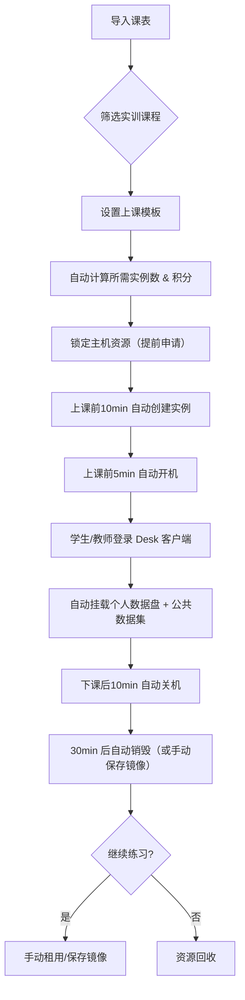

下面我们来系统地聊聊这份 **《云电脑业务管理系统》** 的需求文档（PDF + XMind 思维导图）。我会从 **整体架构 → 核心业务流程 → 关键实体模型 → 计费/配额/权限 → 学校场景特殊性 → UI/交互细节 → 可能的实现难点** 几个维度展开，最后再一起 brainstorm 一些 **优化点、遗漏点和落地建议**。

---

## 1. 整体架构一览

| 层级 | 核心对象 | 关键能力 |
|------|----------|----------|
| **基础设施** | 机房 → 主机（CPU/GPU） → 资源池 | 资源统计、可用/已用、驱动/CUDA 版本 |
| **虚拟化** | 虚机实例（云电脑） | 创建/销毁、开/关机、升降配、迁移、保存镜像 |
| **存储** | 系统盘、数据盘（SSD/NVME）、公共/私有磁盘、Ceph、外部网盘 | 只读/可写、共享、扩缩容 |
| **镜像/模板** | 公共/私有镜像、模板（用途/OS/最低配置） | 上/下架、审核、缓存地区 |
| **用户/权限** | 用户、用户组（院校-专业-年级-班级）、角色（教师/学生/教务/IT） | 配额、积分、租户隔离 |
| **计费/订单** | 按量/包时长、积分/余额、订单/退款 | 不同机房/GPU 品牌/型号单价、免费额度 |
| **业务场景** | 学校排课、临时上课、个人练习、资源申请 | 课表自动创建、锁资源、自动销毁 |

> **核心理念**：**资源池化 + 按需计费 + 学校排课自动化 + 镜像/数据盘分离**，实现“云端实验室”。

---

## 2. 核心业务流程拆解

### 2.1 学校排课（最复杂、最有特色）

**关键点**：
- **资源冲突检查**：创建实例时要检查 **时间 + 场所 + 用户** 三维冲突。
- **积分扣除**：学校配额（学期积分） vs 用户个人积分（免费/充值）。
- **退费机制**：锁定资源后若取消，扣除“手续费”后退还积分。

### 2.2 临时/个人使用

1. 选择用途 → 模板 → 配置 → 主机 → 时长 → 支付（积分/余额）。
2. 支持 **按量 ↔ 包时长** 互相转换（满整周/日按包价）。
3. 到期前 **预警** → 费用不足 **自动关机并提醒**。

---

## 3. 关键实体模型（ER 简要）

| 实体 | 核心属性 | 关联 |
|------|----------|------|
| **机房** | id、名称、位置、状态 | 1:N 主机 |
| **主机** | uuid、类型(CPU/GPU)、资源、驱动、所属机房、资源池 | 1:N 虚机实例 |
| **虚机实例** | id、名称、状态、规格、系统盘、数据盘、镜像、所属用户、计费方式、释放时间 | N:1 主机、镜像、用户 |
| **镜像** | id、名称、OS、用途、最低配置、所有者、状态（上/下架） | N:N 模板 |
| **模板** | 编号、用途、OS、挂载磁盘、适用配置 | 1:N 镜像 |
| **磁盘** | id、类型(系统/数据/公共/私有)、容量、挂载点、读写 | N:1 实例 |
| **用户** | id、角色、所属租户、配额、积分 | N:N 用户组 |
| **订单** | 编号、类型、状态、支付方式、关联实例/磁盘 | 1:N 收支明细 |

---

## 4. 计费、配额、权限设计

### 计费要素（多维度组合单价）

| 维度 | 计费方式 |
|------|----------|
| **机房** | 不同机房有基准价系数 |
| **GPU** | 品牌（N/A/H）+ 型号（3090/4090…）+ 数量 |
| **CPU** | 核心数 |
| **内存** | GB |
| **存储** | 免费额度后 0.01/GB/日 |
| **计费模式** | 按量 / 包日 / 包周 / 包月（学校场景禁用包月） |

> **转换规则**：包时长 → 按量时，满整周/日按对应包价计费，防止“拆包”薅羊毛。

### 配额体系

| 层级 | 配额类型 | 过期策略 |
|------|----------|----------|
| **学校租户** | 学期总积分 | 学期末作废 |
| **用户** | 免费积分（平台赠送） | 1 个月失效 |
| **实例** | 最大并发数、总时长 | 超限自动关机 |

---

## 5. UI/交互细节（XMind 思维导图已覆盖）

| 页面 | 关键交互 |
|------|----------|
| **实例列表** | 标签页（个人/团队）、实时刷新（30s）、二次确认释放 |
| **实例详情** | 实时监控（CPU/GPU/显存/磁盘）、运行记录、操作栏 |
| **创建实例** | 用途筛选模板 → 配置比例约束（GPU 1:8:32）→ 主机池筛选 → 验证资源 → 批量创建 |
| **资源申请** | 计划开/关机时间 → 审批流 → 锁定资源 |

---

## 6. 可能的实现难点 & 风险点

| 难点 | 说明 | 建议 |
|------|------|------|
| **资源冲突检测** | 多用户、多时间段、多机房 | 采用 **区间树 + 锁表**，创建时加行锁 |
| **课表自动创建实例** | 需要解析课表、匹配模板、预估资源 | 提前 **跑批任务**（每天 0 点），生成 **PlanInstance** 表 |
| **GPU 比例分配** | 1 GPU : 8 CPU : 32 GB 内存 | 在主机资源池里 **预分配 Slot**，类似 K8s Device Plugin |
| **数据盘自动挂载** | 个人盘 + 公共只读盘 | 使用 **Ceph RBD Snapshot** + **ReadOnlyMany** |
| **计费精度** | 按秒计费 vs 包时长转换 | 统一 **按秒计费**，前端展示“约 X 元/天” |
| **退款与资源回收** | 防止“先占资源后退款” | 退款前 **强制关机 + 标记不可恢复** |

---

## 7. 值得优化的点（Brainstorm）

1. **智能推荐主机**  
   - 根据历史使用率、温度、故障率，给出 **“最优主机”** 推荐（类似 AWS 的“推荐实例类型”）。

2. **镜像版本管理 + 灰度发布**  
   - 支持 **多版本镜像**，教师可指定“本学期使用 v2.1”。

3. **一键克隆实验环境**  
   - 教师上传 **完整实验镜像（含数据盘快照）**，学生一键加载。

4. **监控告警中心**  
   - 实例异常（CPU 100% > 30min）、磁盘快满、GPU 驱动崩溃 → 推送微信/企业微信。

5. **批量操作增强**  
   - 支持 **Excel 导入** 批量创建实例（带校验）。

6. **多租户隔离**  
   - 不同学校 **网络 VPC 隔离**，防止跨校访问。

7. **绿色节能**  
   - 夜间低峰自动 **关机未使用实例**，计入“环保积分”。

---

## 8. 你想重点聊哪一块？

可以挑一个方向深入：

1. **学校排课自动化**的实现细节（批处理、锁资源、冲突检测）  
2. **GPU 资源池化**与比例分配的算法  
3. **计费系统的防刷单/退款风控**  
4. **前端 UI 交互流程优化**（创建实例向导式）  
5. **数据盘/镜像的生命周期管理**（快照、版本、共享）  
6. **与 OneLink 统一认证的集成方案**  

或者你有其他想补充的需求点？直接说，我们继续拆！